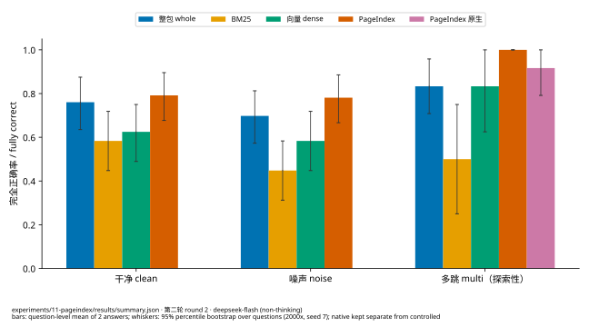
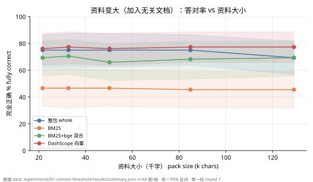

# Don't reach for RAG too early

**Measured retrieval, model and framework choices for a personal knowledge base**

[简体中文](README.md) · [Full report](experiments/report/REPORT.en.md) · [Beginner handbook](experiments/report/HANDBOOK.en.md) · [Product case study](docs/case-study-product.en.md) · [Engineering highlights](docs/engineering-highlights.en.md)

One of my personal projects does real-time spoken Q&A. When someone finishes a sentence, it pulls relevant passages from my own notes and asks an LLM for an answer I can say out loud. If nothing appears two seconds after the question ends, the answer is useless, so the project is sensitive to **latency, cost and accuracy** all at once.

Most advice says "add RAG, a vector database and an agent framework". I wanted data on plainer questions:

- How much material do you need before retrieval actually helps?
- Which retrieval: keywords, embeddings, or letting the model read a table of contents (PageIndex)?
- Are LangChain, LlamaIndex and LangGraph worth adopting?
- How much time and money do small local models, quantization, the KV cache and prefix caching really save?

So I ran 13 reproducible experiments in two rounds on a public Chinese computer-science note collection.

## Key findings

1. **With little material, sending it whole is the best "retrieval".** Up to 60k Chinese characters, just send everything. Accuracy holds at 75% up to 85k characters, prefix-cache hits run 97–98%, and each question costs under 0.01 CNY.
2. **When you retrieve, don't rely on keywords alone.** BM25 gets 46–67% fully correct, dense retrieval 74–96%. Speech-recognition typos cost BM25 another ten-plus points.
3. **Local embedding models are good enough.** On a laptop GPU, Qwen3-Embedding-0.6B ties cloud DashScope: 95.8% vs 97.9% of correct passages found.
4. **PageIndex is a diligent student who reads the table of contents, and is just as slow.** It beats BM25 by 21–33 points and dense retrieval by 17–20, but its difference from sending everything is not significant, and it costs about 5 s more and 6–7× the price per question.
5. **For real time, watch the first token; otherwise, watch accuracy.** Reasoning models think for over a minute first, which rules them out for real time.
6. **Frameworks have no magic.** Configured properly, they match a few hundred lines of hand-written code; their Chinese defaults barely work, and they bring 346 MB of dependencies.
7. **Caching saves money, not necessarily time.** Locally, q8_0 cut KV-cache startup allocation by 46.875%. In the cloud, prefix-cache hits cut whole-pack input cost by about 96%, without consistently faster first tokens.





## Read by role

| You are | Start with |
| --- | --- |
| A product manager, or curious why decisions were made | [Product case study: deciding a knowledge-base design with experiment data](docs/case-study-product.en.md) |
| An agent / AI application developer | [Engineering highlights: budget gateway, integrating a third-party agent SDK, evaluation method](docs/engineering-highlights.en.md) |
| After all data and methods | [Full report](experiments/report/REPORT.en.md) (22 figures) |
| New to the field | [Beginner handbook](experiments/report/HANDBOOK.en.md): tokens, RAG, embeddings, agents, GPU memory, KV cache, networking and system design, with plenty of everyday analogies |

## What was done

- **13 experiments**: pack size, same-topic growth, retrieval methods, chunking, passages per answer, speech noise, answer models (4 cloud, 5 local), embedding models, frameworks (LangChain / LlamaIndex / LangGraph), concurrency, a PageIndex comparison, local KV cache, and cloud prefix caching.
- **Evaluation method**: a strict "answer only from the material" rule, so retrieval misses become wrong answers; question-level bootstrap 95% intervals; methods compared paired by question; failures count in the denominator.
- **Cost control**: a hand-written cross-process budget gateway. Every paid request reserves an upper bound first and settles on reported usage, so SDK-internal calls and retries cannot escape the budget. Round 2 made 3043 requests for 9.39 CNY by usage.
- **Findings shipped and designs backed**: the whole-pack limit rose from 30k to 60k characters; retrieval moved from 3 to 5 passages (+6–12 points fully correct); no framework adopted; local bge embeddings by default, with cloud embeddings only on explicit user consent.

## Repository layout

```
README.md / README.en.md            this page
docs/
  case-study-product.*.md           product view: problem, hypotheses, experiments, decisions, trade-offs
  engineering-highlights.*.md       agent-developer view: budget gateway, SDK integration, evaluation, pitfalls
experiments/
  report/
    REPORT.zh-CN.md / REPORT.en.md  full report
    HANDBOOK.zh-CN.md / .en.md      beginner handbook
    figures/  data/                 all figures (SVG) and plotted data (CSV)
    *.py                            plotting and measurement scripts
  lib/                              budget gateway, ledger, evidence limits, and their tests
  11-pageindex/                     PageIndex comparison: runner, adapter, statistics, results
  12-kv-cache/                      local KV and cloud prefix cache: scripts and results
  01-…/09-…/results/                round-1 experiment summaries
```

## Reproducibility

- The code is a **snapshot** for reading and review. Some scripts depend on internal modules of the original project (the retrieval implementation, the key loader), so they do not run on their own.
- Every figure is generated by the scripts in `experiments/report/` from the experiments' `results/*.json`; each number traces back to a summary file.
- Raw answers, judge text, corpus text and question text are not included: they quote the corpus, which has its own license.

## Data and license

- Corpus: the public [CS-Notes](https://github.com/CyC2018/CS-Notes) (CC BY-NC-SA 4.0) at a pinned commit. This repository contains neither its text nor the questions derived from it, only aggregated results.
- Code is released under the [MIT License](LICENSE).
- Costs are API usage × list price at the time, not provider bills. Models and prices change; conclusions describe the tested conditions only.
