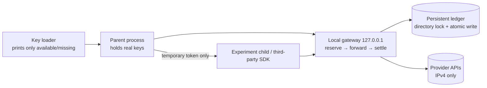

# Engineering highlights: budget gateway, third-party agent SDK integration, and evaluation method

[简体中文](engineering-highlights.zh-CN.md) · [Home](../README.en.md) · [Full report](../experiments/report/REPORT.en.md)

Written for agent and AI-application developers, this picks the most engineering-heavy parts of the project: what went wrong, how it was found, how it was fixed and how the fix was verified. Each section links the code, which is a snapshot for reading.

## 1. A cross-process budget gateway that no paid call can escape

**Problem**: the experiments call several paid APIs (answer, judge and embedding models) and run a third-party agent SDK that sends and retries its own requests. Bookkeeping at the call site can't contain that. The budget has a hard ceiling (20 CNY in total) and must be controlled per stage.

**Design** ([`experiments/lib/gateway.cjs`](../experiments/lib/gateway.cjs), [`budget.cjs`](../experiments/lib/budget.cjs), [`with-budget.cjs`](../experiments/lib/with-budget.cjs)):

- **Reserve first, settle later**: before sending, reserve "request bytes (a safe upper bound on tokens) + max output tokens"; once the provider reports usage, replace the reservation with the actual cost.
- **Unknown usage is never free**: truncated streams, missing usage and HTTP failures keep their full reservation.
- **Cross-process atomic bookkeeping**: the ledger is a local JSON file guarded by a lock directory and written via temp file + rename, so concurrent experiment processes can't overspend or corrupt it.
- **Tiered limits**: a 20 CNY total, plus separate caps for each stage (preflight, indexing, main, multi-hop, cloud cache, reserve) that can't borrow from each other. Cap changes need approval and are recorded in the ledger's `capHistory`.
- **Credential isolation**: real keys exist only in the gateway process. Children and SDKs get a temporary token, so even an SDK trying to bypass the gateway has no usable key.
- **Circuit breaker**: after 5 upstream failures in one gateway process, it stops forwarding, so SDK retry loops can't multiply reservations.
- **Priced models only**: requests for models missing from the price table are rejected; `max_tokens` is capped; thinking mode is set by configuration only, and caller-supplied `reasoning_effort` is stripped.

**Verification**: 10 Node tests ([`infrastructure.node.cjs`](../experiments/lib/infrastructure.node.cjs)) cover concurrent processes not overspending, missing usage never refunding, the ledger surviving restarts, truncated streams, the failure breaker, and provider-bound keys.

**In practice**: round 2 made 3043 paid requests for 9.39 CNY with 0 unknown reservations. When a stage cap was hit, the gateway returned 402 and the run stopped. After approval, `--resume` finished it without paying again for completed work.

## 2. Integrating a third-party agent SDK: mocked tests are not enough

PageIndex is a retrieval SDK that has the model read a table of contents, then pages. Internally it calls models through LiteLLM and the OpenAI Agents SDK. Putting it behind the budget gateway surfaced six problems:

| Symptom | Root cause | Fix | How it was found |
| --- | --- | --- | --- |
| Index summaries could be truncated | The SDK sends no `max_tokens` while indexing, and the gateway defaulted to 512 | Use the 4096 ceiling when absent; record `finish_reason=length` in the ledger | Reading SDK source |
| One failure retried 10 times, multiplying reservations | The SDK retries 10 times and treats only 401/403/404 as final | Mark 400/402/413/422/503 final; disable SDK and LiteLLM retries | Source reading + a local stub (exactly 1 attempt on 402) |
| Network access at import | LiteLLM downloads the `cl100k_base` tokenizer at import, and its bundle lacks exactly that file | The egress block stopped the download; use an existing local copy verified against the official hash | Egress-block error + stack trace |
| The child process couldn't import the SDK | The approved dependency overlay was never added to the Python path | The adapter loads the overlay itself and fails if it's missing | Offline code review |
| The first real call failed | The adapter's constructor arguments followed an assumed API, not the installed 0.2.10 | Correct the arguments; then run index, controlled and native paths end to end against a **local mock model and the real PDF** before spending again | Live preflight error (about 0.0012 CNY spent) |
| Native-mode page reads were always empty | Native mode never calls the client's `get_page_content`; it calls the internal tool table | Wrap each read tool in the official `_IMPLEMENTATIONS` table, recording tool, arguments, pages and returned characters | Evidence length stayed null in the mock end-to-end test |

**Lesson**: verify a third-party SDK integration in three layers.
1. Read the source for hidden network, retry and default-parameter behavior.
2. Run the full flow against a local mock model, exercising the real call chain.
3. Only then run a small paid preflight with checkpoints, stopping on any failed check.

Code: [`adapter.py`](../experiments/11-pageindex/adapter.py), [`test_adapter.py`](../experiments/11-pageindex/test_adapter.py).

## 3. Controlled agentic retrieval: stopping the model from inventing evidence

**Problem**: a model that browses an outline, reads pages and picks evidence may pick a passage it never read, or invent an ID.

**Approach** (`controlled` in [`adapter.py`](../experiments/11-pageindex/adapter.py)):

- Expose only two official tools: read the outline (`get_document_structure`) and read pages (`get_page_content`).
- Record the pages the model **actually read** and allow evidence only from passages on those pages; choosing unread evidence counts as a failure.
- Cap each question at 6 model calls and 120 s; exceeding the cap is a recorded failure, never a silent switch to another method.
- Trim evidence to at most 5 units, 3 per document and 2000 characters, the same limits as the other methods.

**Result**: PageIndex put the gold passage into its evidence 97.9% of the time while sending only 706–769 characters on average, the most accurate method in this comparison. The cost was 4 requests and about 6.4 s per question.

## 4. Evaluation method: not fooling yourself

Code: [`stats.ts`](../experiments/11-pageindex/stats.ts), [`stats.test.ts`](../experiments/11-pageindex/stats.test.ts), [`run.ts`](../experiments/11-pageindex/run.ts).

- **The question is the unit**: two answers to one question are averaged first, not counted as two independent samples, which would fake a narrower interval.
- **Failures count in the denominator**: a failed request is a wrong answer. Latency covers successful requests only, and says so.
- **Paired bootstrap by question**: subtract two methods question by question, resample 2000 times (fixed seed) for a 95% interval, and call an interval that crosses 0 "not significant".
- **Judge cost kept separate**: per-question cost covers retrieval and answering only, with judge calls recorded separately, so an expensive judge can't make a method look expensive.
- **Unmeasurable means null**: native first-answer time and occupied KV bytes couldn't be observed, so they are null, not filled with proxies.
- **Resumable runs**: `--resume` keeps successful records for the same phase, model and corpus, reruns the rest, and lists dropped failures.

## 5. Measurement pitfalls

- **Equal characters aren't equal tokens**: before the cloud-cache run, all 33 markers for the "token-equal varying prefix" were measured (11 tokens each).
- **A first request isn't guaranteed to miss the cache**: the very first preflight request hit 256 cached tokens because an earlier run had used the same prefix.
- **Measured latency may come from a local proxy**: DNS took a few milliseconds and TCP under one. The IPs were a proxy's fake-IP range (`198.18.0.0/15`), and only TLS reached the server ([`api_timing.py`](../experiments/report/api_timing.py)).
- **For reasoning models, time the first answer token**: the visible thinking doesn't count. The R1 distill's median first answer token was 96–128 s.
- **Cross-check measurements with theory**: KV size = 2 × layers × KV heads × head dim × bytes. With dimensions read from the model file, this gives 1152 MiB (f16) and 612 MiB (q8_0), exactly matching the runtime logs.

## 6. Two small designs in the app

(Original project code, not included here.)

- **Cache-friendly prompt layering**: byte-identical persona and personal material first, then retrieved material, then the question and live transcript last. Before work starts, a `max_tokens=1` prewarm request makes the provider build its prefix cache.
- **Hybrid retrieval that never blocks an answer**: BM25 and embeddings fused with RRF (weights 1:1 for local embeddings, 1:2 for cloud), with a cosine floor. If vectors aren't ready, the query times out, or nothing clears the floor, it falls back to plain BM25. Retrieval must never slow the answer.

## 7. Interview questions this answers

- "How do you stop an agent from blowing the budget?" → Section 1: reserve then settle, conservative unknown usage, credential isolation, tiered limits, circuit breaker.
- "What went wrong integrating a third-party SDK?" → Section 2: hidden retries, defaults, network at import, version mismatch, and the three-layer verification (source → mock end to end → small paid preflight).
- "How do you judge whether a RAG design is good?" → Sections 3 and 4: strict answer rule, paired comparison, intervals, failures in the denominator.
- "Design an agent billing platform" → [chapter 12 of the handbook](../experiments/report/HANDBOOK.en.md): this gateway is its single-machine miniature.
