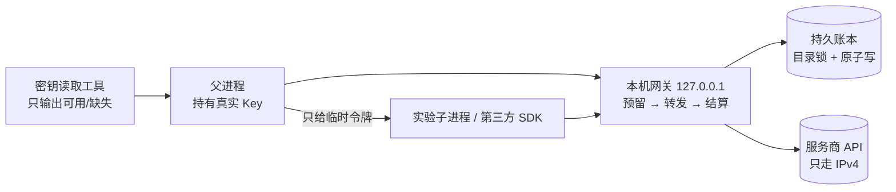

# 工程亮点：预算网关、第三方 Agent SDK 接入与评测方法

[English](engineering-highlights.en.md) · [返回首页](../README.md) · [完整报告](../experiments/report/REPORT.zh-CN.md)

这份文档从 Agent / AI 应用开发的角度，挑出这次实验里最有工程含量的几件事：遇到了什么问题，怎么定位，怎么解决，怎么验证。每一节都附代码位置；代码是快照，用于阅读。

## 1. 跨进程预算网关：让所有付费调用都逃不出预算

**问题**：实验要调用多家付费 API（回答模型、评分模型、向量模型），还要跑第三方 Agent SDK。SDK 内部会自己发请求、自己重试，普通的“在调用处记账”根本管不住。预算有硬上限（总共 ¥20），而且要分阶段控制。

**设计**（[`experiments/lib/gateway.cjs`](../experiments/lib/gateway.cjs)、[`budget.cjs`](../experiments/lib/budget.cjs)、[`with-budget.cjs`](../experiments/lib/with-budget.cjs)）：

- **先预留、后结算**：每个请求发出前，按“请求字节数（token 数的保守上限）+ 最大输出 token”预留费用；拿到服务商返回的用量后，改成实际费用。
- **未知用量不当免费**：断流、缺用量、HTTP 失败的请求，保留全部预留，不退回。
- **跨进程原子记账**：账本是本机 JSON 文件，用“创建锁目录”做互斥，用“写临时文件再重命名”保证不会写坏。多个实验进程可以同时跑，不会超额。
- **分级额度**：总上限 ¥20，再按阶段（预检、建索引、主对照、多跳、云端缓存、预留）分别设上限，阶段之间不能自动借用。调整上限要经过批准，并记录在账本的 `capHistory` 里。
- **凭证隔离**：真实 Key 只在网关进程里。子进程和 SDK 只拿到一个临时令牌，就算 SDK 想绕开网关，也没有能用的 Key。
- **熔断**：同一个网关进程累计 5 次上游失败就停止转发，防止 SDK 的重试循环成倍占用预留。
- **只认已定价的模型**：请求里的模型不在价格表里就直接拒绝；`max_tokens` 强制设上限；思考模式只能由配置决定，调用方传入的 `reasoning_effort` 会被删掉。

**验证**：10 个 Node 测试（[`infrastructure.node.cjs`](../experiments/lib/infrastructure.node.cjs)），覆盖跨进程并发不超额、缺用量不退款、重启后账本不丢、流式中途断开、失败熔断、密钥按服务商绑定等场景。

**实际效果**：第二轮共 3043 次付费请求、¥9.39，未知预留为 0。超出阶段上限时，网关返回 402，实验自动停下，等批准后用 `--resume` 续跑，已完成的部分不重花钱。

## 2. 接入第三方 Agent SDK：只跑模拟测试是不够的

PageIndex 是一个“让模型先读目录、再读页面”的检索 SDK，内部用 LiteLLM 和 OpenAI Agents SDK 调模型。把它接到预算网关后面，前后踩了 6 个坑：

| 现象 | 根因 | 修复 | 怎么发现的 |
| --- | --- | --- | --- |
| 建索引的摘要可能被截断 | SDK 建索引时不传 `max_tokens`，而网关原来默认只给 512 | 未指定时取 4096 上限；`finish_reason=length` 记入账本 | 读 SDK 源码 |
| 一次失败会重试 10 次，成倍占用预留 | SDK 自带 10 次重试，只把 401/403/404 当作不可恢复 | 把 400/402/413/422/503 也设为不可恢复，关闭 SDK 和 LiteLLM 的重试 | 读 SDK 源码 + 本机桩服务验证（402 时只发 1 次） |
| 导入时偷偷联网 | LiteLLM 导入时要下载 `cl100k_base` 分词文件，它自带的文件里恰好缺这一个 | 出站拦截挡住了下载；改用本机已有、且按官方哈希校验过的副本 | 出站拦截报错 + 打印调用栈 |
| 子进程根本导入不了 SDK | 启动 Python 时没把批准的依赖目录加进路径 | 适配器自己加载依赖目录，缺失就报错 | 离线检查代码时发现 |
| 第一次真实调用就失败 | 适配器按想象中的 API 写的构造参数，和实际安装的 0.2.10 版本不一致 | 改成正确参数；之后用**本机模拟模型 + 真实 PDF** 把索引、受控检索、原生三条路径完整跑通，再花钱 | 真实预检报错（已花约 ¥0.0012） |
| 原生模式的读页记录永远是空的 | 原生模式不走客户端的 `get_page_content`，而是直接调用内部工具表 | 包装官方 `_IMPLEMENTATIONS` 里的每个读取工具，记录工具名、参数、页码和返回字数 | 模拟端到端测试里证据长度一直为 null |

**经验**：第三方 SDK 接入要做三层验证。
1. 读源码，找出它隐含的网络、重试、默认参数行为；
2. 用本机模拟模型跑完整流程，把真实的调用链都走一遍；
3. 最后才是小额真实预检，并且每一项都设检查点，任一项失败就停。

代码：[`adapter.py`](../experiments/11-pageindex/adapter.py)、[`test_adapter.py`](../experiments/11-pageindex/test_adapter.py)。

## 3. 受控的 Agent 式检索：防止模型“编造证据”

**问题**：让模型自己翻目录、读页面、挑证据，它可能挑一个根本没读过的片段，或者编一个不存在的编号。

**做法**（[`adapter.py`](../experiments/11-pageindex/adapter.py) 的 `controlled`）：

- 只开放两个官方工具：看目录（`get_document_structure`）和读页（`get_page_content`）。
- 程序记录模型**实际读过的页**，只允许它从这些页对应的片段里选证据；选了没读过的，直接判为失败。
- 每题最多 6 次模型调用、120 秒，超限就记为失败，不悄悄换成别的方法。
- 证据统一裁剪到“最多 5 段、每篇最多 3 段、共 2000 字”，和其他检索方法同条件比较。

**结果**：PageIndex 把标准答案片段放进证据的比例是 97.9%，平均只送 706–769 字，在本次对照里准确率最高；代价是每题 4 次请求、约 6.4 秒。

## 4. 评测方法：怎么避免自欺欺人

代码：[`stats.ts`](../experiments/11-pageindex/stats.ts)、[`stats.test.ts`](../experiments/11-pageindex/stats.test.ts)、[`run.ts`](../experiments/11-pageindex/run.ts)。

- **以题为单位**：同一题答两遍，先在题内取平均，不能当两个独立样本，否则区间会虚假地变窄。
- **失败计入分母**：请求失败的题算答错。延迟只统计成功请求，并单独说明。
- **按题配对的 bootstrap**：两种方法逐题相减，再重抽样 2000 次（固定随机种子）算 95% 区间。区间跨 0 就写“不显著”。
- **评分费用单列**：每题的费用只算检索和回答，评分调用另记，避免“评分越贵、方法看起来越贵”。
- **测不到的就写 null**：原生模式的首个回答字、运行中 KV 占用的字节数都测不到，就记为空，不用别的数字代替。
- **可续跑**：`--resume` 保留同一阶段、同一模型、同一语料下已成功的记录，只重跑剩下的部分，并列出被丢弃的失败记录。

## 5. 测量中的几个“坑”

- **字数相同不等于 token 数相同**：云端缓存实验要构造等长的“变化前缀”，先实测了全部 33 个标记的 token 数（都是 11），再开跑。
- **首次请求不保证未命中缓存**：兼容预检时，第一次请求就命中了 256 token，因为前一次运行用过同样的前缀。
- **测到的延迟可能来自本机代理**：DNS 只要几毫秒、TCP 握手不到 1 毫秒，查下来是代理软件的“假 IP”（`198.18.0.0/15`），真正连到服务器的是 TLS 那一步（[`api_timing.py`](../experiments/report/api_timing.py)）。
- **推理模型的首字要算“首个回答字”**：先吐出的思考过程不算。R1 蒸馏版的首个回答字中位数是 96–128 秒。
- **用理论公式交叉核对实测**：KV cache 大小 = 2 × 层数 × KV 头数 × 每头维度 × 字节数。用模型文件里读出的参数算出 1152 MiB（f16）和 612 MiB（q8_0），和运行日志完全一致。

## 6. 应用里的两个小设计

（原项目代码，未包含在本仓库）

- **缓存友好的提示词分层**：最前面放逐字节不变的角色设定和个人资料，中间是资料，最后才是问题和实时转录；开始工作前发一个 `max_tokens=1` 的预热请求，让服务商先建好前缀缓存。
- **不会卡住回答的混合检索**：BM25 和向量用 RRF 融合（本地向量权重 1:1，云端 1:2），设余弦下限；向量没建好、查询超时或者都低于下限，就退回纯 BM25。检索永远不能拖慢回答。

## 7. 可以拿来回答的面试题

- “怎么防止 Agent 跑飞预算？”→ 第 1 节：先预留后结算、未知用量保守计入、凭证隔离、分级额度、熔断。
- “接入第三方 SDK 踩过什么坑？”→ 第 2 节：隐含的重试、默认参数、导入时联网、版本不一致，以及“读源码 → 模拟端到端 → 小额预检”三层验证。
- “怎么评估一个 RAG 方案好不好？”→ 第 3、4 节：严格回答规则、配对比较、区间、失败计入分母。
- “设计一个 Agent 计费平台”→ 小白手册[第 12 章](../experiments/report/HANDBOOK.zh-CN.md)：这里的预算网关就是它的单机缩小版。
