# Beginner handbook: the concepts behind "Don't reach for RAG too early"

[Back to the report](REPORT.en.md) · [中文报告](REPORT.zh-CN.md) · [中文手册](HANDBOOK.zh-CN.md)

> For people who can code but haven't built an LLM application yet. Reading it takes about two hours. The first eleven chapters explain concepts with analogies, figures and real code from my own project. Chapters 2 and 3 add computing basics (networking, processes, encoding, audio), chapter 9 adds hardware (CPU, GPU, VRAM), and chapter 12 ties everything together through a system-design interview question. A glossary at the end helps you review the vocabulary of agent-development and AI-infrastructure roles. Every number comes from the [report](REPORT.en.md); no new experiments were run for this handbook. For concrete questions and answers, see the [walkthrough](WALKTHROUGH.en.md).

> About code paths: files starting with `experiments/` are in this repository. Paths starting with `shared/`, `electron/` or `src/` belong to the original project (a real-time spoken Q&A desktop app), which is not public; they only show where something is implemented.

**What this handbook covers**: the parts an LLM application passes through between "a question arrives" and "an answer comes out", the choices for each part, and how the report measured which choice to make.

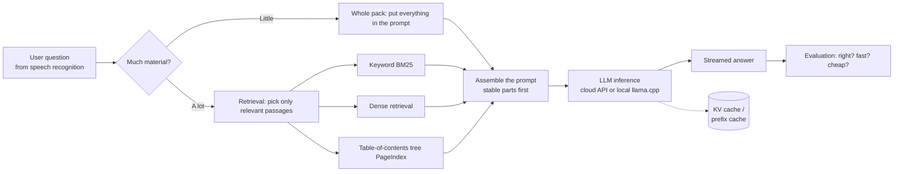

## Contents

1. The minimal loop of an LLM app: tokens, context, streaming and first-token latency
2. Networking and API calls: what one request goes through
3. Computing basics: processes, encoding and audio
4. Whole pack or retrieval: what RAG actually solves
5. The three basic retrieval tools: chunking, BM25, embeddings
6. Three embedding models: bge-small, Qwen3-Embedding, DashScope
7. How frameworks are built: LangChain, LlamaIndex, LangGraph
8. Agents: models that call tools themselves
9. Hardware basics: CPU, GPU and VRAM
10. Inference and AI infrastructure: KV cache, quantization, concurrency
11. Evaluation and cost: how to know you're not fooling yourself
12. Engineering in practice: designing an enterprise agent invocation and billing platform

Appendix: glossary

## 1. The minimal loop of an LLM app

### 1.1 Tokens: the "words" a model sees

A model doesn't read characters or words directly. It first cuts text into small pieces and numbers each one; these pieces are **tokens**. You don't put a whole cucumber in your mouth, you slice it first, and a token is one slice. How the text gets sliced is decided by the **tokenizer**. In English a token is roughly 3–4 letters; in Chinese a token covers roughly 1–2 characters. The report's 60k Chinese characters come to roughly 30–40k tokens.

Two things tie tokens directly to money and speed:

- **Billing is per token**: cloud APIs charge separately for input and output tokens, priced per million tokens. Think of a cucumber stall that charges by the slice: every slice you hand over (input) and every slice it hands back (output) costs money.
- **Equal length doesn't mean equal tokens**: two equally long cucumbers don't always give the same number of slices. For the cloud-cache experiment in report section 9.2, building prefixes of "equal length, different content" meant measuring each prefix's token count first, not just counting characters.

### 1.2 Context window: how much the model can see at once

The **context window** is the token limit for input plus output in one request: commonly 32k or 128k, sometimes 1M.

Think of it as the model's **desk**. The desk is only so big, and the model can't see papers that don't fit. The fuller the desk, the slower and pricier the work, and the easier it is to miss a page. "How much is too much" is exactly what report section 3 measures.

### 1.3 How a prompt is structured

A chat request is usually made of several **messages**:

- **system**: the setup, such as "answer only from the material and say so if it's not there". Like a job description handed to a new employee.
- **user**: what the user says, possibly including material. Like a customer's question.
- **assistant**: the model's earlier answers.

The model itself has "goldfish memory": it remembers nothing between requests. In a multi-turn chat, the whole conversation has to be handed back every time.

My project splits the prompt into three layers (`electron/llm/prompts.ts`):

1. First, a **stable prefix**: the persona and personal material, byte-identical in every request;
2. Then the material needed for this question;
3. Last, the question and the latest transcript.

This order exists to benefit from the **prefix cache** (chapter 10). Picture a meeting that always opens with the same speech: after hearing it enough times, the provider memorizes it, skips it next time and only listens to the new question, which is faster and cheaper. Change a single word of the opening, though, and it has to listen from the start again.

### 1.4 Streaming and first-token latency

**Streaming** means the model returns text as it generates instead of waiting for the full answer. Speed is measured by:

- **TTFT** (time to first token): from sending the request to receiving the first token. Real-time use cares most about this; the report records the first **answer** token.
- **TPOT** (time per output token) or **tokens/s**: how fast the following tokens arrive.
- **End-to-end latency**: from sending the question until the answer is complete.

Remember it as a restaurant: TTFT is how long until **the first dish arrives**, tokens/s is **the pace of the following dishes**, and end-to-end latency is **finishing the whole meal**. In real time, what guests hate most is sitting there waiting for the first dish.

A reasoning model first outputs its "thinking" and only then answers, like a top student who works on scratch paper for ages before saying anything: great in an exam, terrible in a quiz show. Counting the first word on the scratch paper as the first token badly underestimates the wait. In report section 6, the R1 distill's median first answer token came after 96–128 **seconds**, enough time to brew a cup of tea.

## 2. Networking and API calls: what one request goes through

The report's cloud models, cloud embeddings and cloud speech recognition are all reached by "calling an API" over the network. This chapter takes one call apart from start to finish and explains some network terms you'll hear a lot.

### 2.1 Layers: like sending a parcel

Network communication is layered, and each layer minds its own business:

| Layer | Responsible for | Examples | Parcel analogy |
| --- | --- | --- | --- |
| Application | What is being said | HTTP, WebSocket, DNS | The letter's content and format |
| Security | Encryption and identity | TLS (the S in HTTPS) | A sealed envelope and proof of identity |
| Transport | Reliable delivery or fast delivery | TCP, UDP | Registered mail or a postcard |
| Network | Which machine to deliver to | IP (IPv4 / IPv6) | The delivery address |
| Link | How to cross one physical stretch | Ethernet, Wi-Fi | The delivery van and the road |

Application code usually touches only the top two layers, but delays and failures can come from any of them.

### 2.2 IP, ports and DNS

- An **IP address** is a machine's address on the network. **IPv4** looks like `203.0.113.7`, with about 4.3 billion in total, long since too few. **IPv6** looks like `2001:db8::1`, with more addresses than anyone could use, but not every network routes it reliably.
- A **port** tells different services on the same machine apart. If the IP is the apartment complex, the port is the apartment number: HTTPS lives at 443 by default, and local services often use `127.0.0.1:<port>`.
- `127.0.0.1`, also called **localhost / the loopback address**, is like mailing a letter to yourself: the data never leaves the machine and comes straight back.
- **DNS** translates a domain name (`api.deepseek.com`) into an IP address, like a phone's contact list: you remember "Alex", but the phone dials a number. DNS lookups usually use UDP.

**Why the project uses IPv4 only**: a domain may have both IPv4 and IPv6 addresses, and which one a program tries first depends on system and runtime settings. If IPv6 is tried first and doesn't work, you wait for it to time out before IPv4 is tried, adding seconds for nothing. It's like a navigation app sending you down a highway under construction and only turning you around at the toll booth. So the project pins every network request to IPv4:
- on the command line, `curl -4`;
- in Node, `--dns-result-order=ipv4first`, plus `family: 4` when connecting;
- in Python, `AF_INET` only.

### 2.3 TCP and UDP: registered mail and postcards

**TCP** (Transmission Control Protocol) is reliable and ordered:

- Before talking, a **three-way handshake** sets up the connection, much like a phone call: "Hello?" "Hi, I can hear you, can you hear me?" "Yes." Only then does the real conversation start. This costs one round trip, one **RTT** (round-trip time).
- Every packet is acknowledged, and lost ones are **retransmitted**, so the other side receives complete data in order.
- **Congestion control** slows sending automatically when the network is busy.
- The price: if an earlier packet is lost, later packets that already arrived must wait for its retransmission. This is **head-of-line blocking**, like a car breaking down on a single-lane road: everyone behind it waits, however urgent.

**UDP** (User Datagram Protocol) is "send it and forget it": no connection, no acknowledgements, no retransmission, no ordering guarantee. Like shouting through a megaphone in a town square: whoever hears it, hears it. It sounds unreliable, but it's fast and cheap, and it fits cases where "late is worse than never":

- **DNS lookups**: one tiny question, one tiny answer;
- **Real-time audio and video** (such as WebRTC in internet calls and video meetings): losing a sliver of sound is fine, while waiting for a retransmission causes stutter;
- **QUIC / HTTP/3**: builds its own reliable, encrypted transport on top of UDP, merging the TCP and TLS handshakes to connect faster and avoiding TCP's head-of-line blocking.

LLM APIs today almost all use HTTPS over TCP (HTTP/1.1, HTTP/2) or QUIC (HTTP/3).

### 2.4 TLS: encrypting the connection

**HTTPS = HTTP + TLS**. The TLS handshake does two things:

1. **Verify the server's identity**: the server presents a **certificate** signed by a trusted authority, proving "I really am api.deepseek.com". Like a courier showing a staff badge stamped by the company before you open the door.
2. **Agree on a key only the two sides know**, then encrypt everything with it. The magic: the key is "negotiated" in full view of everyone, yet eavesdroppers can't work it out. A piece of mathematics (key exchange) makes this possible; for now, just remember that it can be done.

A TLS 1.3 handshake usually takes one RTT. So before a brand-new HTTPS connection can send a request, it spends at least "DNS + TCP handshake + TLS handshake".

### 2.5 HTTP: what requests and responses look like

An HTTP request to an LLM API looks roughly like this:

```
POST /chat/completions HTTP/1.1
Host: api.deepseek.com
Authorization: Bearer <API Key>
Content-Type: application/json

{"model": "deepseek-flash", "messages": [...], "stream": true, "max_tokens": 400}
```

- **Method**: `GET` fetches data, `POST` submits data. Calling a model uses `POST`.
- **Headers**: `Authorization: Bearer <Key>` identifies you; `Content-Type` describes the body.
- **Body**: the parameters, as JSON.
- **Status code**: three digits telling you the outcome.

| Status | Meaning | Where the report met it |
| --- | --- | --- |
| 200 | Success | Normal requests |
| 400 | Malformed request | DashScope sometimes uses 400 for "backend busy", so it can't always be treated as a format error |
| 401 | Authentication failed | The measurement in 2.6 deliberately sends no key and gets 401 |
| 402 | Payment required / insufficient balance | The budget gateway returns 402 when over budget |
| 429 | Too many requests, rate-limited | Wait and try again |
| 5xx | Server error | Retry a limited number of times |

- **Connection reuse** (keep-alive): one TCP / TLS connection can carry many requests in a row, skipping later handshakes. Like not hanging up after one topic and moving straight on to the next, without another round of "Hello? Hello?".
- **HTTP/2** runs several requests over one connection at once (multiplexing); **HTTP/3** runs over QUIC.

### 2.6 Measured: where the time of one HTTPS request goes

I used `curl -4` to send 5 fresh-connection requests each to DeepSeek's and DashScope's API addresses. **No API key was sent**, so the servers answered 401 at once: no model was called and nothing was spent.

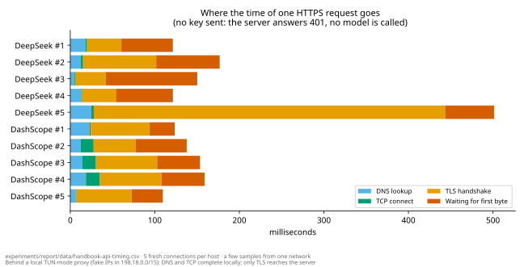

Results ([data](data/handbook-api-timing.csv), [script](api_timing.py)):

- A full request usually took **100–180 ms**: TLS handshake about 20–90 ms, waiting for the server's first byte about 30–110 ms.
- Occasionally a TLS handshake took over 400 ms (about one in five across three runs), most likely while the proxy opened a new upstream connection.
- **A surprise**: DNS took a few milliseconds and the TCP handshake less than one, too fast to be reaching a real server. The resolved IPs all fell in `198.18.0.0/15`, the "fake IP" range a local proxy uses in **TUN mode**. DNS and TCP were answered locally by the proxy; only at the TLS step did the connection actually go through the proxy to the server. **So before measuring network latency, find out whether you're behind a proxy.**

How this relates to the report: the whole pack's first answer token arrives in about 0.8 s. Setting up the connection accounts for the one or two hundred milliseconds measured here (and none at all when a connection is reused); most of the rest is the server processing the input (prefill, chapter 10) and producing the first token.

My project also uses a trick: when work starts, it sends a `max_tokens=1` "prewarm" request (`electron/main.ts`). It carries the same byte-identical stable prefix as real requests, so the provider builds its prefix cache in advance and the connection gets established. While idle, it "tops up" every 4 minutes or so. The first real answer then doesn't pay the cold-start price.

### 2.7 Streaming: SSE and WebSocket

**SSE** (Server-Sent Events) is what almost every LLM API uses for streaming output:

- the client sends an ordinary HTTP request; instead of answering all at once, the server keeps the connection open and pushes lines of the form `data: {...}`;
- it ends with `data: [DONE]`;
- usage normally arrives in the last chunk.

The report's budget gateway (`experiments/lib/gateway.cjs`) parses exactly this format line by line. A request is only settled once `[DONE]` arrives with usage; a stream cut off midway keeps its reservation.

**WebSocket** "upgrades" one HTTP request into a long-lived two-way channel, after which either side can send text or binary messages at any time. It suits real-time speech recognition, where you "send while speaking and get results while sending". The project's cloud speech recognition (`electron/asr/aliyunRealtimeEngine.ts`) works like this:

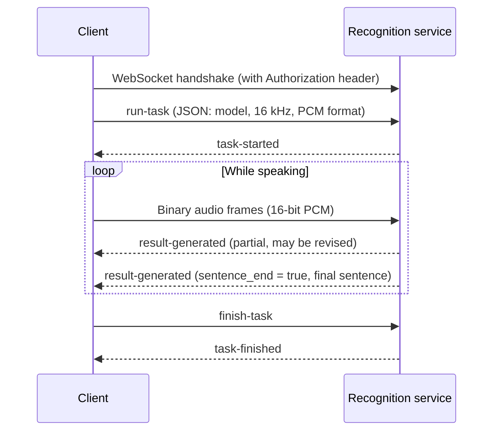

SSE is a one-way push from server to client, like a radio: the station keeps broadcasting and you just listen. WebSocket is two-way, like a walkie-talkie: either side can press the button and talk. Both run over TCP.

### 2.8 Proxies and gateways

- A **forward proxy** goes out to other servers on your behalf, like a personal shopper: you tell them what you want and they go to the store for you. The proxy software on this machine is one, and it's what produced the "fake IPs" in 2.6.
- A **reverse proxy / gateway** stands in front of a service and receives requests for it, like a company reception desk: visitors sign in and get a badge before being shown in. It can handle authentication, rate limiting, billing and logging in one place.
- The report's **budget gateway** is a small local gateway running on `127.0.0.1`. Experiment programs (third-party SDKs included) get only a temporary token and send requests to this local address. The gateway checks the budget, swaps in the real API key and forwards the request to the provider. Real keys never appear in child processes, and SDK-internal retries can't escape the budget.

### 2.9 Timeouts, retries and rate limits

- **Timeout**: every request needs an upper bound, or a stuck network makes the program wait forever. The report's experiments allow 120 s per question.
- **Retry**: transient errors (network blips, 5xx, 429) can be retried, but with a cap on attempts and a longer wait each time: **exponential backoff**. Like calling a busy number: try again after 1 minute, then 2, then 4, instead of redialing a hundred times a second and jamming their line.
- **Idempotency**: whether doing a request once or many times gives the same result. An elevator button is idempotent: press it once or ten times and one elevator comes. Ordering takeout isn't: tap "order" three times by accident and three meals show up. Queries are usually idempotent; calling an LLM is **not**: each retry costs money again and may return a different answer. That's why the report's budget gateway reserves budget afresh for every retry and turns off the SDK's own retries, and stops forwarding after 5 upstream failures.
- **Rate limit**: providers cap requests or tokens per minute and return 429 when you exceed it, like a trendy bubble-tea shop's "two cups per customer". The concurrency experiment (report section 10) measures how many simultaneous requests you can send before things slow down.

### 2.10 API design and security

- **REST style**: URLs name resources and HTTP methods name actions, such as `POST /chat/completions`, `POST /embeddings`, `GET /models`.
- **OpenAI-compatible APIs**: many providers (DeepSeek, Alibaba's DashScope, a local llama-server) imitate OpenAI's API format. The same client code switches providers by changing only the base URL, model name and key.
- **An API key is a password**, or more precisely a **bank card that can spend your money**: whoever holds it can use your quota. So:
  - never put it in code, logs or URLs;
  - the project stores it encrypted with Electron's `safeStorage` (backed by the operating system's data protection on Windows);
  - the experiments only report whether a key is "available / missing", never the key itself.
- **Keys are bound to providers**: a DeepSeek key may only be sent to DeepSeek's address, never to another service just because a config field happens to contain a key.

## 3. Computing basics: processes, encoding and audio

### 3.1 Processes and threads

Think of a computer as a food court:

- A **process** is a running program with its own memory, like one independent **stall** in the food court with its own kitchen. If one stall catches fire (crashes), the fire usually doesn't reach the next.
- A **thread** is a flow of execution inside a process, like several **cooks** in the same stall. They share one kitchen (shared memory) and work fast together, but if one knocks over a pot, the whole kitchen stops.
- **The main thread must not block**: an interface program has a single main thread that responds to clicks and repaints the screen, like the stall's only **front-counter server**. Send that server to the back to cook a ten-minute dish (say, running a model) and nobody serves customers: that's a "frozen UI".

**My project (an Electron desktop app) is multi-process**:

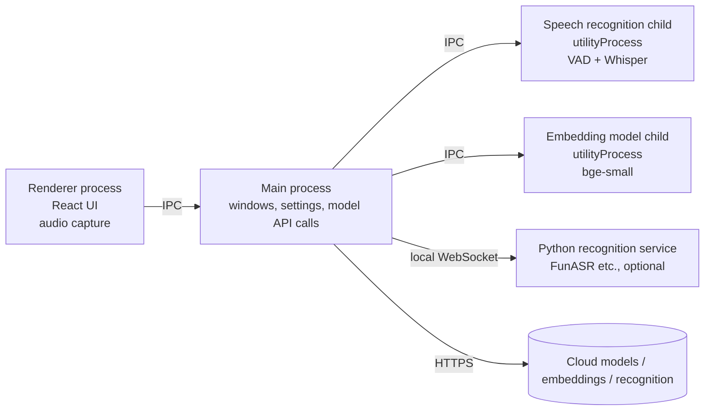

- The **main process** handles windows, settings and network requests; the **renderer process** is the interface (essentially a web page); the **preload script** sits between them and exposes only a controlled set of functions.
- **IPC** (inter-process communication): processes can't read each other's memory, only send messages, like cooks in neighboring stalls who can't barge into each other's kitchens and pass notes instead. The project defines every message channel in one place, `shared/protocol.ts`, and the main process validates everything the renderer sends.
- **utilityProcess**: a separate child process provided by Electron. Speech recognition (`electron/asrHost.ts`) and the local embedding model (`electron/embed/`) run there, so they never block the main thread and a crash doesn't take down the interface, like moving loud heavy machinery into its own workshop so it doesn't disturb the shop front. A comment in the source records a real reason too: running recognition on the GPU (DirectML) inside the main process hung on real speech, and moving it to its own process fixed it.
- A **sidecar** is another independent program the main app starts alongside itself. The project's local FunASR recognition is a Python service (started and cleaned up by `electron/funasrSidecar.ts`) that talks to the app over `ws://127.0.0.1:<port>`, so Python dependencies never have to ship inside the desktop app.

### 3.2 Memory, disk and atomic writes

- **Memory** (RAM) is fast but loses everything when power goes; **disk** (SSD) is slower but keeps data. Model files live on disk and are loaded into memory or VRAM when used.
- **Atomic writes**: overwriting a file in place can leave it half-written and broken if the program crashes or power fails. The usual approach is to write a temporary file first, then **rename** it to the real name. On the same disk, a rename happens in one step: you get either all of the old file or all of the new one. Like handing in homework: you draft on scrap paper and copy it into the notebook in one go, so the teacher never sees half an assignment. The project's settings file (`electron/fsAtomic.ts`) and the experiments' budget ledger (`experiments/lib/budget.cjs`) are both written this way. Windows adds one wrinkle: antivirus or indexing services briefly lock freshly written files, so a failed rename should wait a moment and retry.
- **Locks**: several processes editing one file at once overwrite each other. A lock is like a bathroom door lock: while someone's inside, everyone else queues outside. The budget ledger "creates a lock directory" so only one process writes to the books at a time.

### 3.3 Bytes, characters and encoding

- A **bit** is a 0 or 1; a **byte** is 8 bits. File sizes, network traffic and VRAM are all measured in bytes.
- **Character encoding** defines how characters become bytes:
  - **Unicode** gives almost every character in the world a number, like a worldwide ID number for characters;
  - **UTF-8** defines how that number is packed into bytes and is by far the most common: English letters take 1 byte, common Chinese characters 3. So Chinese text takes about 3× the bytes of English text of the same length.
- **Token count never exceeds UTF-8 byte count**: mainstream LLMs (DeepSeek included) use byte-level tokenizers, so at worst each byte is one token. The report's budget gateway therefore uses the request's byte count as a safe upper bound on tokens when reserving budget: better to reserve too much than to underestimate.
- **GBK** is an older Chinese encoding that many tools on Chinese Windows still default to. Read bytes with the wrong encoding and you get mojibake, like decoding a telegram with the wrong codebook: `é` turns into `é`, and Chinese text into gibberish. Pitfalls the report hit: pip reading requirements.txt as GBK, and Python printing in GBK by default (set `PYTHONIOENCODING=utf-8`).
- **Line endings**: Windows uses CRLF (`\r\n`), Linux and macOS use LF (`\n`). This is a typewriter leftover: CR "returns the carriage to the start of the line" and LF "feeds the paper up one line". Typewriters have been in museums for decades, but these two characters still trouble programmers. A stray `\r` in a generated file leaves an invisible character at the end of a URL. The project uses LF for all source and generated files.
- **JSON**: almost every API request, response and config uses it. It's a plain-text data format made of objects `{}`, arrays `[]`, strings, numbers and booleans.
- **Base64**: encodes any binary data as printable text so it fits in JSON or a config file, like rewriting a photo as a long string of letters so it can travel in a "text-only" letter. Note: Base64 only changes the spelling, it is **not encryption**; anyone can decode it. The encrypted keys are stored as Base64.
- **Hash**: turns any data into a fixed-length "fingerprint", such as **SHA-256**. Change one byte and the fingerprint changes completely. The report uses hashes to verify the corpus, the PDF and downloaded dependencies, making sure "what we measured is exactly that file".

### 3.4 Digital audio basics

Sound is vibrating air. A microphone turns it into a voltage, and the sound card turns that continuous signal into a stream of numbers: this is **sampling**. It works like a cartoon: continuous motion is broken into dozens of drawings per second, and flipped fast enough, it looks smooth.

- **Sample rate**: points per second, i.e. "drawings per second".
  - Music and system audio commonly use 48 kHz (48,000 points per second);
  - speech recognition usually uses **16 kHz**, because the important frequencies of speech are below 8 kHz. By the sampling theorem, sampling at twice the highest frequency is enough to reconstruct the signal. To film a hummingbird beating its wings 8,000 times a second, you need at least 16,000 frames a second.
- **Bit depth**: how many bits per point, like how fine the marks on a ruler are. **16-bit PCM** is the most common raw format: each point is an integer from −32768 to 32767. Browsers internally use 32-bit floats from −1 to 1 and convert to 16-bit integers before sending (`f32ToPcm16` in the project).
- **Channels**: mono or stereo. Speech recognition uses mono.
- **Data rate**: 16 kHz × 16 bits × mono = 32 KB per second, about 1.9 MB per minute, far less than video and easy to upload in real time.
- **Frames**: audio is processed in small fixed slices, such as 20–30 ms each. Each frame's **energy** (RMS, root mean square) tells whether there's sound, like the level meter dancing on a stereo.

### 3.5 The real-time speech recognition pipeline

In the project, a sentence goes from "spoken" to "text" through these steps:

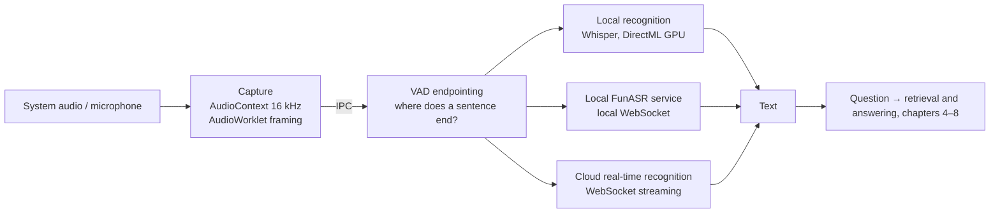

1. **Capture**: on Windows, the system "loopback" captures whatever the computer is playing (`src/audio/loopbackCapture.ts`); the microphone can be captured too. The `AudioContext` is created at 16 kHz, so the browser handles resampling. An **AudioWorklet** (a small program running on a dedicated audio thread) cuts the sound into frames and sends them over IPC to the recognition child process.
2. **VAD** (voice activity detection) decides when someone is speaking and when a sentence ends (`electron/asr/vad.ts`). It works like a meeting chair: it waits for a short pause before deciding "that sentence is done", and remembers the breath the speaker took before starting. The project uses an energy-based method:
   - a frame counts as speech when its energy exceeds "background noise × 3";
   - 300 ms of silence ends a sentence;
   - 300 ms of audio before speech starts is kept, so the first syllable isn't clipped;
   - a sentence is cut at 10 s at most.
   - VAD is also the privacy and cost gate: when nobody speaks, no audio goes to any recognition service.
3. **Recognition**:
   - Local **Whisper**: OpenAI's open-source recognition model. It first turns sound into a **mel spectrogram** (a "picture of sound" modeled on human hearing: time on one axis, pitch on the other, loudness as color, like a heat map of sound), then an encoder-decoder "reads the picture and writes the text". The project runs it on the GPU with onnxruntime (via Windows' **DirectML** interface).
   - Local **FunASR**: Alibaba's open-source Chinese recognition toolkit, running as a Python sidecar.
   - Cloud **real-time recognition** (DashScope's fun-asr-realtime / paraformer-realtime-v2): audio streams up while **partial results** (which may be revised) and **final results** (fixed when a sentence ends) come back, like a simultaneous interpreter who gives a rough version from half a sentence and corrects it once the sentence is complete.
4. **Where the latency comes from**:
   - VAD waits for 300 ms of silence to confirm a sentence has ended;
   - recognition itself takes time;
   - only then do retrieval and answering begin.
   - That's why real-time use cares so much about the answer model's first-token latency: the earlier stages have already spent part of the "two-second budget".

### 3.6 Why recognition makes typos

Report section 5 measured speech noise; here is where it comes from:

- **Homophones**: Chinese has many characters that sound alike, and the model can only guess from context.
- **Technical terms and mixed languages**: "TCP" may come out as something like "tee-see-pee" written phonetically, and "OSI" as "oh-ess-eye". The model has rarely seen how these words sound in casual speech.
- **Filler words and sentence breaks**: "um" and "like" creep into the text, and sentences may be cut in odd places.
- **Environment**: echo, background music, people talking over each other.

This is why the report recommends dense retrieval (chapter 5): embeddings search by meaning and are far more forgiving of surface errors. Putting both the Chinese and English spellings of terms into headings also helps retrieval match.

## 4. Whole pack or retrieval: what RAG actually solves

**RAG** (retrieval-augmented generation) means: before answering, **retrieve** a few relevant passages from the knowledge base, put them in the prompt, then let the model **generate** the answer. It's an open-book exam: find the relevant pages first, then write. It exists because the material is too big for the context window, or too slow and expensive to send whole.

But what if there isn't much material? For a thin booklet, you just lay the whole thing open on the desk; why check the table of contents first? That's the report's **whole pack**. Its core findings:

- Up to 60k characters, the whole pack beats every retrieval method on stability; up to 85k, its accuracy stays at 75% (report section 3).
- On the 200k-character corpus, the difference between the whole pack and the strongest retrieval method, PageIndex, is not significant (report section 4.3).

In my project, the whole-pack limit is a single constant: `FULL_CONTEXT_MAX_CHARS = 60_000` in `electron/ipc/knowledgeIpc.ts`. Material up to 60k characters is sent whole; only larger material goes through retrieval.


The four ways to "fetch material" side by side: how each searches, what it's like, and what we measured:

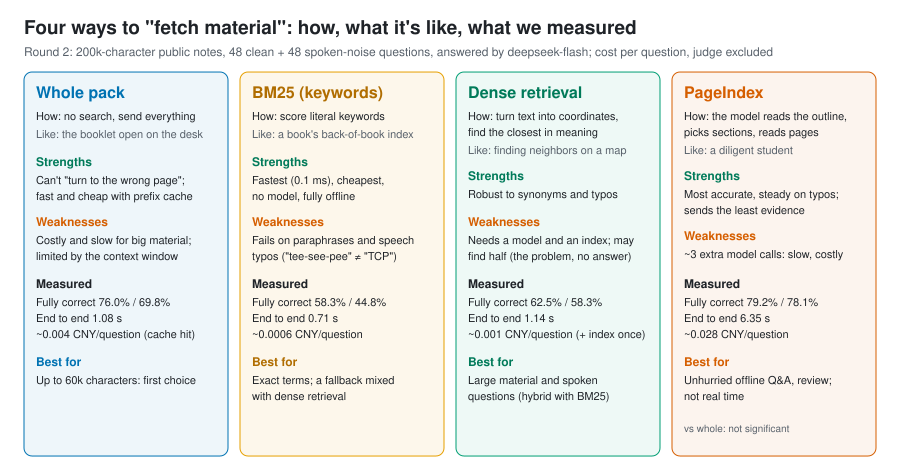

**Why the whole pack wins on small material**: retrieval can pick the wrong passage, and then even the smartest model can't answer correctly, just as flipping to the wrong page in an open-book exam gives a wrong answer however well you write. The whole pack can't "flip to the wrong page". Its cost is more input tokens, but the **prefix cache** makes resending the same material almost free (chapter 10).

## 5. The three basic retrieval tools: chunking, BM25, embeddings

### 5.1 Chunking

Before retrieval, long documents are cut into pieces (chunks), the smallest unit retrieval works with. It's like cutting a cake: slices too thin and you can't tell what cake it is (context is lost); slices too big and one slice mixes several flavors (irrelevant content creeps in).

My project chunks by Markdown heading in `shared/retrieval.ts`: target 400 characters (`CHUNK_TARGET`), at most 600 (`CHUNK_MAX`), with 80 characters of overlap between neighbors (`CHUNK_OVERLAP`, so no sentence is cut in half). Report section 4.2 measured that chunking by heading beats fixed-length windows: DashScope found the right passage 85% vs 79% of the time.

### 5.2 BM25: keyword retrieval

**BM25** is the classic keyword scoring method: the more often the query's words appear in a passage, and the rarer they are elsewhere, the higher the passage scores. A word like "the" appears everywhere and tells you nothing; "three-way handshake" appears in only a few passages and pinpoints them, so the rarer the word, the more it's worth. BM25 is fast (0.1 ms per query), needs no model and runs fully offline; its weakness is that it only sees the **literal words**, so synonyms, Chinese/English swaps and speech-recognition typos all defeat it.

Chinese adds one more trap: **word segmentation**. English splits words on spaces; Chinese has no spaces. LangChain's and LlamaIndex's BM25 split on spaces or English rules by default, which nearly wipes them out on Chinese: only 27% of correct passages found (report section 8). One line adding jieba Chinese segmentation brings it back to 81%. My project handles Chinese itself in `tokenize` in `shared/retrieval.ts` and boosts words in headings (`HEADING_BOOST = 3`).

### 5.3 Dense retrieval: searching by meaning

An **embedding** turns a passage into a list of numbers, say 512 or 1024 dimensions, so that passages with similar meaning end up close together. Imagine pinning every passage onto a giant map: passages about network protocols live in one neighborhood, garbage collection in another. To search, pin the question on the same map and see who its neighbors are.

"Close" is usually measured by **cosine similarity**: picture each vector as an arrow from the origin and check whether two arrows **point the same way**, regardless of length.

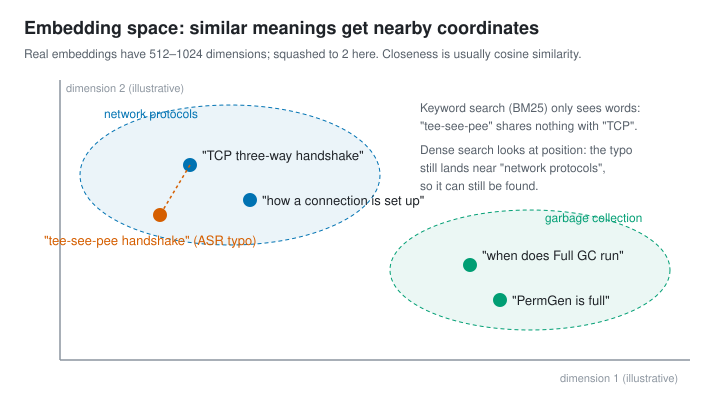

That's why dense retrieval resists speech noise: the misheard "tee-see-pee handshake" and "TCP three-way handshake" share no words, so BM25 can't connect them, but their embeddings are close. Report section 5 measured that on spoken-style questions BM25 found the right passage 52% of the time and DashScope embeddings 85%.

A **vector database** (vector store) stores vectors and finds nearest neighbors. For small data, an array and brute-force comparison are enough: my project stores each knowledge pack's vectors in a local file and compares them one by one at query time (`denseSearch` in `electron/kbVectors.ts`). Only big data needs FAISS, Milvus and similar databases with approximate-nearest-neighbor (ANN) indexes. Finding neighbors in a complex of a few dozen homes, you can knock on every door; in a city of millions, you divide it into districts and only search the nearby ones.

### 5.4 Hybrid search and RRF

BM25 is good at exact terms and embeddings at synonyms and typos, so combining them gives **hybrid search**. The most common way to merge results is **RRF** (reciprocal rank fusion): each method produces a ranking, and a passage's final score is the weighted sum of `1 / (k + rank)` across rankings. It looks only at ranks, ignoring that the methods' scores live on different scales. Think of a talent show with several judges, some strict and some lenient: adding raw scores isn't fair, so RRF only uses each judge's **ranking**: first place earns the most, and each later place earns less.

My project (`electron/kbSemantic.ts`):

- local mode is `RRF(BM25, bge)` with weights 1:1; DashScope mode is `RRF(BM25, DashScope)` with weights 1:2, giving the more accurate DashScope a bigger say;
- `k = 60` (`rrf` in `electron/kbVectors.ts`);
- each embedding model has a cosine floor (0.5 for bge), and results below it are dropped;
- if vectors aren't built yet, the query times out, or nothing clears the floor, it falls back to plain BM25. Retrieval must never block an answer.

### 5.5 Reranking and "how many passages"

**Reranking** first retrieves a few dozen passages roughly, then reorders them with a finer model, like a talent show's open audition followed by the semifinal: the audition must be fast, the semifinal must be accurate. The report didn't test reranking but tested a related question: how many passages should the model get in the end? In report section 4.2, 5 passages beat 3 by 6–12 points fully correct, while 8 brought no consistent gain.

### 5.6 Table-of-contents retrieval: PageIndex

**PageIndex** takes a different road: no chunking and no embeddings. It first builds a "table-of-contents tree" for the document; to answer, the model reads the outline, picks sections, then reads the matching pages. It's the reading method we were all taught as kids: check the contents, then turn to the chapter. It really is more accurate, and it really is slower; flipping through a book has never been fast. It's essentially **agentic retrieval** (retrieval driven by the model, see chapter 8). Report section 4.3 measured it as more accurate than BM25 and dense retrieval, especially on noisy questions, but each question needs about 3 extra model calls and takes about 5 s longer.

## 6. Three embedding models: bge-small, Qwen3-Embedding, DashScope

The report's three embedding models stand for three ways of deploying. Think of coffee:

- **bge-small (CPU)** is instant coffee at home: always at hand, free, tastes okay;
- **Qwen3-Embedding (GPU)** is a coffee machine at home: you need the machine (a graphics card) first, but the result is about as good as the café's;
- **DashScope** is the café downstairs: the best taste and nothing to prepare, but it costs money and you have to carry your "material" out the door.

In detail:

| | bge-small-zh-v1.5 (q8, CPU) | Qwen3-Embedding-0.6B (GGUF Q8_0, GPU) | DashScope text-embedding-v4 |
| --- | --- | --- | --- |
| What it is | A small Chinese embedding model from BAAI | The embedding model of Alibaba's Qwen3 series, 0.6B parameters | Alibaba Cloud Bailian's online embedding service |
| Runs on | Local CPU | Local graphics card | Alibaba Cloud servers |
| Model size | About 24 MB (q8 quantized) | 639 MB (Q8_0 quantized) | No download |
| Dimensions | 512 | 1024 | 1024 by default, 64–2048 available |
| Runtime | transformers.js (ONNX) | llama.cpp (GGUF) | HTTP API (OpenAI-compatible format) |
| Cost | Free | Free (needs a GPU) | 0.5 CNY per million tokens |
| Privacy | Material stays local | Material stays local | Material is uploaded |
| Right passage found (clean / speech noise) | 83.3% / 77.1% | 95.8% / 91.7% | 97.9% / 91.7% |
| Query time | 1–4 ms | About 20 ms | About 150 ms (network) |

(The last two rows come from report section 7, with 5 passages and at most 3 per document.)

Some terms:

- **q8 / Q8_0**: 8-bit **quantization**, compressing model weights from 16 bits to about 8, halving the size with almost no quality loss (chapter 10).
- **GGUF**: llama.cpp's model file format, packing weights, tokenizer and metadata into one file, like a shipping container with every part and the manual inside, ready to carry off.
- **ONNX**: a general model interchange format; transformers.js uses it to run models in JavaScript without Python.
- **Query instruction prefix**: bge adds a fixed instruction when embedding a **question** but not when embedding a **passage** (`electron/embed/contract.ts`). Many embedding models have such a convention, and getting it wrong costs accuracy. It's like sticking an "I am a question" label on the question so the model can tell it apart from the material.

**How my project uses them**:

- bge-small is built in: the model files are downloaded from Hugging Face's `Xenova/bge-small-zh-v1.5` at a pinned version (`electron/embed/modelFiles.ts`) and run in a separate Electron child process (`electron/embed/embedders.ts`) so the interface never blocks.
- DashScope is optional: material is uploaded only after the user **explicitly clicks** to build the index, because it costs money and hands the material over.
- Qwen3-Embedding has only been tested in the experiments (`experiments/07b-embeddings`). It matches DashScope and is a worthwhile future feature.


## 7. How frameworks are built: LangChain, LlamaIndex, LangGraph

First, to be clear: **my project itself doesn't use any of these three frameworks**. Its retrieval is hand-written TypeScript: chunking plus BM25 is 405 lines with no dependencies. The frameworks appear only in comparison experiments: `experiments/02-frameworks` rebuilds the same retrieval pipeline in LangChain and LlamaIndex, and `experiments/08-langgraph` builds an agent in LangGraph. This chapter uses those two experiments to show what the frameworks are made of.

A nickname for each, to make them stick:

- **LangChain** is a box of **LEGO bricks**: lots of parts with uniform connectors, and you build what you like;
- **LlamaIndex** is a **librarian**: hand over your books, it builds the catalog, and you just ask questions;
- **LangGraph** is a **subway map**: each station does one job, conditions decide the next stop, and lines can loop back.

### 7.1 LangChain: a box of standardized bricks

LangChain splits an LLM application into parts with uniform interfaces; you choose which to use and how to connect them. Parts used in experiment 02 (`experiments/02-frameworks/pipelines.py`):

| Part | Role | How experiment 02 used it |
| --- | --- | --- |
| `Document` | Text plus metadata | One Document per note |
| Text Splitter | Chunking | `RecursiveCharacterTextSplitter`, 1000 characters per chunk, 200 overlap |
| `Embeddings` | Calls an embedding model | `OpenAIEmbeddings` pointed at DashScope's `text-embedding-v4` |
| Vector Store | Stores vectors, finds nearest neighbors | `InMemoryVectorStore` (in memory) |
| Retriever | A uniform "question in, passages out" interface | The vector store's `.as_retriever()`; `BM25Retriever` (space-split by default, jieba added once tuned) |
| Chat Model | Calls a chat model | `ChatOpenAI` pointed at DeepSeek's deepseek-chat |
| Runnable / LCEL | Chains parts into a pipeline with `|` | This experiment only took retrieval results; one shared script did the answering |
| Callbacks | Hooks before and after calls (usage, timing) | Experiment 08 counted token usage with them; calls inside conditional edges escape them, so count at the call site |

Three traps with non-OpenAI services (report section 8): `OpenAIEmbeddings` sends token ids instead of text by default; DashScope takes at most 10 items per batch; it returns HTTP 400 when busy, and the client doesn't retry by default. Once fixed, LangChain's dense retrieval reached 67% fully correct, on par with the hand-written implementation.

### 7.2 LlamaIndex: built around the index

LlamaIndex starts from "build the material into an index, then query the index":

| Part | Role | How experiment 02 used it |
| --- | --- | --- |
| `Document` / `Node` | Original document / chunk | The same notes |
| Node Parser | Chunking | `SentenceSplitter`, 1024 tokens with 200 overlap by default; 400 / 60 when tuned |
| Embedding | Embedding model | `OpenAILikeEmbedding` pointed at DashScope |
| `VectorStoreIndex` | Vector index | Top 2 most similar by default (`similarity_top_k=2`), 3 when tuned |
| `BM25Retriever` | Keyword retrieval | English stemming and tokenization by default, useless for Chinese |
| Query Engine | Retrieval + prompt + answer in one | `.as_query_engine()` as shipped: 77% fully correct, but no streaming |
| `Settings` | Global default models and parameters | Sets the default models in one place |

LlamaIndex's dense defaults are less fuss than LangChain's and reach 77% with tuned chunking. But the two frameworks plus dependencies come to 103 Python packages and 346 MB, with 1–5 s imports. For a project packaged as a desktop app where every second counts, that's why neither was adopted: if all you want is to slice a cucumber, you don't move the whole kitchen into your house.

### 7.3 LangGraph: drawing the flow as a graph

LangGraph describes a flow as a **graph**: nodes are steps, edges say "where next", and conditional edges branch on the current state. It suits agents with loops and decisions. Experiment 08 (`experiments/08-langgraph/agent.py`) built this graph following the official agentic RAG tutorial:

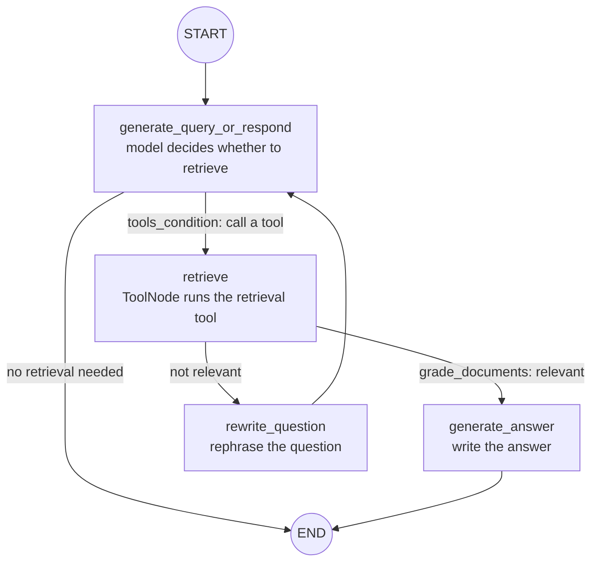

The parts:

- `StateGraph(MessagesState)`: the graph's state is the message list, which every node reads and writes.
- `add_node` / `add_edge` / `add_conditional_edges`: add nodes, plain edges and conditional edges.
- `ToolNode`: runs whatever tool the model asked for (here the retrieval tool `retrieve_notes`).
- `tools_condition`: checks whether the model issued a tool call this step and picks the next edge.
- Models used: deepseek-chat for answering and judging relevance (`ChatOpenAI`, temperature 0.2, at most 400 output tokens); DashScope `text-embedding-v4` for embeddings, stored in `InMemoryVectorStore`.

Results (report section 8): about 4 points more fully correct than single retrieval, within the interval; rewriting triggered on only 2–4% of questions; 3 model calls per question, over 5 s end to end, about 15× the cost. **Single-hop Q&A doesn't need an agent loop**: it behaves like an over-conscientious intern who checks in three times per question and hands in about what you'd have found yourself.

### 7.4 Mapping to my project's hand-written version

| Framework part | Hand-written equivalent |
| --- | --- |
| Text Splitter | `chunkDocument` in `shared/retrieval.ts` (by heading, 400 / 600 / 80) |
| BM25 Retriever | `Bm25Index` in `shared/retrieval.ts` (Chinese tokenization, heading boost) |
| Embeddings | `electron/embed/` (bge child process) + DashScope HTTP calls |
| Vector Store | `PackVectors` in `electron/kbVectors.ts` (one local vector file per knowledge pack) |
| Ensemble / Hybrid Retriever | `rrf` in `electron/kbVectors.ts` + `electron/kbSemantic.ts` |
| Prompt Template | `electron/llm/prompts.ts` (three layers, cache-friendly) |
| Chat Model | A streaming HTTP client calling OpenAI-compatible APIs directly |

**When to use a framework**: for quick prototypes inside a Python service, or when you need its ready-made connectors to dozens of data sources and vector stores, a framework pays off. For latency-sensitive, streaming products packaged as desktop apps, a few hundred hand-written lines are easier to control.


## 8. Agents: models that call tools themselves

### 8.1 Tool calling (function calling)

In a plain chat, a model can only output text. **Tool calling** attaches a set of "tool descriptions" (name, purpose, a JSON Schema for parameters) to the request. Instead of answering directly, the model can return a structured call, such as "call `get_page_content` with `pages: "12-13"`". The program runs the tool and sends the result back as a `tool` message, and the model decides what to do next.

Think of the model as a consultant who can talk but can't use their hands: they can write a note saying "please turn to pages 12–13", but the program is the one that turns the pages. The tool descriptions are the "list of assistants you can call on" handed to the consultant.

### 8.2 The agent loop and ReAct

An **agent** lets a model repeat "think a step → call a tool → look at the result" in a loop until it decides it can answer, like a detective: examine a clue, reason a bit, go find the next clue, until the case is closed. **ReAct** (Reason + Act) is the best-known prompting pattern for this.

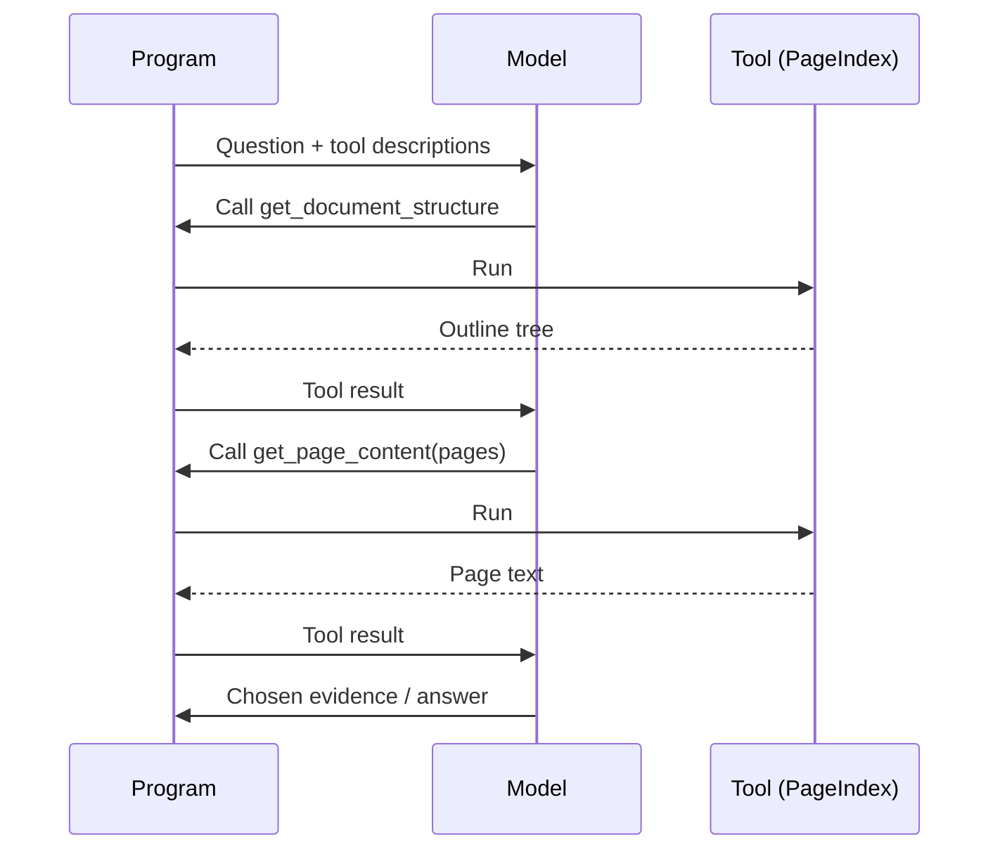

This is exactly the flow of the PageIndex controlled group in report section 4.3 (`experiments/11-pageindex/adapter.py`): about 3 model calls per question on average, capped at 6 calls and 120 s. To prevent "invented evidence", the program only lets the model choose passages from pages it **actually read**.

The report also records the price of agents: every extra loop adds one model call's latency and cost. PageIndex made 4.06 requests per question and took about 6.4 s end to end.

### 8.3 MCP

**MCP** (Model Context Protocol) is an open protocol defining how tools and data sources are exposed to model applications in a uniform way. With it, one tool service can be used by different agent clients without writing an adapter for each. The common analogy is "USB-C for AI": every device used to have its own charger and the drawer was full of cables; now there's one port and you just plug in. The PageIndex SDK also offers its tools over MCP; this report used its local Python tools instead.

### 8.4 Controlled vs native flows

The report tested PageIndex in two groups:

- **Controlled**: I control the loop, the evidence limits and the final answer prompt, for a like-for-like comparison with the other methods.
- **Native**: the official `chat_completions`, where the SDK decides how to retrieve and how much to read.

The native group read more text (5208 characters on average vs about 900 for controlled), and its streaming mixes narration like "let me look that up" with the answer, so its first answer token is unobservable. The lesson: **the same tool used differently is a different experiment**.

## 9. Hardware basics: CPU, GPU and VRAM

The previous chapters were about how the software is put together. This one adds the hardware: what a model actually runs on, why VRAM is never enough, and why generation speed is limited by "bandwidth" rather than "compute". Every example uses the report's laptop: an Intel i9-13980HX, 16 GB of RAM and an NVIDIA RTX 4060 Laptop GPU (8 GB of VRAM).

### 9.1 CPU and GPU: a few all-rounders vs a crowd of line workers

- A **CPU** (central processing unit) has a small number of powerful **cores** (this i9 has 24 cores and 32 threads). Each core handles complex branching logic on its own, which suits "many varied steps" work like operating systems, web pages and business code. CPUs can also process a small batch of numbers per instruction with **SIMD** (such as AVX2), so small models run on a CPU too.
- A **GPU** (graphics processing unit) has thousands of simple compute units and excels at "the same operation on huge amounts of data at once". The core of LLM computation is **matrix multiplication**: billions of weights times the input, each multiply-add independent, which is exactly what GPUs are best at.
- A **graphics card** isn't just the GPU chip; it carries its own dedicated memory, **VRAM**. To run a model on the GPU, its weights must first be moved into VRAM.

An analogy: the CPU is a few master chefs who can cook anything; the GPU is thousands of helpers who can only chop vegetables. To julienne ten tons of potatoes, thousands of helpers crush the master chefs. LLM inference happens to be those ten tons of potatoes.

That's the division of labor in the report: the 24 MB bge-small embedding model is fast enough on the CPU (1–4 ms per passage), while multi-gigabyte answer models need the GPU.

### 9.2 How a GPU is organized: SMs, threads, warps and kernels

Using NVIDIA as the example (terms from the CUDA programming model):

- An **SM** (streaming multiprocessor) is a "workshop" of the GPU. The RTX 4060 Laptop has 24.
- Each SM has two kinds of compute units:
  - **CUDA cores** for ordinary floating-point and integer math, 3072 on this card;
  - **Tensor Cores**, specialized for matrix multiplication in low-precision formats like FP16 and INT8, the workhorses of LLM inference.
- A **thread** is the smallest unit of execution. 32 threads form a **warp**, and all threads in a warp execute the same instruction at the same moment, like a row of people doing morning exercises: one command, 32 identical moves. Several warps form a **thread block**, which is scheduled as a whole onto one SM.
- A **kernel** is a function that runs on the GPU, such as "compute one attention layer", like one step on the workshop's production line. Inference engines (llama.cpp, vLLM) are built from piles of kernels.
- **FLOPS** (floating-point operations per second) measures compute, like a chef's chopping speed. **Bandwidth** is how many bytes per second move between memory and the compute units, like how wide the conveyor belt is from the warehouse to the kitchen. However fast the chef, if the belt doesn't deliver, the chef waits. As we'll see, LLM inference often gets stuck on the "conveyor belt".

### 9.3 The GPU memory hierarchy

GPU memory is a pyramid: the closer to the compute units, the faster and smaller. Remember it as cooking:

| Memory | Cooking analogy |
| --- | --- |
| Registers | The scallion in your hand |
| Shared memory / L1 | The cutting board by the stove |
| L2 cache | The fridge behind you |
| VRAM (global memory) | The warehouse downstairs |
| System RAM | The logistics center on the edge of town, across an often-jammed road (PCIe) |

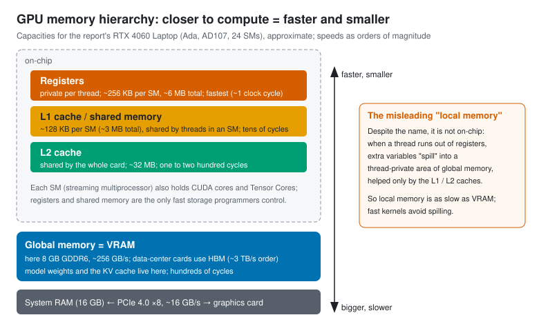

From top to bottom:

1. **Registers**: private to each thread and fastest (about 1 clock cycle). About 256 KB per SM, about 6 MB on the whole card.
2. **Shared memory** and **L1 cache**: on-chip, carved from the same SRAM in adjustable proportions. About 128 KB per SM; threads in one block exchange data through shared memory. Registers and shared memory are the only fast storage a programmer controls directly.
3. **L2 cache**: shared across the card, about 32 MB, managed by the hardware.
4. **Global memory** is the **VRAM**. This card has 8 GB of **GDDR6** at about 256 GB/s. Data-center GPUs (such as the H100) use **HBM** (high bandwidth memory), stacking memory chips right against the GPU package for bandwidth on the order of 3 TB/s, over ten times GDDR6. That's like building the warehouse right next to the kitchen with a dozen conveyor belts, and paying a lot more for it. Model weights and the KV cache live here.
5. **System RAM**: the CPU side's 16 GB, connected to the card over the **PCIe** bus. This card uses PCIe 4.0 ×8 at about 16 GB/s, more than an order of magnitude slower than VRAM.

**A misleading name: local memory**. Despite being called "local", it is **not on the chip**, like a real-estate ad that says "downtown" for a place an hour's drive away. When a thread has more variables than its registers can hold, the extra ones "spill" (register spill) into a thread-private area of global memory, accelerated only by the L1 and L2 caches. Local memory is therefore about as slow as VRAM, and high-performance kernels try hard to avoid spilling.

**What happens when VRAM runs out**: the Windows graphics driver lets part of system RAM act as "shared GPU memory". If a model doesn't fit in 8 GB of VRAM, the overflow is read across PCIe and speed collapses, like a warehouse too full to hold everything, so part of the stock goes to the logistics center out of town and every pickup crawls along that jammed road. In report section 6, Apertus-8B Q6_K took 7.7 GB after loading, needed 82 s to cold-start and stayed slow afterwards, very likely for this reason.

### 9.4 Where the KV cache lives and how it moves

First, attention in one paragraph. For every token it reads, a model computes three vectors:

- **Q** (query): "what am I looking for";
- **K** (key): "what am I";
- **V** (value): "what information can I offer".

To generate the next token, the new token's Q is compared with the K of **every** earlier token, and their Vs are summed, weighted by those similarities.

Picture looking for material in a library: Q is the request slip in your hand, K is the label on each book's spine, and V is the book's content. You compare your slip against every label, and the better a label matches, the more carefully you read that book.

Earlier tokens' K and V never change, so they are computed once and stored for reuse: that's the **KV cache**, like copying each book's label and a summary of its content into a notebook so you don't have to fetch it from the shelf every time.

Where the KV cache lives and how it moves:

- **It always lives in VRAM (global memory)**, because it's far too big for on-chip caches.
- During attention, a kernel moves K and V from VRAM into shared memory and registers **one tile at a time**, finishes that tile on the chip, keeps only the running result, and fetches the next tile. Data brought onto the chip is discarded after use; it is **not** moved back for long-term storage. Like carrying vegetables up from the warehouse one crate at a time and cooking each crate before fetching the next, instead of dumping the whole warehouse into the kitchen.
- When the new token's own K and V are computed, they are appended to the KV cache in VRAM.
- **FlashAttention** (`-fa on` in llama.cpp) is the algorithm that takes this "tile, fetch and compute as you go" approach to the extreme: it never writes the huge intermediate matrix back to VRAM, so it's faster and uses less memory.

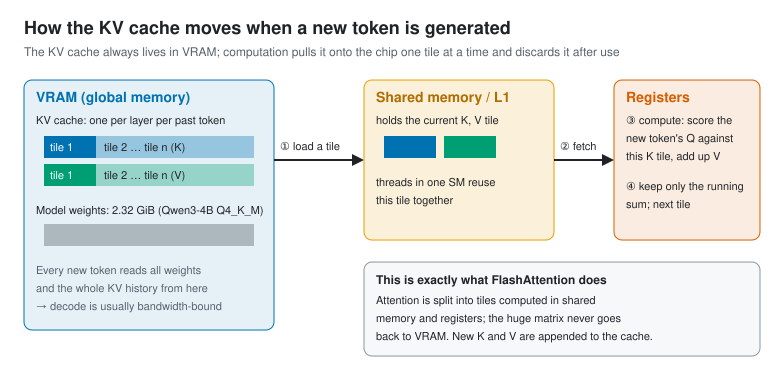

**How big is the KV cache? You can calculate it**:

```
KV bytes per token = 2 (K and V) × layers × KV heads × dimensions per head × bytes per number
```

The report's Qwen3-4B-Instruct-2507, read from the model file's GGUF metadata, has 36 layers and 32 query heads but only 8 KV heads, with 128 dimensions per head.

- **f16** (2 bytes per number): 2 × 36 × 8 × 128 × 2 = 147456 bytes, i.e. **144 KiB** per token.
- × 8192 tokens = **1152 MiB**; × 16384 tokens = 2304 MiB.
- **q8_0** (8.5 bits per number on average): 1152 × 8.5 ÷ 16 = **612 MiB**, a reduction of 1 − 8.5 ÷ 16 = **46.875%**.

This matches the allocation measured from runtime logs in report section 9.1 exactly: theory and measurement agree.

A memory-saving design hides in there too: 32 query heads share 8 sets of K and V. This is **GQA** (grouped-query attention), and it makes the KV cache a quarter of what it would be if every head had its own KV, like 32 students sharing notebooks in groups of four, so you only need a quarter as many notebooks.

**Longer context and more concurrency mean a bigger KV cache**: each extra slot needs its own context's worth of KV. That's why the report's 8635-token whole pack didn't fit in the 8192-context configurations.

### 9.5 Compute or bandwidth: prefill and decode get stuck in different places

One idea measures where you're stuck: **arithmetic intensity**, the number of operations performed per byte read from VRAM.

- **Prefill** (reading the input) processes hundreds or thousands of tokens at once; one pass over the weights serves all of them, so there's lots of math and relatively little moving. It's **compute-bound**, like bringing a big load of ingredients up from the warehouse to cook a whole banquet: one trip, many dishes.
- **Decode** (generating token by token) must read **all the weights** and the whole KV history from VRAM for **every single** token, while doing little math. It's **memory-bound** (bandwidth-bound), like hauling every spice in the warehouse upstairs for each small dish: the carrying is far more work than the cooking.

**An estimate for this laptop**: the Qwen3-4B Q4_K_M model file is 2.32 GiB (about 2.5 GB). Each token requires reading it at least once, and VRAM bandwidth is about 256 GB/s, so single-stream generation tops out at roughly 256 ÷ 2.5 ≈ **100 tokens/s**. Report section 10 measured about 46 tokens/s for a single stream, the right order of magnitude once you add KV reads and kernel scheduling overhead. This is an estimate, not a measured ceiling.

**Why concurrency raises total throughput**: with 4 requests generating at once, one read of the weights serves 4 tokens. In report section 10, 4 concurrent streams on 4 slots raised total output from 46 to 96 tokens/s. That's the point of **batching**, like carpooling: the car (one pass over the weights) makes the trip anyway, so extra passengers cost almost nothing. Server engines' continuous batching (chapter 10) takes the idea further.

This "is it compute or bandwidth?" analysis is the **roofline model**. Plot arithmetic intensity on the x-axis and achievable performance on the y-axis, and performance is capped by two lines at once: a sloped "bandwidth" line and a flat "compute ceiling". The plot looks like a roof with a slope: a program either hits the slope (ingredients can't arrive fast enough) or the flat top (the chef's hands are maxed out), and how to go higher depends on which side of the roof you're on.

### 9.6 Budgeting VRAM

Whether a model fits on a card is like measuring furniture before a move: the living room (VRAM) is only so big, and the sofa (weights), coffee table (KV cache) and walkway (compute buffers) all have to fit. Roughly:

```
VRAM used ≈ model weights + KV cache + compute buffers + system and other programs
```

For the local Qwen3-4B in report section 6 (KV in q8_0, context 16384):

- weights 2.32 GiB;
- KV cache 1224 MiB;
- plus compute buffers and system use (0.6–1.2 GB); the measured total was 5.0 GB, which roughly adds up.

An 8B model in Q6_K needs over 6 GB for the weights alone; with KV and system use, an 8 GB card is nearly full (7.7 GB measured). That's why the report recommends Q4_K_M for 8B models on an 8 GB card.

### 9.7 On the CPU side: memory, bandwidth and other chips

- **System RAM** has much lower bandwidth than VRAM (dual-channel DDR5 is in the range of several tens of GB/s up to about a hundred), so generating with a big model on the CPU is much slower. Small embedding models don't care: bge-small processes 31–41 passages per second on the CPU (report section 10).
- **Unified memory**: Apple's M-series chips let the CPU and GPU share one pool of memory with no PCIe copying, so they can run models larger than a typical "VRAM" size. It's like knocking down the wall between kitchen and warehouse into one big open space where everything is within reach; the catch is that this open space's "conveyor belt" is usually narrower than a discrete card's VRAM.
- **NPU** (neural processing unit): an AI accelerator built into some new laptop processors. It's power-efficient, but mainstream local inference tools support it only partially so far, like a new helper who can do the work while most foremen don't yet know how to give him orders. The report didn't use one.

## 10. Inference and AI infrastructure: KV cache, quantization, concurrency

### 10.1 Prefill and decode

A model produces an answer in two phases:

- **Prefill**: read the entire input at once and compute every token's intermediate results. Longer input takes longer; this phase determines **first-token latency**. It's "reading the question" in an exam.
- **Decode**: generate one token at a time; this phase determines **output speed**. It's "writing the answer word by word".

### 10.2 KV cache and prefix caching

During prefill, the Keys and Values computed for each token are stored: that's the **KV cache**. Every new token looks back at them, so the KV cache keeps occupying VRAM and grows with context length. Where it lives, how it moves and how big it is: see section 9.4.

If the next request **starts** exactly like the previous one, that part can be reused directly. This is **prefix caching**.

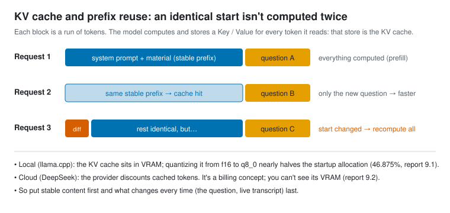

Three measurements from the report:

- **Local (llama.cpp)**: with a shared prefix, median first-token time for short retrieval requests dropped from about 170–220 ms to about 35–39 ms (report section 9.1).
- **Local KV quantization**: switching the KV cache from f16 to q8_0 cut startup allocation by 46.875% (for example from 2304 MiB to 1224 MiB at 16384 tokens).
- **Cloud (DeepSeek)**: once a stable prefix hits the cache, whole-pack input cost drops by about 96%, but first tokens don't get consistently faster (report section 9.2). A cloud cache is a **billing concept**; you can't see the server's VRAM.


This is why section 1.3 layers the prompt: stable content first, the ever-changing question last.

### 10.3 Quantization

**Quantization** stores model weights (or the KV cache) with fewer bits, trading a little precision for smaller size and lower memory use. Like compressing a phone photo from the original to a regular JPEG: the file shrinks several times and you can barely see a difference, but compress too hard and the picture turns to mush.

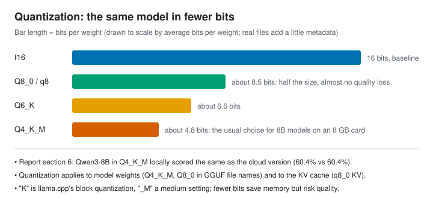

- **f16 / bf16**: 16-bit floating point, usually the "original" baseline.
- **Q8_0**: about 8.5 bits, nearly lossless.
- **Q4_K_M**: about 4.8 bits, the usual choice for 8B models on an 8 GB card. In report section 6, Qwen3-8B Q4_K_M locally scored the same as the cloud version (60.4% on retrieval for both).
- Fewer bits save more memory but risk more quality; an 8B Q6_K model nearly fills an 8 GB card and takes 82 s to cold-start.

### 10.4 Inference engines: llama.cpp and vLLM

- **llama.cpp**: an inference engine written in C/C++, good at running GGUF quantized models on personal computers (CPUs, consumer GPUs, Macs). `llama-server` offers an OpenAI-compatible HTTP API. All the report's local models ran on it. Common flags:
  - `-ngl 99`: put as many layers as possible on the GPU (GPU offload);
  - `-c`: context length;
  - `-fa on`: enable Flash Attention, a faster and more memory-efficient way to compute attention;
  - `--parallel` / slots: number of parallel slots, each serving one request at a time.
- **vLLM**: a server-oriented inference engine whose core technique is **PagedAttention**, managing the KV cache the way an operating system manages memory pages to reduce fragmentation. Like a parking lot that hands out single spaces instead of reserving a whole row for each convoy, so empty spaces aren't held hostage. Combined with **continuous batching** (requests join the running batch as they arrive), it greatly raises throughput under high concurrency, like a bus that lets people on and off at every stop instead of waiting until it's full to leave. The report didn't test vLLM; it's introduced here only as a concept.

In one line: llama.cpp is a home rice cooker, compact and handy, cooking for a few people at a time; vLLM is a canteen's industrial steamer, built to feed hundreds at once.

### 10.5 Throughput and latency

- **Latency**: how long one request waits, which users feel directly.
- **Throughput**: how much gets processed per unit time in total (tokens/s or requests/s), which decides how many people you can serve.

Think of a highway: latency is how long **one car** takes to drive the whole route; throughput is how many cars pass **per hour**. More cars mean more total traffic, until it jams and every car slows down. The two often pull against each other. In report section 10, with 4 local slots, 1–4 concurrent streams had first tokens at 0.26–0.46 s and total output rose from 46 to 96 tokens/s; at 8 streams, more than the slot count, requests queued and the first token rose to 2.8 s. In the cloud, deepseek-chat's first token barely changed at 16 concurrent streams, while qwen3.8-flash slowed noticeably.

For budgeting VRAM, see section 9.6. Note that the report measured the KV **startup allocation**; how many bytes are actually occupied at runtime isn't exposed by llama.cpp, so the report records it as null instead of substituting total GPU memory.

## 11. Evaluation and cost: how to know you're not fooling yourself

First, the full path of one question from writing to grading. Every approach answers the same questions and only the "fetch material" step changes, so any difference really comes from that step:

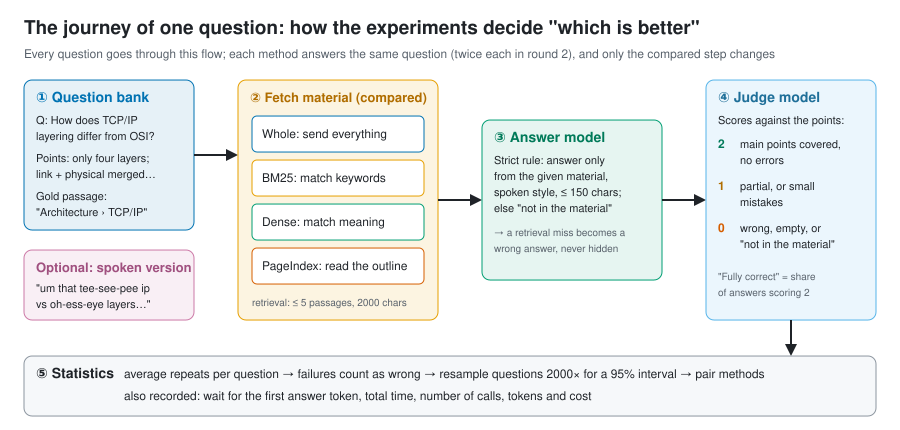

Two real examples show why the evaluation is designed this way (questions adapted from CS-Notes, CC BY-NC-SA 4.0):

- **Finding it isn't answering it**. The question: "In a 2-D array increasing along rows and columns, how do you find a number efficiently?" Dense retrieval did put the gold passage into the evidence, but the model saw only the problem and an example, not the solution, so it answered "no solution in the material" and scored 0. That's why the report checks the final answer, not just whether the gold passage was found.
- **Half an answer scores 1**. For a question combining the "reflection" and "PermGen" sections, the whole pack explained only the PermGen half and scored 1; approaches covering both scored 2. The headline "fully correct" rate counts only 2s, so "half right" isn't counted as right.

More real questions, answers and a card per experiment are in the [walkthrough](WALKTHROUGH.en.md).

### 11.1 Test sets and metrics

- **Test set**: questions plus reference answer points. The report uses the public CS-Notes, with model-generated questions and 2–4 points each.
- **Fully-correct rate**: the share of answers covering the main points with no errors (2 points).
- **Wrong rate**: the share of answers that are wrong or say "not in the material" (0 points).
- **Retrieval hit rate / evidence coverage**: whether the passage containing the answer was retrieved and put into the prompt. It shows the passage was "given", not that the answer "used" it.

### 11.2 LLM-as-judge

Using another model to score answers against the points is **LLM-as-judge**. It's cheap, fast and scalable; the downside is that the judge may favor its own vendor's phrasing and also makes mistakes, a bit like letting students mark their own exams: convenient, but hard not to go easy on yourself. The report's questions, answers and judging all came from the same vendor's models; this is listed as a known bias, and no human reviewed the scores.

### 11.3 Confidence intervals, bootstrap and paired comparison

Getting 38 of 48 questions right is 79.2%, but a different batch of questions might give 70% or 88%. A **confidence interval** describes that uncertainty.

- **Bootstrap**: draw 48 questions from the 48 at random with replacement and compute the accuracy; repeat 2000 times and take the middle 95% as the interval. Imagine writing the 48 questions on 48 cards in a hat: draw one, note it, put it back, 48 times, and that's one score. "Retaking the test" 2000 times shows how far the score wobbles. The report fixes the random seed at 7, so anyone recomputing gets the same result.
- **Paired comparison**: when two methods answer the same questions, subtract them question by question and bootstrap the differences. This is more sensitive than comparing two separate intervals. Like comparing two teaching methods by having the same students learn both, which is fairer than two different groups each learning one: the effect of easy or hard questions cancels out. That's how report section 4.3 concluded "PageIndex beats BM25 by 20.8 points, interval 7–35, not crossing 0".
- **An interval crossing 0 means no evidence of a difference**. PageIndex vs whole was +3.1 with an interval of −6–14, so the report can only say "not significant", not "PageIndex is better". Like two people whose heights differ by 3 cm measured with a ruler accurate to ±10 cm: you can't tell who's taller.
- **The question is the unit**: two answers to one question are averaged first, not counted as two independent samples, or the interval pretends to shrink. If asking a question twice counted as two questions, asking it a hundred times would make the interval narrow enough to move you to tears.
- **Failures count in the denominator**: a failed request is a wrong answer, never quietly dropped.

### 11.4 Cost engineering

- **Usage-based billing**: cost = input tokens × input price + output tokens × output price, with cached input tokens charged at a lower price.
- **Peak and off-peak prices**: DeepSeek charges half price off-peak; the report conservatively used peak prices.
- **Amortizing index builds**: PageIndex and dense retrieval both pay once to build an index. Spreading that over 1 / 10 / 100 queries makes per-question cost comparisons fair (report section 4.3).
- **Budget gateway**: every paid request first goes through a local proxy (`experiments/lib/gateway.cjs`). Before sending, it atomically reserves the "maximum possible cost"; once the API reports usage, it settles. Failed, truncated or usage-less requests keep their reservation and are never treated as free. Even if an SDK secretly retries internally, it can't exceed the budget. It's like giving a child a prepaid card with a limit instead of handing over your bank card.
- **Observability**: record every call's tokens, latency, cache hits and whether it was truncated. A pitfall from the report: the PageIndex SDK sends no output limit while indexing, so if the gateway defaulted to 512 tokens, summaries would be silently cut off, and only logging `finish_reason=length` would reveal it.

## 12. Engineering in practice: designing an enterprise agent invocation and billing platform

A common system-design interview question:

> Design an enterprise AI agent invocation and billing platform. Peak ingress is 20,000 QPS, and a single task can run for tens of minutes. Handle long-running tasks, quota deduction under high concurrency, accurate billing and high availability.

This chapter fills in the concepts first, then works through the problem step by step. The report's budget gateway happens to be a single-machine miniature of this design; the end of the chapter maps them piece by piece.

### 12.1 Concepts first

- **QPS** (queries per second): requests per second, a measure of ingress pressure.
- **Little's law**: the number of tasks in a system = arrival rate × average time in the system. It's the most important formula for estimating concurrency. Remember it with a bubble-tea shop: if 2 customers come in per minute and each stays 15 minutes, there are 30 people in the shop on average.
- **Synchronous vs asynchronous**:
  - synchronous is "wait here, I'll answer when I'm done", like standing at the counter watching your drink being made;
  - asynchronous is "here's a ticket (task_id), come back when it's ready", like taking a number and sitting down until it's called.
  - Long tasks must be asynchronous; an HTTP connection can't hang around for tens of minutes. Nobody stands at the counter for half an hour waiting for one bubble tea.
- **Message queue** (MQ, such as Kafka or RocketMQ): producers put messages in the queue, consumers take them at their own pace, like a bank's ticket machine and waiting area.
  - What it's for: **peak shaving** (a sudden rush queues first, so however crowded the lobby, the counters aren't overwhelmed) and **decoupling** (the ticket machine doesn't wait for a teller to finish).
  - Most MQs guarantee **at-least-once** delivery: messages aren't lost but may be duplicated, like a courier who'd rather deliver twice than ever lose a parcel. Consumers must therefore handle duplicates.
  - Messages that can't be processed go to a **dead-letter queue** (DLQ) to be isolated and handled separately, like a courier's "problem parcel" warehouse.
- **Redis**: an in-memory key-value database that handles on the order of a hundred thousand simple operations per second on one machine. It runs commands single-threaded, and a **Lua script** executes atomically with nothing slipped in between, which suits uninterruptible operations like "check the balance and deduct". But Redis persistence and replication can both lose the latest writes, so it's **not fit to be the only source of truth for a ledger**. Think of it as the notebook at the cash register: lightning fast, but now and then a page goes missing; the real books stay locked in the safe (the database).
- **Database transaction**: a group of writes either all succeed or all fail, like a bank transfer: "take 100 from your account" and "add 100 to mine" must happen together, never just one of them. Money data such as ledgers and freeze records belongs in a relational database with transactions.
- **Eventual consistency**: across several systems (database, Redis, MQ), no single transaction can guarantee everything succeeds together; you can only guarantee they "line up after a while". The usual technique is the **outbox pattern**: write the "message to send" in the **same database transaction** as the business data, and let a background process deliver messages from the outbox table to the MQ. Like jotting "letters to mail" at the bottom of the same diary page, with someone flipping through the diary daily to post them: if the diary entry exists, the letter will be sent; "written but forgot to send" can't happen.
- **Idempotency key**: the client gives each request a unique ID, and the server uses a unique constraint so each ID is processed once; retries never double-charge or create duplicate tasks. It's an order number: for one order number, the warehouse ships once.
- **Lease and heartbeat**: when a worker claims a task it gets a time-limited "lease", say 30 seconds, and renews it periodically, like a library loan you must renew before it's due, or the book goes to someone else. If the worker dies and the lease expires, another worker can take over the task.
- **Fencing token**: every reassignment issues an increasing number that must accompany writes; writes with an older number are rejected. This stops an old worker that "seemed dead" and woke up from writing alongside the new one, like a landlord changing the locks so the previous tenant's old key no longer opens the door.
- **Checkpoints and event sourcing**: a long task logs each completed step (which model was called, what the tool returned). After a restart it continues from the last step instead of starting over, like a **save point** in a video game: nobody wants to replay from level one because the power went out.
- **Rate limiting, circuit breaking, backpressure**:
  - **token-bucket** rate limiting hands out tokens at a fixed rate and only lets requests with a token through, like a theme park admitting visitors at a steady pace;
  - a **circuit breaker** stops calling a downstream service that keeps failing, preventing a cascade, like the breaker in your home that trips when a circuit overloads to protect the whole building;
  - **backpressure** makes upstream slow down or reject new requests when downstream can't keep up, like a swamped kitchen telling the front counter to pause takeout orders.
- **Reconciliation**: periodically check two independent records against each other, such as the internal ledger and the provider's bill, alerting and correcting on any difference, like comparing your own expense notebook with your bank statement at the end of the month.

### 12.2 Step one: clarify requirements and estimate

A common line of reasoning: 20,000 QPS is the ingress peak, but tasks run for tens of minutes, so a huge number of tasks run at once and HTTP connections can't wait for results. **The direction is right, but the estimate has to be accurate.**

By Little's law: if **all** 20,000 QPS were new tasks averaging 30 minutes (1800 seconds), the number running at once would be 20000 × 1800 = **36 million**, not a few hundred thousand. 36 million agents running at once, each calling LLMs constantly, is unrealistic in both cost and compute. So in the interview, first ask: **how much of the 20,000 QPS is new long-running tasks?**

A more realistic split:

| Request type | Assumed share | Rate | Notes |
| --- | --- | --- | --- |
| Status queries, polling | Most | About 15,000 / s | Read-only, can be cached |
| Short synchronous calls (one Q&A) | Some | About 5,000 / s | Done within seconds |
| New long tasks | Few | About 200 / s | 200 × 1800 ≈ **360,000** running at once |

The shares are assumptions; say them out loud in the interview and ask the interviewer to confirm. With 360,000 running tasks, estimate further:

- **Task state storage**: state plus checkpoints is a few KB per task, so a few GB for 360,000, which one database cluster can hold.
- **Usage events**: if each task calls a model every 10 s on average and reports one usage event per call, that's 360,000 ÷ 10 = **36,000 events / s**. That volume must go through an MQ with batched writes, never a synchronous balance update per event.
- **Number of workers**: agents spend most of their time waiting for models, so the work is I/O-bound. One worker process with async I/O can drive hundreds to thousands of tasks, so a few hundred worker instances can carry the load.

### 12.3 Overall architecture: fast in, fast out

The main idea: **synchronous requests only "take the order"; they never "do the work"**.

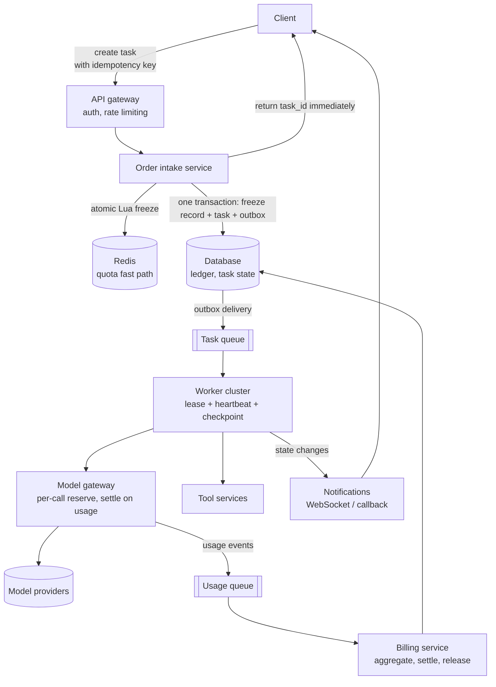

1. **Gateway**: authentication, per-tenant rate limiting (token bucket), idempotency-key checks.
2. **Order intake**:
   - atomically "check available quota and freeze" with a Lua script in Redis;
   - write the freeze record, the task record and the outbox message in **one database transaction**;
   - return the task_id immediately.
3. **Task queue**: a background outbox process delivers tasks to the MQ, which absorbs peaks.
4. **Workers**: claim a task with a lease, send heartbeats, and checkpoint after every step.
5. **Model gateway**: every model call must go through it; it reserves per call, settles on usage and reports usage events. This is the key to accurate billing, detailed below.
6. **Billing service**: consumes usage events, aggregates them per task and settles when the task ends.
7. **Getting results**: the client polls task status or receives pushes over WebSocket / callbacks.

### 12.4 Quota: freeze first, settle later

**Why not deduct at the door**: a task runs for tens of minutes, and at the door you simply don't know how many tokens it will use or how many tools it will call. So deduction is split into two phases:

1. **Freeze an upper bound at the door**: "model tier × estimated token ceiling + tool-call ceiling", recorded as a freeze record. Freezing exists to **prevent overspending**.
2. **Settle on actual usage when the task ends**: deduct for real and release whatever was over-frozen; on failure, release according to the rules. Settlement is the **real charge**.

It's exactly how hotels work: at check-in the front desk places a **pre-authorization** on your credit card for a deposit (the freeze), at check-out you pay for what you actually used (settlement), and the rest of the hold is released. Nobody tries to guess at check-in how many minibar sodas you'll drink.

Beyond this main line, interviewers usually probe the following.

**① The freeze must be atomic**. If "is the balance enough?" and "deduct the frozen amount" are two separate steps, two concurrent requests can both see enough balance and both freeze, overspending in the end.

- Do it in one Redis Lua script: `available = balance − frozen; if enough, add this amount to frozen, otherwise reject`.
- Also write the freeze record to the database keyed uniquely by task_id. **The database is the ledger's source of truth; Redis is only the fast path**, and the two are reconciled regularly. If Redis loses data, it can be rebuilt from the database.

**② Hot tenants**. A large enterprise customer may send thousands of requests per second on one account, all hitting the same Redis key and creating a bottleneck, like every employee of a company crowding around a single ATM. Common fixes:

- split the quota into N **sub-buckets** and route each request to one at random, like opening several ATMs with part of the cash in each;
- or let each intake server **claim a small block of quota** from the total, deduct locally, and claim more when it runs out (the "segment allocation" idea), like giving each department petty cash and letting them request more when it's spent.

The price is fragmented quota: "enough in total but not in this bucket" can happen, so buckets need to rebalance between themselves.

**③ What if a long task exceeds its freeze midway?** The freeze is an estimated ceiling, and a running agent may go past it. Think of prepaying at a gas station: pay 200 up front and top up if needed; if the card is truly empty, pull over to the roadside instead of abandoning the car.

- Before each call, the model gateway reserves that call's upper bound from the task's frozen amount;
- when the remaining freeze runs low, it tries to **extend the freeze** from the tenant's balance;
- if the balance is also insufficient, **pause the task**: save a checkpoint and ask the user to top up or confirm, rather than killing it and wasting everything spent so far.

**④ Usage is multidimensional, and the basis must be consistent**:

- Instrument each dimension: input tokens, output tokens, cached tokens, tool calls, execution time, model tier.
- Freeze and settle with **the same version of the same price table**: record the price version on the freeze record and settle with it. Otherwise a price change mid-task produces "frozen at A, settled at B" mismatches.

**⑤ Accurate billing comes from per-call metering, not after-the-fact estimates**:

- After each call, once the provider returns usage, the model gateway emits a usage event **with a unique event_id**, stored idempotently.
- Final settlement = the sum of all the task's usage events, not a fresh estimate at the end.
- **When usage is unavailable** (a stream cut off midway, the provider returned no usage): never treat it as free. Record the call's reserved upper bound as "pending cost" and correct it later by reconciling with the provider's bill. This is exactly how the report's budget gateway "keeps unknown reservations".

**⑥ Idempotency end to end**:

| Step | Idempotency mechanism |
| --- | --- |
| Creating a task | The client's idempotency key; a unique constraint on task_id |
| Freezing | Freeze records keyed uniquely by task_id; a repeated freeze returns the existing result |
| Reporting usage | Unique event_id; duplicate events are dropped |
| Settlement | A state machine `frozen → settled / released`, using conditional updates (change only if the current state is "frozen") so it settles exactly once |
| Duplicate MQ delivery | Consumers deduplicate on the keys above |

**⑦ Handle failures by case**:

- A model call fails with no usage: release the whole freeze.
- Some tool calls succeed before a failure: settle for the completed part.
- A broken stream with unknown usage: charge the conservative upper bound provisionally and correct after reconciliation.
- The user cancels: settle the usage incurred and release the rest.

### 12.5 Long tasks and high availability: it's all about task state

The hard part of high availability isn't the gateway (it's stateless; just run more copies) but the **hundreds of thousands of half-finished tasks**. The gateway is the host at the restaurant door; swap in another and guests are still greeted. What's really nerve-racking is the hundreds of thousands of pots simmering in the kitchen: if a cook collapses, someone has to know how far each pot has cooked and carry on.

- **Persist task state**: the state machine (queued → running → paused / succeeded / failed) lives in the database, along with each step's checkpoint. Schedulers and workers can then be stateless and recover from the database after a restart.
- **Take over with leases and heartbeats**:
  - workers renew their leases periodically; if a worker dies, its lease expires, the task becomes claimable again, and a new worker continues from the last checkpoint;
  - fencing tokens stop an old worker that "comes back to life" from writing a second time.
- **Side effects of tool calls**: some tool calls must not run twice, such as "send an email" or "place an order". Either give tool calls idempotency keys too, or record "executed, result was X" in the checkpoint first and read that record on recovery instead of executing again.
- **MQ peak shaving and isolation**:
  - sudden spikes queue up first;
  - tasks that still fail after repeated retries go to the dead-letter queue, releasing their frozen quota automatically and notifying the user;
  - when the queue backlog passes a threshold, the gateway starts rate-limiting new tasks: backpressure.
- **Dependency failures**:
  - **Model provider** failure: open the circuit breaker and switch to a backup provider or model; timeouts need caps, and retries need attempt limits and backoff.
  - **Redis** failure: the billing path must **fail closed**, preferring to pause intake of new tasks over admitting tasks it can't freeze, which would overspend.
  - **Database**: primary-replica setup across availability zones.
- **Reconciliation and safety nets**:
  - regularly reconcile frozen amounts between Redis and the database, and the internal ledger against provider bills;
  - freeze records still unsettled after "the longest task duration + a buffer" should raise an alert and, once confirmed, be released automatically so quota isn't held forever.

### 12.6 Mapping to the report's budget gateway

The budget gateway written for the report's experiments (`experiments/lib/budget.cjs`, `gateway.cjs`) is a single-machine miniature of this design:

| Platform design | Budget-gateway counterpart | Difference in scale |
| --- | --- | --- |
| Freeze an upper bound at the door | Before each request, reserve "input bytes + max output tokens", a conservative bound | The platform freezes per task; the gateway reserves per call |
| Settle on actual usage | Replace the reservation with the actual cost once the provider returns usage | Same |
| Unknown usage is never free | Truncated streams, missing usage and HTTP failures keep their full reservation | Same |
| Atomic freeze | A cross-process directory lock plus "write temp file, then rename", so concurrent reservations can't overspend | The platform uses Redis Lua plus database transactions |
| Tiered quota | A 20 CNY total with per-stage caps that can't borrow automatically | Tenant / project / task levels |
| Auditable quota changes | Stage-cap changes recorded in the ledger's `capHistory` | Ledger entries |
| Retries billed separately | Every retry reserves again; SDK retries disabled | Idempotency and retry policy |
| Circuit breaker | Stop forwarding after 5 upstream failures in one process | Provider circuit breakers |
| Credential isolation | Children get only a temporary token; real keys stay in the gateway | The gateway holds provider credentials centrally |
| Every call must pass the gateway | Outbound connections are blocked, so SDKs can't bypass the gateway | The model gateway is the only exit |

This table works as a "project experience" story in an interview: a small but complete implementation showing that you personally handled the core problems of "reserve first, settle later, count unknown usage conservatively, never overspend under concurrency".

### 12.7 The spoken interview version (3–5 minutes)

**Order of the answer**:

1. **Clarify requirements (30 s)**: "How much of the 20,000 QPS is new long tasks? How long does a task run on average? What are the billing dimensions? How much overspend risk is acceptable?" Then state the Little's-law estimate: if everything were a long task, that's 36 million concurrent tasks, which is unrealistic, so assume about 200 new tasks/s, roughly 360,000 running at once.
2. **Overall architecture (1 min)**: fast in, fast out. Gateway auth and rate limiting → atomic freeze → one transaction writing the freeze record, task and outbox → MQ → workers execute in the background → return the task_id immediately; results come by polling or push.
3. **Billing (1–1.5 min)**:
   - freeze an upper bound first, settle on actual usage later;
   - every model call goes through the model gateway for per-call metering, with usage events stored idempotently by event_id;
   - freeze and settle with the same price version;
   - extend the freeze or pause when a task runs over midway;
   - count unknown usage conservatively and reconcile afterwards;
   - idempotency end to end.
4. **Long tasks and high availability (1 min)**:
   - persist task state and checkpoints;
   - worker leases plus heartbeats, so another worker resumes from the checkpoint if one dies, with fencing tokens preventing double writes;
   - tool side effects must be idempotent;
   - a dead-letter queue isolates failed tasks and releases their quota;
   - circuit breakers downstream, failing closed when a billing dependency is down.
5. **Trade-offs and safety nets (30 s)**: Redis is the fast path and the database is the ledger; hot tenants get bucketed; reconcile regularly; alert on and release freezes that stay unsettled too long.
6. **Bring in your project**: "In evaluating a personal project, I built a miniature budget gateway…" (see section 12.6)

**Common follow-ups and short answers**:

| Follow-up | Short answer |
| --- | --- |
| Redis deducted but the database write failed? | The database wins. Redis freezes carry an expiry; roll back the Redis freeze when the transaction fails, or let reconciliation release any "freeze with no freeze record" |
| Why not a distributed transaction (two-phase commit)? | Low throughput and complex. Outbox plus idempotent consumers give eventual consistency, enough for billing, with reconciliation as a safety net |
| Can duplicate message consumption double-charge? | No. Event_ids on usage events and the settlement state machine both guarantee idempotency |
| A task runs out of balance midway? | Try to extend the freeze first; if that fails, pause with a checkpoint and notify the user instead of killing the task |
| How do you prevent undercharging? | Model calls can only go through the model gateway, with outbound traffic blocked; missing usage is charged at the upper bound and reconciled with the bill later |
| The estimated freeze is so large it locks up the user's quota? | Default freeze ceilings per tier, overridable by the user; long tasks use "initial freeze + extend on demand" |
| A worker freezes and then recovers: can two workers run one task? | Takeover only happens after the lease expires, and writes carry fencing tokens, so writes with the old token are rejected |
| Prices change midway? | Freeze records store the price version; tasks already started settle at the original version |
| How do you handle 20,000 QPS of status queries? | Serve queries from caches and read replicas; prefer WebSocket or callback pushes over high-frequency polling |
| How do you prove billing is accurate? | Per-call metering plus event aggregation; daily reconciliation against provider bills; alerts when differences exceed a threshold |

## Appendix: glossary

| Term | One-line explanation | In this report / project |
| --- | --- | --- |
| Token | The smallest unit of text a model processes | Billing and context length are counted in tokens |
| Tokenizer | The program that cuts text into tokens | Different models use different tokenizers |
| Context window | The token limit for one request | 1M for deepseek-flash |
| System prompt | The setup placed first | "Answer only from the material" |
| Few-shot | Giving examples in the prompt | Not used in this report |
| Temperature | A parameter controlling output randomness | Mostly 0.2 in the experiments |
| max_tokens | The output length limit | The gateway enforces a cap |
| Streaming | Returning text as it's generated | All timings use streaming |
| TTFT | Time to first token | The report records the first answer token |
| TPOT / tokens/s | Time per output token / output speed | Report section 10, concurrency |
| End-to-end latency | From question to finished answer | PageIndex p50 6.35 s |
| Reasoning model | A model that outputs its thinking before answering | The R1 distill is unfit for real time |
| Thinking mode | A model's thinking switch | On by default for deepseek-flash; must be turned off |
| RAG | Retrieve, then generate | The report's subject |
| Whole pack | Putting all material in the prompt | First choice up to 60k characters |
| Chunk | The smallest unit of text for retrieval | By heading, target 400 characters |
| Chunk overlap | The overlap between neighboring chunks | 80 characters |
| BM25 | Keyword scoring retrieval | Fast, but weak against synonyms and typos |
| Word segmentation | Splitting Chinese text into words | Frameworks don't support Chinese by default |
| jieba | A common Chinese segmentation library | The "one-line fix" in experiment 02 |
| Embedding | A list of numbers representing meaning | 512 dimensions for bge, 1024 for the others |
| Cosine similarity | Whether two vectors point the same way | The "distance" in dense retrieval |
| Vector database | Stores vectors and finds nearest neighbors | The project uses local files + brute force |
| ANN | Approximate nearest-neighbor search | Needed only for large vector stores |
| FAISS / Milvus | Common vector search library / database | Not used in this report |
| Hybrid search | Keywords + embeddings combined | BM25 + bge / DashScope |
| RRF | Fusing several rankings by reciprocal rank | k = 60, weights 1:1 or 1:2 |
| Rerank | Reordering candidates with a stronger model | Not tested in this report |
| Top-k | Taking the first k results | 5 passages per question |
| Recall | How much of what should be found was found | The report's "correct passage found" |
| Precision | How much of what was found is correct | — |
| Hit rate / evidence coverage | Whether the gold passage entered the evidence | PageIndex 97.9% |
| Lost in the middle | Content in the middle of a long context is more easily ignored | Not observed in report section 3 |
| Agentic retrieval | Multi-step retrieval driven by the model | PageIndex |
| PageIndex | Outline tree plus model page reading | Report section 4.3 |
| Tool / function calling | A model outputting structured tool calls | PageIndex tools |
| JSON Schema | A spec describing tool parameter formats | Part of a tool description |
| Agent | A model program that calls tools in a loop until done | The LangGraph experiment |
| ReAct | An agent pattern alternating reasoning and acting | Section 8.2 |
| Agent loop | The agent's think–act–observe cycle | At most 6 per question |
| MCP | An open protocol for connecting tools to model apps | The PageIndex SDK offers MCP tools |
| Orchestration | Organizing multi-step flows and branches | LangGraph's graph |
| LangChain | An LLM app framework of standardized parts | Experiment 02 |
| LCEL / Runnable | How LangChain chains parts together | Section 7.1 |
| LlamaIndex | An index-centered RAG framework | Experiment 02 |
| Query Engine | LlamaIndex's retrieve-and-answer in one | 77%, non-streaming |
| LangGraph | Orchestrating agents with state graphs | Experiment 08 |
| StateGraph / Node / Edge | LangGraph's graph, nodes and edges | Section 7.3 |
| Conditional edge | An edge that branches on state | `tools_condition` |
| ToolNode | A node that runs tool calls automatically | The retrieval tool |
| Memory | Mechanisms that let an agent remember history | Not covered in this report |
| LiteLLM | A Python library for calling many model APIs uniformly | Underneath the PageIndex SDK |
| OpenAI-compatible API | An HTTP API following OpenAI's format | Supported by DeepSeek, DashScope and llama-server |
| Network layers | Application, security, transport, network and link each do one job | Section 2.1 |
| IP address | A machine's address on the network | — |
| IPv4 / IPv6 | Two generations of IP address format | The project uses IPv4 only |
| Port | Distinguishes services on one machine | 443 for HTTPS by default |
| localhost / loopback | 127.0.0.1; data never leaves the machine | The budget gateway, local recognition service |
| DNS | Translates domain names into IP addresses | Measured at a few milliseconds |
| TCP | A reliable, ordered, connection-based transport | Underneath HTTP/1.1 and HTTP/2 |
| Three-way handshake | How TCP sets up a connection | Costs 1 RTT |
| RTT | The time for one round trip | — |
| Head-of-line blocking | Everything behind a lost packet waits | TCP's price |
| UDP | A connectionless transport without retransmission | DNS, real-time media, QUIC |
| QUIC / HTTP/3 | Next-generation transport and HTTP over UDP | — |
| TLS / HTTPS | Encrypted connection / encrypted HTTP | Handshake measured at about 20–90 ms |
| Certificate | An electronic document proving a server's identity | — |
| HTTP method | GET fetches data, POST submits it | Model calls use POST |
| Status code | The server's three-digit result | 200, 400, 401, 402, 429, 5xx |
| Headers / body | Metadata / the actual data | `Authorization`, JSON |
| Keep-alive / connection reuse | Many requests over one connection | Skips repeated handshakes |
| HTTP/2 multiplexing | Several requests at once over one connection | — |
| SSE | Streaming by pushing text chunks from the server | LLM streaming output |
| WebSocket | A long-lived two-way channel | Cloud real-time speech recognition |
| Forward proxy | Accesses outside servers on your behalf | The local proxy software |
| TUN mode / fake-IP | A proxy capturing all traffic and answering DNS with fake IPs | Measured: resolved to 198.18.x.x |
| Reverse proxy / gateway | Stands in front of services to handle auth and billing | The budget gateway |
| Timeout | The longest a request may wait | 120 s per question |
| Retry / exponential backoff | Retrying after waiting longer each time | With an attempt limit |
| Idempotency | Once or many times gives the same result | LLM calls are not idempotent |
| Rate limit / 429 | Rejected for requesting too often | Watch for it in concurrency tests |
| REST | URLs name resources, methods name actions | `/chat/completions` |
| API key / Bearer | The call credential / how it goes in the header | Stored encrypted, never logged |
| Prewarm request | A small early request to build the cache and connection | `max_tokens=1`, topped up about every 4 minutes |
| Process / thread | An independent running program / a flow of execution inside it | Section 3.1 |
| Main thread | The thread responding to the UI; must not block | — |
| IPC | Inter-process communication | Channels defined in `shared/protocol.ts` |
| Main / renderer / preload | The three roles in Electron | Section 3.1 |
| utilityProcess | A separate child process in Electron | Speech recognition, embedding model |
| Sidecar | An independent service started alongside the main app | Local FunASR |
| Atomic write | Write a temp file, then rename | Settings file, budget ledger |
| File lock | Prevents simultaneous edits by several processes | The ledger uses a lock directory |
| Bit / byte | A binary digit / 8 bits | — |
| Unicode | Gives every character a number | — |
| UTF-8 | The most common character encoding | Chinese characters usually take 3 bytes |
| GBK | An older Chinese encoding | A source of mojibake on Windows |
| CRLF / LF | Windows / Unix line endings | The project uses LF throughout |
| JSON | A plain-text structured data format | API requests and configuration |
| Base64 | Encodes binary data as printable text | The encrypted keys |
| SHA-256 | A data fingerprint that changes with any byte | Verifying the corpus and dependencies |
| Sample rate | Samples per second | 16 kHz for speech, often 48 kHz for system audio |
| Bit depth / PCM | Bits per sample / raw audio format | 16-bit PCM |
| Channels | Mono or stereo | Recognition uses mono |
| Frame / RMS | A small slice of audio / its energy | VAD decides by energy |
| Loopback capture | Recording what the computer is playing | `loopbackCapture.ts` |
| AudioWorklet | A real-time audio processing thread in the browser | Framing |
| VAD | Detecting whether someone is speaking | 300 ms of silence ends a sentence |
| Endpointing | Deciding where a sentence starts and ends | VAD's core job |
| Partial / final result | Provisional text that may change / a settled sentence | Cloud real-time recognition |
| Mel spectrogram | A sound feature map modeled on human hearing | Whisper's input |
| Whisper | OpenAI's open-source speech recognition model | Local recognition on a DirectML GPU |
| DirectML | A general GPU compute interface on Windows | Used by onnxruntime |
| FunASR / Paraformer | Alibaba's open-source Chinese recognition toolkit / model | Local sidecar, cloud real-time recognition |
| QPS | Requests per second | Chapter 12: 20,000 at peak |
| Little's law | Concurrency = arrival rate × time in system | 20,000 × 1800 s = 36 million |
| Synchronous / asynchronous | Wait for the result / take a ticket and collect later | Long tasks must be asynchronous |
| Message queue (MQ) | A buffer between producers and consumers | Peak shaving, decoupling |
| At-least-once | Messages are never lost but may repeat | Consumers must be idempotent |
| Dead-letter queue (DLQ) | Isolates messages that keep failing | Failed tasks release their quota |
| Redis / Lua script | An in-memory key-value store / a script run atomically | Atomic quota freezes |
| Database transaction | A group of writes that all succeed or all fail | Freeze record and outbox in one transaction |
| Eventual consistency | Systems line up after a while | The billing pipeline |
| Outbox pattern | Write messages with business data in one transaction, deliver in the background | Avoids "saved but never sent" |
| Freeze / settle | Hold an upper bound / charge actual usage | The gateway's reserve and settle |
| Idempotency key | A unique ID so a request is processed once | task_id, event_id |
| State machine | States may only change along defined paths | frozen → settled / released |
| Hot account / bucketing | One key gets too hot / split into sub-quotas | Large customers' quota |
| Lease / heartbeat | Time-limited task ownership / periodic renewal | A dead worker's task can be taken over |
| Fencing token | An increasing number that rejects writes from old holders | Stops zombie workers writing twice |
| Checkpoint / event sourcing | Log each step so work resumes from where it stopped | Recovering long tasks |
| Token bucket | A rate-limiting algorithm issuing tokens at a fixed rate | Gateway rate limiting |
| Circuit breaker | Stop calling a downstream that keeps failing | Provider failover |
| Backpressure | Make upstream slow down when downstream can't keep up | Throttle when the queue backs up |
| Fail closed | Refuse by default when something breaks | Don't admit tasks when billing is down |
| Reconciliation | Checking two independent records against each other | Internal ledger vs provider bill |
| CPU | Central processing unit: a few powerful cores | i9-13980HX, 24 cores, 32 threads |
| Core / thread | An independent execution unit of a CPU / an instruction stream | — |
| SIMD / AVX | One instruction processing a group of numbers | How CPUs run small models |
| GPU | Thousands of simple compute units, built for parallel work | RTX 4060 Laptop |
| CUDA | NVIDIA's GPU programming platform | llama.cpp built for CUDA 12.4 |
| SM | A GPU's streaming multiprocessor, a "workshop" | 24 on this card |
| CUDA core | A unit for ordinary floating-point and integer math | 3072 on this card |
| Tensor Core | A unit specialized for matrix multiplication | The workhorse of LLM inference |
| Thread / warp / block | A thread / a group of 32 / a thread block | CUDA's execution hierarchy |
| Kernel | A function that runs on the GPU | Inference engines are made of many kernels |
| FLOPS | Floating-point operations per second, i.e. compute | What prefill depends on |
| Bandwidth | Data moved per second | What decode depends on |
| Register | Each thread's private, fastest storage | About 256 KB per SM |
| Register spill | Overflow into local memory when registers run out | Slows kernels down |
| Local memory | A thread's private spill area, physically in VRAM | Called "local", but not on-chip |
| Shared memory / L1 | On-chip SRAM inside an SM | About 128 KB per SM |
| L2 cache | On-chip cache shared by the whole card | About 32 MB |
| Global memory | The GPU's main memory, i.e. VRAM | Weights and the KV cache live here |
| GDDR6 | The VRAM type of consumer cards | 8 GB, about 256 GB/s |
| HBM | Stacked high-bandwidth memory | Data-center cards, on the order of 3 TB/s |
| PCIe | The bus between CPU and graphics card | 4.0 ×8, about 16 GB/s |
| Shared GPU memory | Borrowing system RAM when VRAM runs out | Very slow; suspected in the Apertus case |
| Unified memory | CPU and GPU sharing one memory pool | Apple M series |
| NPU | An AI accelerator in laptop processors | Not used in this report |
| Attention (Q / K / V) | Score keys against a query, then sum values by weight | Where the KV cache comes from |
| GQA | Several query heads sharing one set of K and V | Qwen3-4B: 32 query heads, 8 KV heads |
| KV size formula | 2 × layers × KV heads × head dim × bytes | 144 KiB per token (f16) |
| Arithmetic intensity | Operations per byte read | Decides whether compute or bandwidth is the bottleneck |
| Compute-bound / memory-bound | Limited by compute / limited by bandwidth | Prefill / decode |
| Roofline model | Analyzing performance against compute and bandwidth limits | Section 9.5 |
| Batching | Several requests sharing one read of the weights | 46 → 96 tokens/s total at 4 streams |
| Prefill | The phase that processes the input at once | Determines first-token latency |
| Decode | The phase that generates token by token | Determines output speed |
| KV cache | Cached Keys and Values for each token | q8_0 saves 46.875% of the allocation |
| Prefix caching | Reusing the cache for requests with the same start | Cloud input cost down about 96% |
| Cache hit rate | The share of input tokens served from the cache | 97–98% for the whole pack |
| Quantization | Storing weights or KV with fewer bits | Q4_K_M, Q8_0 |
| GGUF | llama.cpp's model file format | Local models and Qwen3-Embedding |
| ONNX | A general model interchange format | transformers.js runs bge with it |
| f16 / bf16 | 16-bit floating-point precision | The KV baseline |
| llama.cpp / llama-server | A local inference engine / its HTTP server | Build 11222 |
| GPU offload (-ngl) | Putting model layers on the graphics card | `-ngl 99` |
| Flash Attention | Faster, memory-saving attention computation | `-fa on` |
| Slot | How many requests llama-server serves at once | 4 slots serve about 4 real-time streams |
| vLLM | A high-throughput server inference engine | Not tested in this report |
| PagedAttention | Managing the KV cache in pages | The core of vLLM |
| Continuous batching | Requests join the batch as they arrive | Raises throughput under concurrency |
| Throughput | Total work per unit time | 96 tokens/s locally (4 streams) |
| Cold start | The extra time of the first request | 1.5–4.4 s locally |
| VRAM | Graphics card memory | 8 GB is this report's boundary |
| LLM-as-judge | Using a model to score answers | A 0 / 1 / 2 scale |
| Bootstrap | Estimating intervals by resampling | 2000 times, seed 7 |
| Confidence interval | Describes the uncertainty of an estimate | The ranges in parentheses in the report |
| Paired comparison | Subtracting two methods question by question | PageIndex vs each method |
| Test set | Questions plus reference answer points | 48 + 48 + 12 questions |
| Pilot | A small trial run, not counted in formal results | 4 questions per type |
| Budget gateway | A proxy that reserves and settles cost centrally | `experiments/lib/gateway.cjs` |
| Amortization | Spreading a one-off cost over many uses | Index cost ÷ number of queries |
| Observability | Recording calls' usage, latency and status | Logging `finish_reason=length` truncation |
| Egress blocking | Forbidding programs from going online on their own | Stopped LiteLLM's tokenizer download |

Want to see these concepts in measured action? Head back to the [report](REPORT.en.md).
