# 小白手册：读懂“小资料先别急着上 RAG”需要的概念

[返回报告](REPORT.zh-CN.md) · [English report](REPORT.en.md) · [English handbook](HANDBOOK.en.md)

> 写给会写代码、但还没做过大模型应用的人。读完大约需要两个小时。前十一章用比喻、图和我自己项目里的真实代码解释概念：第 2、3 章补充网络、进程、编码和音频等计算机基础，第 9 章补充 CPU、GPU 和显存等硬件基础，第 12 章用一道系统设计面试题把前面的概念串起来，最后附一张术语表，方便复习 Agent 开发和 AI infra 相关岗位的常用词。手册里的数字都来自[报告](REPORT.zh-CN.md)，不另做实验；想看具体的题目和回答，见[实验详解](WALKTHROUGH.zh-CN.md)。

> 关于文中的代码路径：以 `experiments/` 开头的文件包含在本仓库里；以 `shared/`、`electron/`、`src/` 开头的是原项目（一个实时语音问答桌面应用）的源码，没有公开，路径只用来说明实现位置。

**这份手册讲什么**：一个大模型应用从“收到问题”到“吐出回答”，中间经过哪些零件，每个零件有哪些选择，报告又是怎么测出“该选哪个”的。

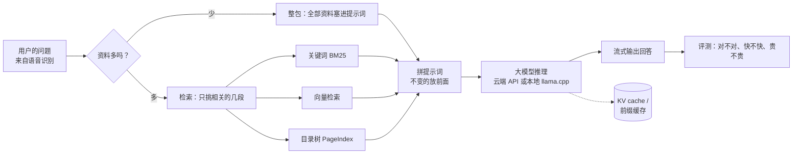

## 目录

1. 大模型应用的最小闭环：token、上下文、流式和首字延迟
2. 网络与 API 调用：一次请求经历了什么
3. 计算机基础：进程、编码与音频
4. 整包还是检索：RAG 到底在解决什么
5. 检索的三板斧：切段、BM25、向量
6. 三个向量模型：bge-small、Qwen3-Embedding、DashScope
7. 框架是怎么搭起来的：LangChain、LlamaIndex、LangGraph
8. Agent：会自己调用工具的模型
9. 硬件基础：CPU、GPU 与显存
10. 推理与 AI infra：KV cache、量化、并发
11. 评测和成本：怎么知道自己没在自欺欺人
12. 工程实战：设计一个企业级 Agent 调用与计费平台

附录：术语表

## 1. 大模型应用的最小闭环

### 1.1 Token：模型眼里的“字”

模型不直接读汉字或单词，而是先把文本切成一小块一小块，再给每块编号，这些小块叫 **token**（词元）。就像你吃黄瓜不会整根塞进嘴里，得先切成片，token 就是那一片。至于怎么切，由**分词器**（tokenizer）决定。英文里一个 token 大约是 3–4 个字母；中文里一个 token 大约对应 1–2 个汉字。报告里 6 万中文字大约是 3–4 万 token。

两件和钱、速度直接相关的事：

- **按 token 计费**：云端 API 分别按输入 token 和输出 token 收费，价格以“每百万 token 多少元”计。像按片收钱的黄瓜摊：你递过去多少片（输入），它切回来多少片（输出），都算钱。
- **字数相同不等于 token 数相同**：两根一样长的黄瓜，切出来的片数不一定一样。报告 9.2 节做云端缓存实验时，要构造“长度相同、内容不同”的前缀，就得先实测每个前缀的 token 数，不能只数字数。

### 1.2 上下文窗口：模型一次能看多少

**上下文窗口**（context window）是一次请求里输入加输出的 token 上限，常见的有 32k、128k，也有 1M。

把它想成模型的**办公桌**：桌面就这么大，放不下的文件模型根本看不到。桌上堆得越满，它找东西越慢、干活越贵，也越容易看漏某一页。“到底堆多少才合适”，就是报告第 3 节要测的问题。

### 1.3 提示词的结构

一次对话请求通常由几段**消息**（message）组成：

- **system**：系统设定，比如“只根据资料回答，找不到就说没有”。相当于给新员工的岗位说明书。
- **user**：用户说的话，也可以包含资料。相当于客户来问的问题。
- **assistant**：模型之前的回答。

模型本身是“金鱼记忆”：两次请求之间它什么都不记得。多轮对话时，每次都得把之前的聊天记录重新递给它看一遍。

我的项目把提示词分成三层（`electron/llm/prompts.ts`）：

1. 最前面是**稳定前缀**：角色设定和个人资料，每次请求逐字节相同；
2. 中间是这次要用的资料；
3. 最后才是这次的问题和最近的转录。

这样排是为了吃到**前缀缓存**的好处（第 10 章）。打个比方：每次开会都先念一遍一模一样的开场白，服务商听多了就背下来了，下次直接跳过开场白，只听新问题，既快又便宜。但开场白里哪怕改一个字，它就得从头再听一遍。

### 1.4 流式输出和首字延迟

**流式输出**（streaming）是模型边生成边返回，不用等整段写完。衡量速度的几个指标：

- **TTFT**（Time To First Token，首字延迟）：从发出请求到收到第一个字。实时场景最看重这个，报告里记的是“首个**回答**字”。
- **TPOT**（Time Per Output Token）或 **tokens/s**：之后每个字出来有多快。
- **端到端延迟**：从发出问题到回答全部结束。

用饭店上菜来记：TTFT 是**第一道菜上桌**要等多久，tokens/s 是**后面上菜的节奏**，端到端延迟是**整顿饭吃完**。实时场景里，客人最受不了的是干坐着等第一道菜。

推理模型（reasoning model）会先输出一段“思考过程”再给答案，像一个先在草稿纸上演算半天才开口的学霸：考试时很靠谱，抢答时就要命了。如果把草稿纸上的第一个字当成首字，就会严重低估等待时间。报告第 6 节里，R1 蒸馏版的首个回答字中位数是 96–128 **秒**，足够泡一杯茶了。

## 2. 网络与 API 调用：一次请求经历了什么

报告里的云端模型、云端向量和云端语音识别，都是通过网络“调用 API”。这一章把一次调用从头到尾拆开，顺便解释几个经常听到的网络词。

### 2.1 分层：像寄快递一样

网络通信是分层的，每层只管自己的事：

| 层 | 管什么 | 例子 | 快递比喻 |
| --- | --- | --- | --- |
| 应用层 | 要说什么内容 | HTTP、WebSocket、DNS | 信的内容和格式 |
| 安全层 | 加密和身份验证 | TLS（HTTPS 里的 S） | 保密信封和身份证明 |
| 传输层 | 可靠送达还是尽快送达 | TCP、UDP | 挂号信还是普通明信片 |
| 网络层 | 送到哪台机器 | IP（IPv4 / IPv6） | 收件地址 |
| 链路层 | 在一段具体的线路上怎么传 | 以太网、Wi-Fi | 快递车和道路 |

写应用时通常只接触最上面两层，但延迟和故障可能出在任何一层。

### 2.2 IP、端口和 DNS

- **IP 地址**是机器在网络上的地址。**IPv4** 形如 `203.0.113.7`，总共约 43 亿个，早已不够用；**IPv6** 形如 `2001:db8::1`，地址多得用不完，但并不是所有网络都能稳定走通。
- **端口**区分同一台机器上的不同服务。如果 IP 是小区地址，端口就是门牌号：HTTPS 默认住 443 号，本机的服务常用 `127.0.0.1:<端口>`。
- `127.0.0.1` 又叫 **localhost / 回环地址**，相当于“给自己寄信”：数据不出本机，转一圈又回到自己手里。
- **DNS** 把域名（`api.deepseek.com`）翻译成 IP 地址，就像手机通讯录：你记住的是“张三”，拨出去的是电话号码。DNS 查询本身通常走 UDP。

**为什么项目规定只用 IPv4**：一个域名可能同时有 IPv4 和 IPv6 地址，程序先试哪个取决于系统和运行时的设置。如果先试的 IPv6 走不通，就要等它超时再换 IPv4，平白多出几秒。这就像导航先把你带上一条正在修的高速，开到收费站才让你掉头。项目干脆把所有网络请求都固定为 IPv4：
- 命令行用 `curl -4`；
- Node 设置 `--dns-result-order=ipv4first`，并在建连时指定 `family: 4`；
- Python 限定 `AF_INET`。

### 2.3 TCP 和 UDP：挂号信和明信片

**TCP**（传输控制协议）是“可靠、有序”的：

- 通信前先**三次握手**建立连接，很像打电话：“喂？”“喂，听得到，你那边呢？”“听得到。”然后才开始说正事。这要花一个来回的时间，即 1 个 **RTT**（Round-Trip Time，往返时延）。
- 每个数据包都要确认，丢了就**重传**，保证对方按顺序收到完整数据。
- 有**拥塞控制**：网络堵的时候自动放慢发送速度。
- 代价是：前面一个包丢了，后面的包即使到了也得等它重传，这叫**队头阻塞**（head-of-line blocking）。就像单车道上前车抛锚，后面的车再急也只能干等。

**UDP**（用户数据报协议）是“发出去就不管”的：不建连接、不确认、不重传、不保证顺序。像在广场上用大喇叭喊话，谁听见算谁的。听起来不靠谱，但它快、开销小，适合“晚到不如不到”的场景：

- **DNS 查询**：一问一答，很小；
- **实时音视频**（比如网络电话、视频会议使用的 WebRTC）：丢一小段声音可以忽略，等重传反而会卡顿；
- **QUIC / HTTP/3**：在 UDP 之上自己实现可靠传输和加密，把 TCP 握手和 TLS 握手合并，减少建连时间，也避免了 TCP 的队头阻塞。

大模型 API 目前基本都走 HTTPS，底层是 TCP（HTTP/1.1、HTTP/2）或 QUIC（HTTP/3）。

### 2.4 TLS：给连接加密

**HTTPS = HTTP + TLS**。TLS 握手要做两件事：

1. **验证服务器身份**：服务器出示**证书**，证书由受信任的机构签名，证明“我确实是 api.deepseek.com”。就像快递员上门先亮工牌，工牌上盖着公司的章。
2. **商量出一把只有双方知道的密钥**，之后所有数据都用它加密。神奇的是，这把密钥是当着所有人的面“商量”出来的，旁听的人却算不出来。背后是一套数学方法（密钥交换），这里记住“能做到”就行。

TLS 1.3 的握手通常需要 1 个 RTT。所以一个全新的 HTTPS 连接，在真正发送请求之前，至少要花“DNS + TCP 握手 + TLS 握手”这几段时间。

### 2.5 HTTP：请求和响应长什么样

一次调用大模型 API 的 HTTP 请求大致是：

```
POST /chat/completions HTTP/1.1
Host: api.deepseek.com
Authorization: Bearer <API Key>
Content-Type: application/json

{"model": "deepseek-flash", "messages": [...], "stream": true, "max_tokens": 400}
```

- **方法**：`GET` 取数据，`POST` 提交数据。调用模型用 `POST`。
- **请求头**（header）：`Authorization: Bearer <Key>` 表明身份，`Content-Type` 说明正文格式。
- **正文**（body）：JSON 格式的参数。
- **状态码**：服务器用三位数字告诉你结果。

| 状态码 | 含义 | 本报告里遇到的情况 |
| --- | --- | --- |
| 200 | 成功 | 正常请求 |
| 400 | 请求格式有错 | DashScope 偶尔用 400 表示后端繁忙，不能一律当“格式错”处理 |
| 401 | 没有通过身份验证 | 2.6 节的测量故意不带 Key，就会收到 401 |
| 402 | 需要付款 / 余额不足 | 预算网关超出预算时返回 402 |
| 429 | 请求太频繁，被限流 | 需要等一会儿再试 |
| 5xx | 服务器出错 | 可以有限次数地重试 |

- **连接复用**（keep-alive）：同一个 TCP / TLS 连接可以连续发多个请求，省掉后续的握手。就像打完一件事的电话先别挂，接着说下一件，省得再“喂？喂？”一遍。
- **HTTP/2** 可以在一个连接里同时跑多个请求（多路复用）；**HTTP/3** 基于 QUIC。

### 2.6 实测：一次 HTTPS 请求的时间花在哪

我用 `curl -4` 对 DeepSeek 和 DashScope 的接口地址各发了 5 次全新连接的请求。**没有带 API Key**，服务器直接返回 401，不会调用模型，也不花钱。

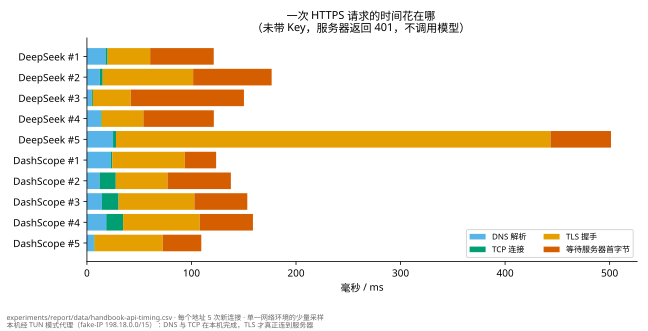

结果（[数据](data/handbook-api-timing.csv)，[脚本](api_timing.py)）：

- 一次完整请求通常在 **100–180 ms**。其中 TLS 握手约 20–90 ms，等待服务器返回首字节约 30–110 ms。
- 偶尔有一次 TLS 握手超过 400 ms（三轮测量中大约每 5 次出现 1 次），很可能是代理新建上游连接的开销。
- **一个意外的发现**：DNS 只要几毫秒，TCP 握手甚至不到 1 毫秒，快得不像真的连到了服务器。查了一下，解析出来的 IP 都在 `198.18.0.0/15` 这个段。这是本机代理软件在 **TUN 模式**下使用的“假 IP”（fake-IP）：DNS 和 TCP 其实都由本机的代理完成，直到 TLS 那一步，才真正经过代理连到服务器。**所以测网络延迟时，要先搞清楚自己是不是在代理后面。**

这些数字和报告的关系：报告里整包的首个回答字约 0.8 秒，其中建立连接的部分是这里的一两百毫秒（连接复用时甚至可以省掉），剩下的大头是服务器端处理输入（prefill，第 10 章）和生成第一个字的时间。

我的项目还用了一个技巧：开始工作时，先发一个 `max_tokens=1` 的“预热”请求（`electron/main.ts`）。它带着和真实请求逐字节相同的稳定前缀，让服务商提前建好前缀缓存，同时把连接建立起来；闲置时每隔约 4 分钟再“续一下”。第一个真实回答就不用付冷启动的代价。

### 2.7 流式传输：SSE 和 WebSocket

**SSE**（Server-Sent Events，服务器推送事件）：大模型 API 的流式输出基本都用它。

- 客户端发一个普通的 HTTP 请求，服务器不一次性返回，而是保持连接，逐段推送 `data: {...}` 格式的文本行；
- 结束时发 `data: [DONE]`；
- 用量（usage）通常在最后一段里。

报告里的预算网关（`experiments/lib/gateway.cjs`）就是逐行解析这种格式：收到 `[DONE]` 并拿到用量，才算这次请求完整结算；中途断流的请求保留预留费用。

**WebSocket**：先用一次 HTTP 请求“升级”成一条长期的双向通道，之后双方随时都能发消息，文本和二进制都可以。它适合实时语音识别这种“一边说一边传、一边出结果”的场景。项目的云端语音识别（`electron/asr/aliyunRealtimeEngine.ts`）的流程是：

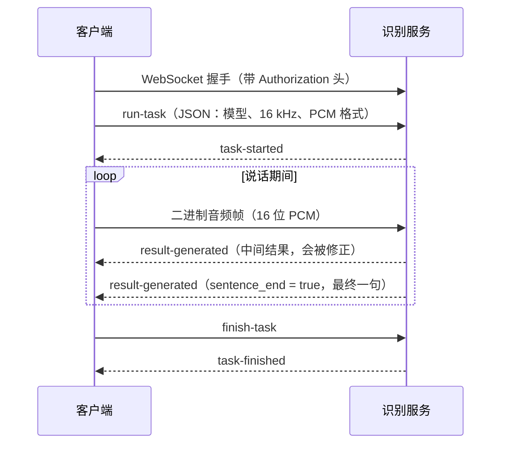

SSE 是服务器到客户端的单向推送，像收音机：电台一直播，你只管听。WebSocket 是双向的，像对讲机：两边随时都能按下按钮说话。两者都跑在 TCP 之上。

### 2.8 代理和网关

- **正向代理**：替你出去访问别的服务器，像“代购”：你把需求告诉代购，代购替你去店里买。本机的代理软件就是这种，2.6 节的“假 IP”就是它在起作用。
- **反向代理 / 网关**：挡在服务前面，替服务接收请求，像公司的前台：访客先在前台登记、换胸牌，再被领进去。它可以统一做鉴权、限流、计费和日志。
- 报告的**预算网关**就是一个跑在 `127.0.0.1` 上的小型本地网关。实验程序（包括第三方 SDK）只拿到一个临时令牌，把请求发给这个本地地址；网关检查预算、换上真正的 API Key，再转发给服务商。这样真实的 Key 不会出现在子进程里，SDK 内部偷偷重试也逃不出预算。

### 2.9 超时、重试和限流

- **超时**：每个请求都要设上限，否则网络卡住时程序会永远等下去。报告里的实验每题上限是 120 秒。
- **重试**：临时性错误（网络抖动、5xx、429）可以重试，但要有次数上限，并且每次等更久，这叫**指数退避**（exponential backoff）。就像打电话遇到占线：隔 1 分钟再打，还占线就隔 2 分钟，再占线就 4 分钟，而不是一秒钟狂拨一百次，把对方的电话打爆。
- **幂等**：同一个请求执行一次和执行多次，结果是否一样。按电梯按钮是幂等的：按一次和按十次，电梯都只来一趟。点外卖下单就不是：手抖点了三次，就会来三份外卖。查询通常是幂等的；调用大模型**不是**：每重试一次就多付一次钱，还可能得到不同的回答。所以报告的预算网关规定每次重试都重新预留费用，同时关掉 SDK 自带的重试；网关累计遇到 5 次上游失败，就停止转发。
- **限流**（rate limit）：服务商限制每分钟的请求数或 token 数，超了返回 429，像网红奶茶店的“每人限购两杯”。并发实验（报告第 10 节）就是在测“同时发多少个请求还不被拖慢”。

### 2.10 API 设计与安全

- **REST 风格**：用 URL 表示资源、HTTP 方法表示动作，比如 `POST /chat/completions`、`POST /embeddings`、`GET /models`。
- **OpenAI 兼容接口**：很多服务商（DeepSeek、阿里云 DashScope、本地的 llama-server）都模仿 OpenAI 的接口格式。同一段客户端代码，只改地址（base URL）、模型名和 Key，就能切换服务商。
- **API Key 就是密码**，更准确地说，是一张能刷你钱的**银行卡**：谁拿到它，谁就能用你的额度。所以：
  - 不写进代码，不打印到日志，不放进 URL；
  - 项目用 Electron 的 `safeStorage`（Windows 上由系统的数据保护接口加密）加密后保存；
  - 实验只从配置里读出“可用 / 缺失”，从不输出 Key 本身。
- **Key 和服务商绑定**：DeepSeek 的 Key 只能发给 DeepSeek 的地址，不能因为某个配置项里恰好有一个 Key，就把它发给另一家服务。

## 3. 计算机基础：进程、编码与音频

### 3.1 进程和线程

把电脑想成一栋美食城：

- **进程**（process）是一个正在运行的程序，有自己独立的内存空间，像美食城里一家家独立的**店铺**，各有各的厨房。一家店着火（崩溃），通常烧不到隔壁。
- **线程**（thread）是进程里的执行流，像同一家店里的几个**厨师**。他们共用一个厨房（共享内存），配合起来很快，但一个厨师把锅打翻了，整个厨房都得停。
- **主线程不能被阻塞**：界面程序只有一个主线程负责响应点击、刷新画面，它就像店里唯一的**前台服务员**。如果让服务员跑去后厨炒一道要炒十分钟的菜（比如跑模型），前台就没人招呼客人了，这就是“界面卡死”。

**我的项目（一个 Electron 桌面应用）是多进程结构**：

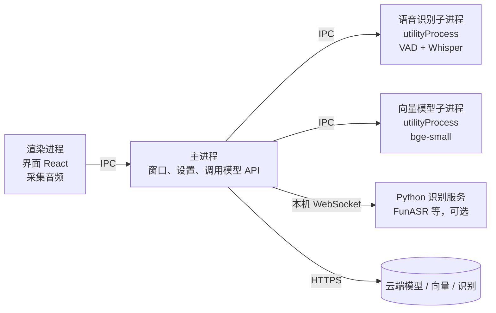

- **主进程**管窗口、设置和网络请求；**渲染进程**是界面（本质上是一个网页）；**preload 脚本**在两者之间，只暴露一组受控的接口。
- **IPC**（进程间通信）：进程之间不能直接读对方的内存，只能发消息，就像隔壁两家店的厨师不能冲进对方厨房，只能递纸条。项目把所有消息通道集中定义在 `shared/protocol.ts`，主进程收到渲染进程的输入后都要校验。
- **utilityProcess**：Electron 提供的独立子进程。语音识别（`electron/asrHost.ts`）和本地向量模型（`electron/embed/`）都放在里面。这样既不阻塞主线程，崩了也不影响界面，就像把轰隆作响的大功率设备搬到单独的车间里，不吵前台做生意。源码注释里还记录了一个实际原因：在主进程里用 GPU（DirectML）跑识别，遇到真实语音时会卡住，放进独立进程后就正常了。
- **sidecar（边车进程）**：主程序在旁边启动的另一个独立程序。项目的本地 FunASR 识别是一个 Python 服务（`electron/funasrSidecar.ts` 负责启动和回收），通过 `ws://127.0.0.1:<端口>` 和主程序通信。这样 Python 的依赖不用打包进桌面应用本体。

### 3.2 内存、磁盘和原子写入

- **内存**（RAM）快但断电就丢；**磁盘**（SSD）慢但能长期保存。模型文件放在磁盘上，用的时候加载进内存或显存。
- **原子写入**：直接覆盖写一个文件时，如果中途崩溃或断电，文件可能只写了一半，就坏了。常用做法是先写到一个临时文件，写完再**重命名**成正式文件名。重命名在同一个磁盘上是一步完成的，要么全是旧的，要么全是新的。就像交作业：先在草稿纸上写好，再一次性誊到作业本上，老师永远不会看到写了一半的作业。项目的设置文件（`electron/fsAtomic.ts`）和实验的预算账本（`experiments/lib/budget.cjs`）都这样写。Windows 上还要额外处理一种情况：杀毒软件或索引服务会短暂锁住刚写好的文件，所以重命名失败时要稍等重试。
- **锁**：多个进程同时改同一个文件会互相覆盖。锁就像卫生间的门锁：里面有人，其他人只能在门外排队。预算账本用“创建一个锁目录”的方式，保证同一时刻只有一个进程在记账。

### 3.3 字节、字符和编码

- **bit** 是一个 0 或 1，**byte**（字节）是 8 个 bit。文件大小、网络流量、显存都按字节算。
- **字符编码**规定“字符怎么变成字节”：
  - **Unicode** 给世界上几乎所有字符一个编号，相当于全球统一的“字符身份证号”；
  - **UTF-8** 规定这个号码怎么装进字节里，是最常用的方式：英文字母 1 字节，常用汉字 3 字节。所以同样长度的中文，字节数大约是英文的 3 倍。
- **token 数不会超过 UTF-8 字节数**：主流大模型（包括 DeepSeek）用的是字节级分词器，最坏情况也只是把每个字节当成一个 token。报告的预算网关就用“请求的字节数”作为 token 数的保守上限来预留费用：宁可多预留，也不低估。
- **GBK** 是较老的中文编码，中文 Windows 的很多工具默认用它。同一段字节用错编码解读，就会出现乱码，好比拿着错误的密码本翻译电报，翻出来全是“锟斤拷”。报告踩过的坑：pip 用 GBK 读 requirements.txt，Python 默认按 GBK 输出（要设 `PYTHONIOENCODING=utf-8`）。
- **换行符**：Windows 习惯用 CRLF（`\r\n`），Linux 和 macOS 用 LF（`\n`）。这是打字机时代留下的习惯：CR 是“把打字头推回行首”，LF 是“纸往上卷一行”。几十年过去了，打字机早进了博物馆，这两个字符还在给程序员添乱。脚本生成的文件如果混进 `\r`，URL 末尾就会多出一个看不见的字符。项目规定源文件和生成文件一律用 LF。
- **JSON**：API 的请求、返回和各种配置几乎都用它，是一种纯文本的数据格式，由对象 `{}`、数组 `[]`、字符串、数字和布尔值组成。
- **Base64**：把任意二进制数据编码成只含可打印字符的文本，方便放进 JSON 或配置文件，好比把一张照片改写成一长串字母，才能塞进一封“只能写字”的信里。注意：Base64 只是换个写法，**不是加密**，谁都能还原。加密后的 Key 就用 Base64 保存。
- **哈希**（hash）：把任意数据算成一个固定长度的“指纹”，比如 **SHA-256**。数据改动一个字节，指纹就完全不同。报告用它校验语料、PDF 和下载的依赖包，确保“测的就是那一份文件”。

### 3.4 数字音频基础

声音是空气的振动。麦克风把它变成电压信号，声卡再把这个连续信号变成一串数字，这个过程叫**采样**。它很像动画片：连续的动作被拆成一秒几十张的画，翻得够快，看起来就是连贯的。

- **采样率**：每秒取多少个点，也就是“每秒画几张”。
  - 音乐和系统声音常用 48 kHz（每秒 48000 个点）；
  - 语音识别常用 **16 kHz**，因为人说话的主要频率在 8 kHz 以下。按照采样定理，采样率只要达到最高频率的两倍，就能还原原信号。打个比方：想拍清楚一只每秒扇 8000 下翅膀的蜂鸟，每秒至少得拍 16000 张。
- **位深**：每个点用多少位表示，像尺子的刻度有多细。**16 位 PCM** 是最常见的原始格式，每个点是 −32768 到 32767 之间的整数。浏览器内部常用 −1 到 1 的 32 位浮点数表示，发送前再转成 16 位整数（项目里的 `f32ToPcm16`）。
- **声道**：单声道（mono）或立体声（stereo）。语音识别用单声道。
- **数据量**：16 kHz × 16 位 × 单声道 = 每秒 32 KB。1 分钟约 1.9 MB，比视频小得多，适合实时上传。
- **帧**（frame）：音频按固定的小段处理，比如每段 20–30 ms。每一帧可以算一个**能量**（RMS，均方根），能量大说明有声音，就像音响上随音乐跳动的音量指示灯。

### 3.5 实时语音识别的流水线

项目里一句话从“对方说出口”到“变成文字”，经过这些步骤：

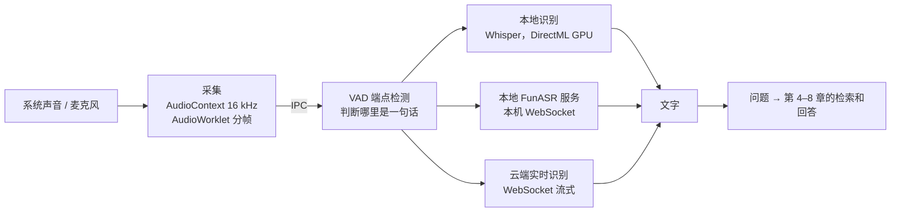

1. **采集**：Windows 上通过系统的“环回”（loopback）捕获电脑正在播放的声音（`src/audio/loopbackCapture.ts`），或者采集麦克风。创建 `AudioContext` 时直接指定 16 kHz，由浏览器负责重采样；再用 **AudioWorklet**（在独立音频线程里运行的小程序）把声音切成帧，经 IPC 发给识别子进程。
2. **VAD**（Voice Activity Detection，语音活动检测）：判断什么时候有人在说话、一句话什么时候结束（`electron/asr/vad.ts`）。它像会议主持人：等发言人停顿一小会儿，才判断“这句说完了”，还会记得对方开口前吸的那口气。项目用的是基于能量的方法：
   - 某一帧的能量超过“背景噪声 × 3”就算有声音；
   - 静音持续 300 ms 就认为一句话结束；
   - 保留说话前 300 ms 的音频，防止吞掉第一个字；
   - 一句话最长切到 10 秒。
   - VAD 还是隐私和费用的闸门：没人说话时，不会有任何音频发给识别服务。
3. **识别**：
   - 本地 **Whisper**：OpenAI 开源的识别模型，先把声音转成**梅尔频谱**（一种模拟人耳感知的“声音图像”，横轴是时间，纵轴是音高，颜色深浅是响度，像一张声音的热力图），再由编码器加解码器“看图写字”，输出文字。项目用 onnxruntime 在 GPU 上跑（Windows 的 **DirectML** 接口）。
   - 本地 **FunASR**：阿里开源的中文识别工具包，作为 Python 边车进程运行。
   - 云端 **实时识别**（DashScope 的 fun-asr-realtime / paraformer-realtime-v2）：一边上传音频，一边收到**中间结果**（partial，会被后续修正）和**最终结果**（final，一句话结束时确定）。像同声传译：先根据前半句说个大概，听完整句再改口。
4. **延迟从哪来**：
   - VAD 要等 300 ms 静音才确认一句话结束；
   - 识别本身需要时间；
   - 然后才进入检索和回答。
   - 所以实时场景特别在意回答模型的首字延迟：前面的环节已经用掉了一部分“两秒预算”。

### 3.6 为什么识别结果会有错字

报告第 5 节专门测了语音噪声，这里解释它们从哪来：

- **同音字**：中文同音字多，识别模型只能靠上下文猜，比如“权限”和“全线”。
- **专业术语和中英混说**：“TCP”可能被识别成“踢西批”，“OSI”被识别成“哦艾斯艾”。模型在训练中很少见过这些词在口语里的读法。
- **口头语和断句**：“嗯”“那个”会混进文字，句子也可能被切在奇怪的位置。
- **环境**：回声、背景音乐、多人同时说话。

这就是报告建议用向量检索的原因（第 5 章）：向量按意思找，对字面错误宽容得多。写资料时把术语的中英文写法都放进标题，也能帮检索对上号。

## 4. 整包还是检索：RAG 到底在解决什么

**RAG**（Retrieval-Augmented Generation，检索增强生成）的意思是：回答之前先从资料库里**检索**出相关的几段，塞进提示词，再让模型**生成**回答。它就像开卷考试：先翻书找到相关的那几页，再动笔作答。它要解决的问题是：资料太多，放不进上下文窗口，或者放进去太慢太贵。

但如果资料本来就不多呢？一本薄薄的小册子，直接整本摊在桌上看就行，何必先翻目录？这就是报告里的**整包**（whole pack）。报告的核心发现是：

- 6 万字以内，整包比任何检索都稳；8.5 万字以内，整包的答对率一直是 75%（报告第 3 节）。
- 在 20 万字的语料上，整包和最强的检索方法 PageIndex 相比，差异也不显著（报告 4.3 节）。

我的项目里，整包的上限就是一个常量：`electron/ipc/knowledgeIpc.ts` 的 `FULL_CONTEXT_MAX_CHARS = 60_000`。资料不超过 6 万字就整包发送，超过才走检索。


四种“取资料”方式放在一起看，各自怎么找、像什么、实测如何：

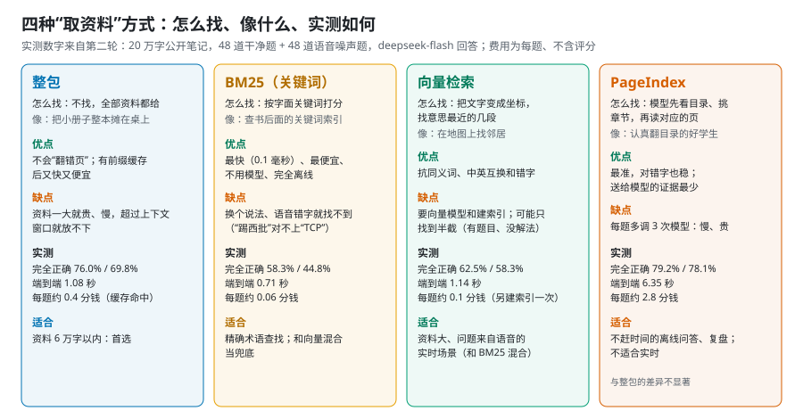

**为什么整包在小资料上赢**：检索可能找错段，一旦找错，后面的模型再聪明也答不对，就像开卷考试翻错了页，写得再漂亮也是错的；整包则不存在“翻错页”。整包的代价是输入 token 多，但**前缀缓存**让重复发送的资料几乎不花钱（第 10 章）。

## 5. 检索的三板斧：切段、BM25、向量

### 5.1 切段（chunking）

检索之前，要先把长文档切成一段一段（chunk），每段是检索的最小单位。这有点像切蛋糕：切得太碎，每一小块都尝不出是什么蛋糕（丢了上下文）；切得太大，一块里混着好几种口味（混进无关内容）。

我的项目在 `shared/retrieval.ts` 里按 Markdown 标题切段：目标 400 字（`CHUNK_TARGET`），最长 600 字（`CHUNK_MAX`），相邻两段重叠 80 字（`CHUNK_OVERLAP`，防止一句话被切断）。报告 4.2 节实测，按标题切比固定长度窗口好：DashScope 找对段落的比例是 85% 对 79%。

### 5.2 BM25：关键词检索

**BM25** 是经典的关键词打分方法，思路是：查询里的词在这段里出现得越多、在其他段里越少见，这段的分数就越高。“的”字每一段都有，查它毫无意义；“三次握手”只在少数几段出现，一查就准，所以越稀有的词越值钱。它的优点是快（查询 0.1 ms）、不用模型、完全离线；缺点是只看**字面**，同义词、中英互换、语音识别错字都会让它失手。

中文还有一个额外的坑：**分词**。英文按空格就能切出词，中文不行。LangChain 和 LlamaIndex 的 BM25 默认按空格或英文规则分词，用在中文上几乎全军覆没，找对段落只有 27%（报告第 8 节）；加一行 jieba 中文分词就恢复到 81%。我的项目在 `shared/retrieval.ts` 的 `tokenize` 里自己处理中文，并给标题里的词加权（`HEADING_BOOST = 3`）。

### 5.3 向量检索：按意思找

**向量**（embedding）是把一段文字变成一串数字，比如 512 维或 1024 维，使意思相近的文字在这个空间里离得近。可以想象成给每段话在一张巨大的地图上标一个坐标：讲网络协议的住在同一片小区，讲垃圾回收的住在另一片。检索时，把问题也标到地图上，看它的邻居都是谁。

“近”通常用**余弦相似度**（cosine similarity）衡量：把每个向量想成从原点出发的箭头，看两个箭头**指的方向**是否一致，不管箭头长短。

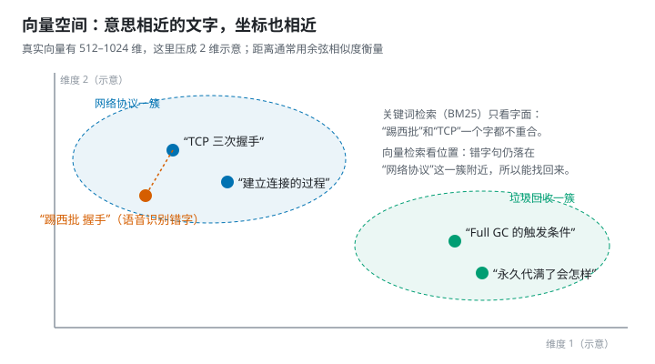

这就是向量检索抗语音噪声的原因：“踢西批 握手”和“TCP 三次握手”一个字都不重合，BM25 找不到，但它们的向量很接近。报告第 5 节实测，语音风格的问题下，BM25 找对段落 52%，DashScope 向量 85%。

**向量数据库**（vector database / vector store）专门负责存向量、找最近邻。数据量不大时，一个数组加暴力计算就够了：我的项目把每个资料包的向量存在本地文件里，查询时逐个算相似度（`electron/kbVectors.ts` 的 `denseSearch`）。数据量很大时才需要 FAISS、Milvus 这类带近似最近邻（ANN）索引的数据库。好比找邻居：小区只有几十户，挨家敲门也很快；一座城市几百万户，就得先按片区划分，只在附近几片里找。

### 5.4 混合检索和 RRF

BM25 擅长精确术语，向量擅长同义和错字，把两者结合起来就是**混合检索**（hybrid search）。最常用的合并方法是 **RRF**（Reciprocal Rank Fusion，倒数排名融合）：每种方法给出一个排名，一段文字的最终分数是它在各个排名里 `1 / (k + 名次)` 的加权和。它只看名次，不管两种方法的分数尺度不同。就像选秀节目有几位评委，有的打分严、有的打分松，直接把分数相加不公平；RRF 只看每位评委给的**名次**，排第一的加分最多，越往后加得越少。

我的项目（`electron/kbSemantic.ts`）：

- 本地模式是 `RRF(BM25, bge)`，权重 1:1；DashScope 模式是 `RRF(BM25, DashScope)`，权重 1:2，因为 DashScope 更准，给它更大的话语权。
- `k = 60`（`electron/kbVectors.ts` 的 `rrf`）。
- 每个向量模型有一个余弦下限（比如 bge 是 0.5），低于下限的结果不要。
- 如果向量还没建好、查询超时，或者什么都没过下限，就退回纯 BM25。检索永远不能卡住回答。

### 5.5 重排（rerank）和“每次给几段”

**重排**是先粗检索出几十段，再用一个更精细的模型重新排序，像选秀先海选、再复赛：海选要快，复赛要准。本报告没有测重排，但测了一个相关的问题：最后给模型几段？报告 4.2 节，5 段比 3 段完全正确率高 6–12 个百分点，8 段没有稳定收益。

### 5.6 目录树检索：PageIndex

**PageIndex** 走的是另一条路：不切段、不用向量，而是先为文档建一棵“目录树”，回答时让模型先读目录、挑章节，再读对应的页。这就是我们小时候被教的读书方法：先看目录，再翻到那一章。它确实更准，但也确实更慢，毕竟翻书这件事，从来就快不起来。它本质上是一种**agentic retrieval**（由模型主导的检索，见第 8 章）。报告 4.3 节实测：它比 BM25、向量都准，尤其在噪声题上；但每题要多调用约 3 次模型，慢约 5 秒。

## 6. 三个向量模型：bge-small、Qwen3-Embedding、DashScope

报告里出现的三个向量模型，代表三种部署方式。可以用喝咖啡来类比：

- **bge-small（CPU）** 像家里的速溶咖啡：随手就有、不花钱，味道一般；
- **Qwen3-Embedding（GPU）** 像家里的咖啡机：要先有台机器（显卡），但做出来的和店里差不多；
- **DashScope** 像楼下的咖啡店：味道最好、什么都不用准备，但要花钱，还得把“资料”带出门。

具体对比：

| | bge-small-zh-v1.5（q8，CPU） | Qwen3-Embedding-0.6B（GGUF Q8_0，GPU） | DashScope text-embedding-v4 |
| --- | --- | --- | --- |
| 是什么 | 北京智源（BAAI）的小型中文向量模型 | 阿里通义 Qwen3 系列的向量模型，0.6B 参数 | 阿里云百炼的在线向量服务 |
| 在哪跑 | 本机 CPU | 本机显卡 | 阿里云服务器 |
| 模型大小 | 约 24 MB（q8 量化） | 639 MB（Q8_0 量化） | 不用下载 |
| 向量维度 | 512 | 1024 | 默认 1024，可选 64–2048 |
| 运行时 | transformers.js（ONNX） | llama.cpp（GGUF） | HTTP API（OpenAI 兼容格式） |
| 费用 | 免费 | 免费（要有显卡） | 每百万 token 0.5 元 |
| 隐私 | 资料不出本机 | 资料不出本机 | 资料要上传 |
| 找对段落（干净 / 语音噪声） | 83.3% / 77.1% | 95.8% / 91.7% | 97.9% / 91.7% |
| 查询耗时 | 1–4 ms | 约 20 ms | 约 150 ms（网络） |

（最后两行来自报告第 7 节，每次 5 段、每篇最多 3 段。）

几个名词：

- **q8 / Q8_0**：8 位**量化**，把模型权重从 16 位压到约 8 位，体积减半，质量几乎不变（第 10 章）。
- **GGUF**：llama.cpp 使用的模型文件格式，把权重、分词器和元数据打包在一个文件里，像一个装好所有零件和说明书的集装箱，拎走就能用。
- **ONNX**：一种通用的模型交换格式；transformers.js 用它在 JavaScript 里跑模型，不需要 Python。
- **查询指令前缀**：bge 在给**问题**算向量时要加一句固定指令，给**资料段落**算向量时不加（`electron/embed/contract.ts`）。很多向量模型都有这种约定，用错会掉点。有点像给问题贴一张“我是问题”的标签，好让模型把它和资料区分开。

**我的项目怎么用**：

- 内置 bge-small：模型文件从 Hugging Face 的 `Xenova/bge-small-zh-v1.5` 下载并固定版本（`electron/embed/modelFiles.ts`），在 Electron 的一个独立子进程里运行（`electron/embed/embedders.ts`），不阻塞界面。
- DashScope 是可选项：用户**明确点击**建索引后才上传资料，因为这既花钱又要把资料交出去。
- Qwen3-Embedding 目前只在实验里测过（`experiments/07b-embeddings`），效果和 DashScope 持平，是值得加的后续功能。

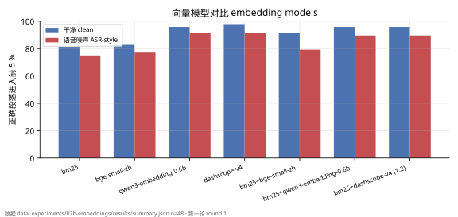

## 7. 框架是怎么搭起来的：LangChain、LlamaIndex、LangGraph

先说清楚一件事：**我的项目本身没有用这三个框架**。检索是手写的 TypeScript，切段加 BM25 共 405 行，零依赖。三个框架只出现在对照实验里：`experiments/02-frameworks` 用 LangChain 和 LlamaIndex 重建同一条检索流程，`experiments/08-langgraph` 用 LangGraph 搭了一个 agent。这一章借这两个实验，讲清楚框架由哪些零件组成。

先给三个框架各起一个外号，方便记：

- **LangChain** 是一盒**乐高积木**：零件多、接口统一，想拼什么自己拼；
- **LlamaIndex** 是一位**图书管理员**：你把书交给它，它编好索引，你只管提问；
- **LangGraph** 是一张**地铁线路图**：每一站做一件事，按条件决定下一站去哪，还能绕回头。

### 7.1 LangChain：一盒标准化的积木

LangChain 把大模型应用拆成一组有统一接口的零件，用哪个、怎么接由你决定。实验 02 里用到的零件（`experiments/02-frameworks/pipelines.py`）：

| 零件 | 作用 | 实验 02 的用法 |
| --- | --- | --- |
| `Document` | 一段文本加元数据 | 每篇笔记一个 Document |
| Text Splitter | 切段 | `RecursiveCharacterTextSplitter`，每段 1000 字符、重叠 200 |
| `Embeddings` | 调用向量模型 | `OpenAIEmbeddings` 指向 DashScope 的 `text-embedding-v4` |
| Vector Store | 存向量、找最近邻 | `InMemoryVectorStore`（纯内存） |
| Retriever | 统一的“给问题、返回几段”接口 | 向量库的 `.as_retriever()`；`BM25Retriever`（默认按空格分词，调好后加 jieba） |
| Chat Model | 调用对话模型 | `ChatOpenAI` 指向 DeepSeek 的 deepseek-chat |
| Runnable / LCEL | 把零件用 `|` 串成流水线 | 本实验只取检索结果，回答统一交给同一个脚本 |
| Callbacks | 在调用前后插入钩子（记录用量、耗时） | 实验 08 用它统计 token 用量；条件边里的调用挂不上，要在调用处自己记 |

接非 OpenAI 服务的三个坑（报告第 8 节）：`OpenAIEmbeddings` 默认发送 token id 而不是文本；DashScope 每批最多 10 条；繁忙时返回 HTTP 400，而客户端默认不重试。修好之后，LangChain 向量检索完全正确 67%，和手写实现同一水平。

### 7.2 LlamaIndex：以“索引”为中心

LlamaIndex 的出发点是“先把资料建成索引，再对索引提问”：

| 零件 | 作用 | 实验 02 的用法 |
| --- | --- | --- |
| `Document` / `Node` | 原始文档 / 切好的段 | 同一批笔记 |
| Node Parser | 切段 | `SentenceSplitter`，默认每段 1024 token、重叠 200；调整后 400 / 60 |
| Embedding | 向量模型 | `OpenAILikeEmbedding` 指向 DashScope |
| `VectorStoreIndex` | 向量索引 | 默认取最相似的 2 段（`similarity_top_k=2`），调整后 3 段 |
| `BM25Retriever` | 关键词检索 | 默认用英文词干和分词规则，对中文无效 |
| Query Engine | 检索 + 提示词 + 回答一条龙 | `.as_query_engine()` 原样使用，完全正确 77%，但不支持流式 |
| `Settings` | 全局默认的模型和参数 | 统一设置默认模型 |

LlamaIndex 的向量默认值比 LangChain 省心，调整切段后能到 77%。但两个框架加依赖一共 103 个 Python 包、346 MB，导入要 1–5 秒。对一个要打包成桌面应用、每一秒都要省的项目来说，这就是没有采用它们的原因：只是想切根黄瓜，没必要把整个厨房搬回家。

### 7.3 LangGraph：把流程画成图

LangGraph 用**图**（graph）描述流程：节点是步骤，边是“下一步去哪”，条件边根据当前状态决定分支。它适合带循环和判断的 agent。实验 08（`experiments/08-langgraph/agent.py`）照官方 agentic RAG 教程搭了这样一张图：

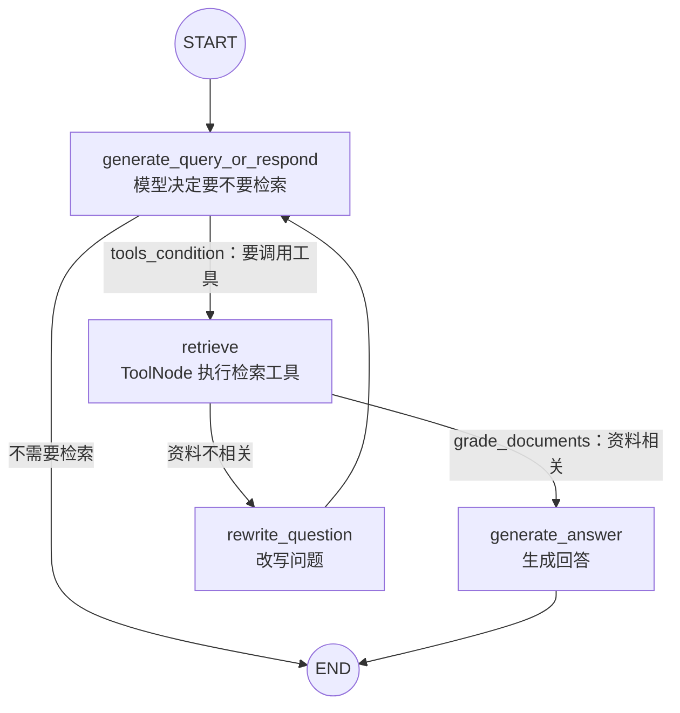

零件对照：

- `StateGraph(MessagesState)`：图的状态就是消息列表，每个节点读写它。
- `add_node` / `add_edge` / `add_conditional_edges`：加节点、普通边、条件边。
- `ToolNode`：自动执行模型要求调用的工具（这里是检索工具 `retrieve_notes`）。
- `tools_condition`：看模型这一步有没有发出工具调用，决定下一步走哪条边。
- 用到的模型：回答和判断用 deepseek-chat（`ChatOpenAI`，temperature 0.2，最多输出 400 token），向量用 DashScope `text-embedding-v4`，存进 `InMemoryVectorStore`。

实测结果（报告第 8 节）：完全正确比单次检索高约 4 个点，但在置信区间内；改写问题只在 2–4% 的题上触发；每题 3 次模型调用，端到端 5 秒以上，费用约 15 倍。**单跳问答不需要 agent 循环**：它像一个过分认真的实习生，每个问题都要请示三遍，最后交上来的答案和你自己查的差不多。

### 7.4 我的项目的“手写版”对应关系

| 框架零件 | 手写对应 |
| --- | --- |
| Text Splitter | `shared/retrieval.ts` 的 `chunkDocument`（按标题，400 / 600 / 80） |
| BM25 Retriever | `shared/retrieval.ts` 的 `Bm25Index`（中文分词，标题加权） |
| Embeddings | `electron/embed/`（bge 子进程）+ DashScope HTTP 调用 |
| Vector Store | `electron/kbVectors.ts` 的 `PackVectors`（每个资料包一个本地向量文件） |
| Ensemble / Hybrid Retriever | `electron/kbVectors.ts` 的 `rrf` + `electron/kbSemantic.ts` |
| Prompt Template | `electron/llm/prompts.ts`（三层、缓存友好） |
| Chat Model | 流式 HTTP 客户端，直接调用 OpenAI 兼容接口 |

**什么时候该用框架**：在 Python 服务里快速做原型，或者需要它现成的几十种数据源和向量库接入时，用框架很划算。对延迟敏感、要流式输出、要打包成桌面应用时，手写几百行更可控。

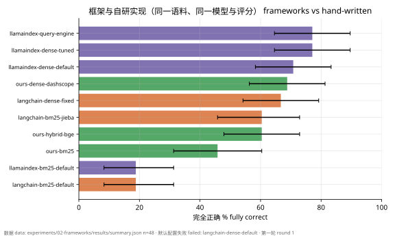

## 8. Agent：会自己调用工具的模型

### 8.1 工具调用（tool calling / function calling）

普通对话里，模型只能输出文字。**工具调用**是在请求里附上一组“工具说明”（名字、用途、参数的 JSON Schema），模型可以不直接回答，而是返回一个结构化的调用请求，比如“调用 `get_page_content`，参数 `pages: "12-13"`”。程序执行这个工具，把结果作为 `tool` 消息送回模型，模型再决定下一步。

可以把模型想成一位只会动嘴、不会动手的顾问：它能写出一张纸条，“请帮我翻到第 12–13 页”，但真正去翻书的是程序。工具说明就是递给顾问的一份“你可以使唤的助手清单”。

### 8.2 Agent 循环和 ReAct

**Agent** 就是让模型在循环里反复“想一步 → 调工具 → 看结果”，直到它认为可以回答为止。它像侦探办案：看一条线索，推理一下，再去找下一条线索，直到能结案。**ReAct**（Reason + Act）是这种模式最有名的提示词范式。

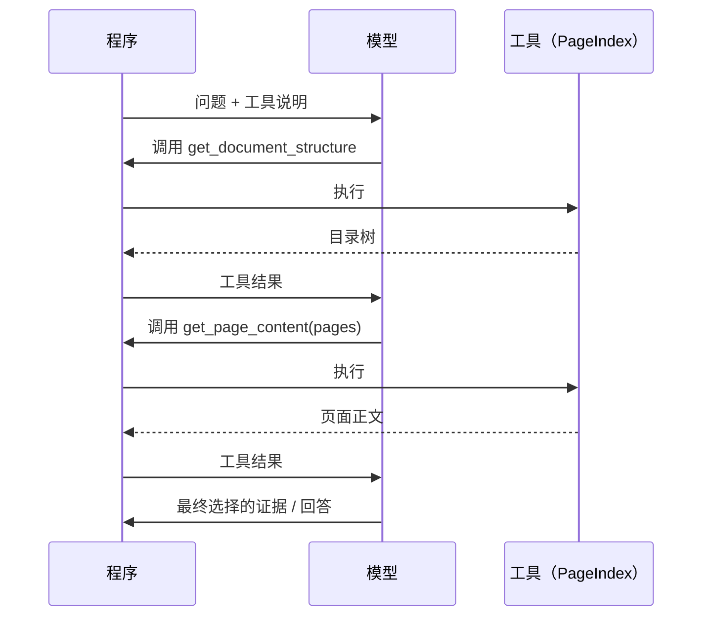

这正是报告 4.3 节 PageIndex 受控组的流程（`experiments/11-pageindex/adapter.py`）：每题平均约 3 次模型调用，上限 6 次、120 秒。为了防止“编造证据”，程序只允许模型选择**实际读过的页**里的片段。

agent 的代价写在报告里：每多一轮循环，就多一次模型调用的延迟和费用。PageIndex 每题 4.06 次请求，端到端约 6.4 秒。

### 8.3 MCP

**MCP**（Model Context Protocol）是一个开放协议，规定工具和数据源怎样以统一的方式暴露给模型应用。有了它，同一个工具服务可以被不同的 agent 客户端接入，不用为每个客户端写一遍适配。常见的比喻是“AI 界的 USB-C”：以前每个设备一种充电头，抽屉里塞满了线；现在统一成一个口，插上就能用。PageIndex 的 SDK 也提供 MCP 形式的工具；本报告用的是它的本地 Python 工具，没有走 MCP。

### 8.4 受控流程和原生流程

报告把 PageIndex 分成两组测：

- **受控组**：我控制循环、证据上限和最终回答的提示词，和其他方法同条件比较。
- **原生组**：直接用官方的 `chat_completions`，由 SDK 自己决定怎么检索、读多少。

原生组读了更多正文（平均 5208 字，受控组约 900 字），而且它的流式输出会把“我去查一下”之类的叙述和回答混在一起，所以首个回答字不可观测。这提醒我们：**同一个工具，用法不同，就是两个实验**。

## 9. 硬件基础：CPU、GPU 与显存

前面几章讲的是“软件怎么搭”，这一章补硬件：模型到底在什么上面跑，为什么显存总是不够，为什么生成速度卡在“带宽”而不是“算力”上。本章的例子都是报告用的那台笔记本：Intel i9-13980HX 处理器、16 GB 内存、NVIDIA RTX 4060 Laptop 显卡（8 GB 显存）。

### 9.1 CPU 和 GPU：少数全能选手 vs 一大群流水线工人

- **CPU**（中央处理器）有少量但很强的**核心**（这台 i9 有 24 个核、32 个线程）。每个核都能独立处理复杂的分支逻辑，适合操作系统、网页、业务代码这类“步骤多、变化多”的活。CPU 也能用 **SIMD 指令**（比如 AVX2）一次算一小组数，所以小模型在 CPU 上也能跑。
- **GPU**（图形处理器）有成千上万个简单的计算单元，擅长“同一个操作，对海量数据同时做”。大模型的主要计算是**矩阵乘法**：几十亿个权重乘以输入，每个乘加彼此独立，正好是 GPU 的强项。
- **显卡**不只是 GPU 芯片，还带着自己的专用内存，也就是**显存**（VRAM）。模型要在 GPU 上跑，权重必须先搬进显存。

打个比方：CPU 像几位全能大厨，什么菜都会做；GPU 像几千个只会切菜的帮工。要切一万斤土豆丝，几千个帮工一起上，大厨完全比不过。大模型推理，恰好就是那一万斤土豆丝。

这就是报告里分工的原因：24 MB 的 bge-small 向量模型放在 CPU 上就够快（每段 1–4 ms）；几 GB 的回答模型必须上 GPU。

### 9.2 GPU 是怎么组织的：SM、线程、warp 和 kernel

以 NVIDIA 为例（术语来自 CUDA 编程模型）：

- **SM**（Streaming Multiprocessor，流式多处理器）是 GPU 的“车间”。RTX 4060 Laptop 有 24 个 SM。
- 每个 SM 里有两类计算单元：
  - **CUDA core**：做普通的浮点、整数运算，这张卡共 3072 个；
  - **Tensor Core**：专门加速矩阵乘法，支持 FP16、INT8 等低精度格式，大模型推理的主力。
- **线程**（thread）是最小的执行单位。32 个线程组成一个 **warp**，同一个 warp 里的线程在同一时刻执行同一条指令，像做广播体操的一排人：口令一下，32 个人做同一个动作。若干个 warp 组成**线程块**（thread block），一个线程块被整体安排在某一个 SM 上运行。
- **kernel** 是在 GPU 上运行的一个函数，比如“算一层注意力”，相当于车间里的一道工序。推理引擎（llama.cpp、vLLM）就是由一大堆 kernel 组成的。
- **FLOPS** 是每秒浮点运算次数，衡量算力，像厨师切菜的手速。**带宽**（bandwidth）是每秒能在存储和计算单元之间搬多少字节，像仓库往厨房送菜的传送带有多宽。手速再快，传送带送不来菜也只能干等。下面会看到，大模型推理经常卡在“传送带”上。

### 9.3 GPU 的存储层级

GPU 的存储像一座金字塔：越靠近计算单元，越快、越小。用做饭来记：

| 存储 | 做饭的比喻 |
| --- | --- |
| 寄存器 | 手里正拿着的那根葱 |
| 共享内存 / L1 | 灶台边的案板 |
| L2 缓存 | 身后的冰箱 |
| 显存（全局内存） | 楼下的仓库 |
| 系统内存 | 城郊的物流中心，隔着一条经常堵车的路（PCIe） |

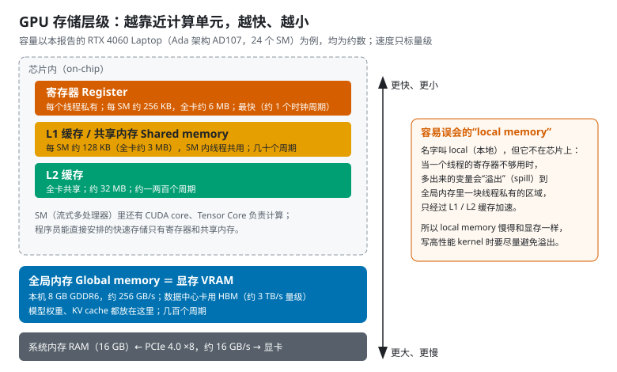

从上到下：

1. **寄存器**（register）：每个线程私有，最快（约 1 个时钟周期）。每个 SM 约 256 KB，全卡约 6 MB。
2. **共享内存**（shared memory）和 **L1 缓存**：在芯片上，是同一块 SRAM，可以按需分配比例。每个 SM 约 128 KB，同一个线程块里的线程可以通过共享内存交换数据。程序员能直接安排的快速存储只有寄存器和共享内存。
3. **L2 缓存**：全卡共享，约 32 MB，由硬件自动管理。
4. **全局内存**（global memory）：就是**显存**。这张卡是 8 GB **GDDR6**，带宽约 256 GB/s。数据中心的显卡（比如 H100）用的是 **HBM**（High Bandwidth Memory，高带宽内存），把内存芯片堆叠起来、紧贴 GPU 封装，带宽可以到约 3 TB/s 量级，是 GDDR6 的十几倍。相当于把仓库直接建在厨房隔壁，还修了十几条传送带，当然也贵得多。模型权重和 KV cache 都放在这一层。
5. **系统内存**（RAM）：CPU 那边的 16 GB，经 **PCIe** 总线和显卡相连。这张卡是 PCIe 4.0 ×8，约 16 GB/s，比显存慢一个数量级以上。

**一个容易误会的名字：local memory**。它叫“本地内存”，但**不在芯片上**，就像有些楼盘广告写着“市中心”，实际开车过去要一个小时。当一个线程的变量多到寄存器放不下时，多出来的部分会“溢出”（register spill）到全局内存里一块线程私有的区域，只经过 L1、L2 缓存加速。所以 local memory 的速度和显存是一个级别，写高性能 kernel 时要尽量避免溢出。

**显存不够时会发生什么**：Windows 的显卡驱动允许把一部分系统内存当“共享 GPU 内存”用。模型放不进 8 GB 显存时，多出来的部分就要隔着 PCIe 读取，速度会暴跌，好比仓库放不下，只好把一部分货存到城郊物流中心，每次取货都得走那条堵车的路。报告第 6 节里，Apertus-8B Q6_K 加载后占 7.7 GB，冷启动 82 秒、之后仍然很慢，很可能就是这个原因。

### 9.4 KV cache 住在哪里、怎么流动

先用一段话讲清楚**注意力**（attention）。模型每读入一个 token，会为它算出三个向量：

- **Q**（Query，查询）：“我在找什么”；
- **K**（Key，键）：“我是什么”；
- **V**（Value，值）：“我能提供什么信息”。

生成下一个 token 时，用新 token 的 Q 和前面**所有** token 的 K 逐一比较相似度，再按相似度对它们的 V 加权求和。

可以想成在图书馆找资料：Q 是你手里的需求单，K 是每本书书脊上的标签，V 是书里的内容。你拿着需求单挨个对标签，越对得上的书，越认真地读它的内容。

前面 token 的 K 和 V 不会变，所以算一次就存起来，下次直接用，这就是 **KV cache**，相当于把每本书的标签和内容摘要抄在小本子上，不用每次都去书架上重新取。

KV cache 的位置和流动方式：

- **它一直住在显存（全局内存）里**，因为它太大，芯片上的缓存放不下。
- 计算注意力时，kernel 把 K、V **一小块一小块**（tile）地从显存搬进共享内存和寄存器，在芯片上算完这一块，只保留累加结果，再去搬下一块。搬进芯片的数据用完就丢，**不会**搬回去长期存放。这就像从楼下仓库一箱一箱地往厨房搬菜，炒完一箱再搬下一箱，而不是把整个仓库倒进厨房。
- 新 token 自己的 K、V 算完后，追加写入显存里的 KV cache。
- **FlashAttention**（llama.cpp 的 `-fa on`）就是把这种“分块、边搬边算”做到极致的算法：它不把巨大的中间矩阵写回显存，所以更快、更省显存。

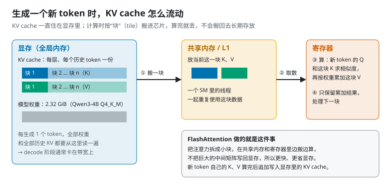

**KV cache 有多大？可以直接算出来**：

```
每个 token 的 KV 字节数 = 2（K 和 V）× 层数 × KV 头数 × 每头维度 × 每个数的字节数
```

报告用的 Qwen3-4B-Instruct-2507，从模型文件（GGUF 元数据）里读出：36 层，32 个查询头但只有 8 个 KV 头，每头 128 维。

- **f16**（每个数 2 字节）：2 × 36 × 8 × 128 × 2 = 147456 字节，即每个 token **144 KiB**。
- 乘以 8192 个 token = **1152 MiB**；乘以 16384 个 token = 2304 MiB。
- **q8_0**（平均每个数 8.5 位）：1152 × 8.5 ÷ 16 = **612 MiB**，减少 1 − 8.5 ÷ 16 = **46.875%**。

这和报告 9.1 节从运行日志里实测的分配量完全一致，理论和实测对上了。

这里还藏着一个省显存的设计：32 个查询头共用 8 组 K、V，叫 **GQA**（Grouped-Query Attention，分组查询注意力），KV cache 因此只有“每个头都有自己的 KV”时的四分之一。像 32 个学生四人一组共用一本笔记，笔记本的总数就只要原来的四分之一。

**上下文越长、并发越多，KV cache 越大**：每多一个槽位，就要多备一份上下文的 KV。报告里整包 8635 token 在 8192 上下文的配置中放不下，就是这个原因。

### 9.5 算力还是带宽：prefill 和 decode 卡在不同的地方

用一个概念衡量“卡在哪”：**算术强度**（arithmetic intensity），即每从显存读一个字节，要做多少次运算。

- **Prefill**（读输入）：一次处理成百上千个 token，读一遍权重可以给所有 token 共用，运算多、搬运相对少。瓶颈在**算力**（compute-bound）。像一次从仓库搬来一大批菜，做一整桌宴席：搬一趟，做很多道菜。
- **Decode**（逐字生成）：每生成 **1 个** token，都要把**全部权重**和全部历史 KV 从显存读一遍，而只做很少的运算。瓶颈在**显存带宽**（memory-bound）。像每炒一道小菜，都得把整个仓库的调料全搬上楼一遍：搬运比炒菜累多了。

**用这台笔记本估算一下**：Qwen3-4B Q4_K_M 的模型文件 2.32 GiB（约 2.5 GB）。每生成一个 token 至少要读一遍，显存带宽约 256 GB/s，所以单路生成速度的理论上限约为 256 ÷ 2.5 ≈ **100 token/s**。报告第 10 节实测单路约 46 token/s，考虑到还要读 KV、kernel 调度开销，量级是吻合的。这只是估算，不是实测上限。

**为什么并发能提高总吞吐**：4 路请求同时生成时，读一遍权重可以同时给 4 个 token 用。报告第 10 节里，4 个槽位并发 4 路时，总输出从 46 升到 96 token/s。这就是**批处理**（batching）的意义，像拼车：反正车（读一遍权重）都要开一趟，多捎几个乘客几乎不增加成本。服务端引擎的连续批处理（第 10 章）把这个思路做得更彻底。

这种“看瓶颈在算力还是带宽”的分析方法叫 **roofline 模型**（屋顶线模型）：画一张图，横轴是算术强度，纵轴是可达到的性能，性能被“带宽斜线”和“算力天花板”两条线同时限制。整张图就像一个带斜坡的屋顶：程序要么撞上斜坡（菜送不过来），要么撞上平顶（厨师手速到头了），想长高只能看自己在屋顶的哪一边。

### 9.6 显存预算怎么算

一个模型能不能在一张卡上跑起来，就像搬家前量家具：客厅（显存）就这么大，沙发（权重）、茶几（KV cache）、过道（计算缓冲区）都得放得下。大致这么算：

```
显存占用 ≈ 模型权重 + KV cache + 计算缓冲区 + 系统和其他程序
```

用报告第 6 节的本地 Qwen3-4B（当时 KV 用 q8_0、上下文 16384）估算：

- 权重 2.32 GiB；
- KV cache 1224 MiB；
- 再加上计算缓冲区和系统占用（0.6–1.2 GB），实测总占用 5.0 GB，大致对得上。

8B 模型用 Q6_K 时，光权重就约 6 GB 以上，加上 KV 和系统占用，8 GB 显卡几乎全满（实测 7.7 GB）。所以报告建议 8 GB 显卡上的 8B 模型用 Q4_K_M。

### 9.7 CPU 这边：内存、带宽和其他芯片

- **系统内存**的带宽比显存低得多（双通道 DDR5 大约在几十 GB/s 到一百 GB/s 左右），所以大模型放在 CPU 上生成会慢很多。小的向量模型不受影响：bge-small 在 CPU 上每秒能处理 31–41 段（报告第 10 节）。
- **统一内存**（unified memory）：苹果 M 系列芯片让 CPU 和 GPU 共用同一块内存，不用经过 PCIe 搬数据，所以能跑超出“显存”容量的大模型。相当于把厨房和仓库打通成一个大开间，东西随手就能拿到；代价是这个大开间的“传送带”通常没有独立显卡的显存那么宽。
- **NPU**（神经网络处理器）：一些新款笔记本处理器带的 AI 加速单元，功耗低，但目前主流本地推理工具对它的支持还有限，像一位新来的帮手，能干活，但大多数“工头”还不知道怎么使唤他。本报告没有使用。

## 10. 推理与 AI infra：KV cache、量化、并发

### 10.1 Prefill 和 Decode

模型生成回答分两个阶段：

- **Prefill（预填充）**：一次性读完整个输入，计算每个 token 的中间结果。输入越长越慢，它决定了**首字延迟**。相当于考试时“读题”。
- **Decode（解码）**：一个 token 一个 token 地往外生成，它决定了**输出速度**。相当于“一个字一个字地写答案”。

### 10.2 KV cache 和前缀缓存

Prefill 时，模型为每个 token 算出的 Key / Value 会暂存起来，这就是 **KV cache**。后续生成每个新 token 都要回看它们，所以 KV cache 一直占着显存，上下文越长占得越多。它住在哪一层、怎么流动、有多大，见 9.4 节。

如果下一次请求的**开头**和上一次一模一样，这部分就可以直接复用，这叫**前缀缓存**（prefix caching）。

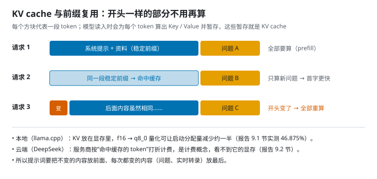

报告里的三个实测：

- **本地（llama.cpp）**：共享前缀后，短检索请求的首字中位数从约 170–220 ms 降到约 35–39 ms（报告 9.1 节）。
- **本地 KV 量化**：KV 从 f16 改成 q8_0，启动分配量少了 46.875%（例如 16384 token 时从 2304 MiB 降到 1224 MiB）。
- **云端（DeepSeek）**：稳定前缀命中后，整包的输入费用降约 96%，但首字没有稳定变快（报告 9.2 节）。云端缓存是**计费概念**，你看不到服务器的显存。

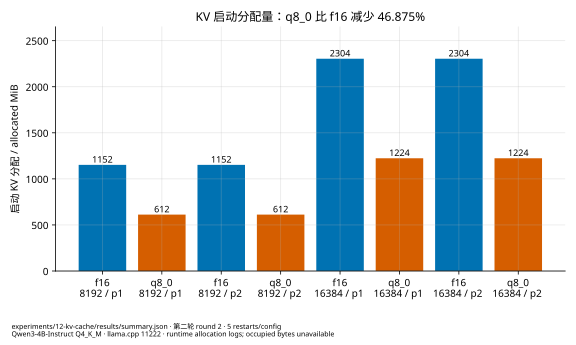

这就是第 1.3 节提示词要分层排的原因：不变的内容放前面，每次都变的问题放最后。

### 10.3 量化（quantization）

**量化**是用更少的位数存模型权重（或 KV cache），以换取更小的体积和显存占用。就像把手机照片从原图压成普通 JPEG：文件小了好几倍，肉眼几乎看不出差别；但压得太狠，照片就糊了。

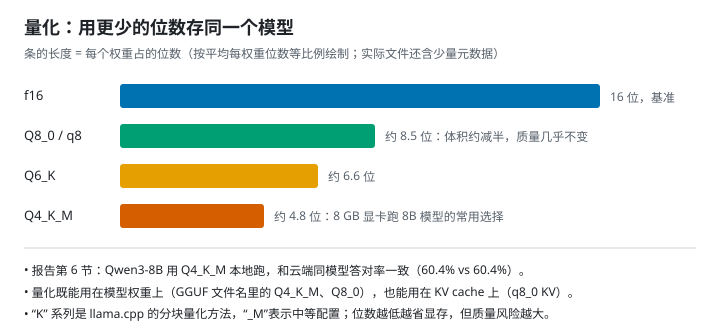

- **f16 / bf16**：16 位浮点，常作为“原版”基准。
- **Q8_0**：约 8.5 位，质量几乎无损。
- **Q4_K_M**：约 4.8 位，8 GB 显卡跑 8B 模型的常用选择。报告第 6 节里，Qwen3-8B 的 Q4_K_M 本地版和云端版答对率一致（检索场景都是 60.4%）。
- 位数越低越省显存，但质量风险越大；8 GB 显卡上 8B 的 Q6_K 模型几乎占满，冷启动要 82 秒。

### 10.4 推理引擎：llama.cpp 和 vLLM

- **llama.cpp**：C/C++ 写的推理引擎，擅长在个人电脑（CPU、消费级显卡、Mac）上跑 GGUF 量化模型。`llama-server` 提供 OpenAI 兼容的 HTTP 接口。报告里的本地模型都跑在它上面。常用参数：
  - `-ngl 99`：把尽量多的层放到 GPU（GPU offload）；
  - `-c`：上下文长度；
  - `-fa on`：打开 Flash Attention，一种更省显存、更快的注意力计算方法；
  - `--parallel` / slots：并行槽位数，每个槽位同时服务一个请求。
- **vLLM**：面向服务器的推理引擎，核心技术是 **PagedAttention**，像操作系统管理内存页一样管理 KV cache，减少碎片。好比停车场按单个车位分配，而不是给每个车队预留一整排，空位就不会被白白占着。配合 **continuous batching**（连续批处理：请求随到随加入正在运行的批次），能在高并发下显著提高吞吐。这就像公交车随上随下，不用等满员才发车，也不用等所有人都到站才让新乘客上车。本报告没有测 vLLM，这里只作概念介绍。

一句话区分：llama.cpp 像家里的电饭煲，小巧好用，一次煮几个人的饭；vLLM 像食堂的大蒸柜，专门为成百上千人同时开饭设计。

### 10.5 吞吐和延迟

- **延迟**（latency）：单个请求要等多久，用户能直接感受到。
- **吞吐**（throughput）：单位时间里总共能处理多少（token/s 或 请求/s），决定能服务多少人。

用高速公路来想：延迟是**一辆车**跑完全程要多久，吞吐是**每小时**能通过多少辆车。车越多，总通过量越大，但车多到一定程度就开始堵，每辆车都变慢。两者常常此消彼长。报告第 10 节：本地 4 个槽位时，并发 1–4 路的首字 0.26–0.46 秒，总输出从 46 升到 96 token/s；并发 8 路超过槽位数，请求开始排队，首字升到 2.8 秒。云端 deepseek-chat 在 16 路并发下首字几乎不变，qwen3.8-flash 则明显变慢。

显存预算的算法见 9.6 节。注意，报告测的是 KV 的“启动分配量”；运行中实际占了多少字节，llama.cpp 没有暴露，所以报告记为空，而不是拿 GPU 总显存来代替。

## 11. 评测和成本：怎么知道自己没在自欺欺人

先看一道题从出题到打分的完整流程。每种方案都答同一批题，只换“取资料”这一步，其他环节完全一样，这样比出来的差别才说明问题：

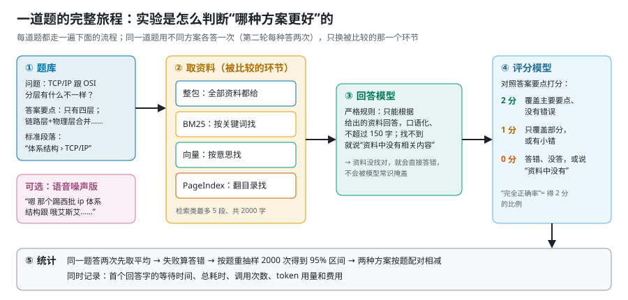

两个真实例子，说明为什么评测要这么设计（题目改编自 CS-Notes，CC BY-NC-SA 4.0）：

- **“找到了”不等于“答对了”**。问题是“每行每列都递增的二维数组里，怎么高效找一个数？”向量检索确实把标准段落放进了证据，但模型看到的只有题目和示例、没有解法，于是回答“资料中没有具体解法”，得 0 分。所以报告除了看“标准段落有没有被找到”，还一定要看最终回答对不对。
- **答一半只得 1 分**。一道要结合“反射”和“永久代”两章的题，整包只讲了永久代那一半，得 1 分；把两章都讲到的方案得 2 分。主指标“完全正确率”只算 2 分，所以“说对一半”不会被算成对。

更多真实题目、回答和每个实验的卡片，见[实验详解](WALKTHROUGH.zh-CN.md)。

### 11.1 评测集和指标

- **评测集**：一组问题加标准答案要点。报告用公开的 CS-Notes，由模型出题，每题 2–4 个要点。
- **完全正确率**：回答覆盖了主要要点、没有错误（得 2 分）的比例。
- **答错率**：答错或说“资料里没有”（得 0 分）的比例。
- **检索命中率 / 证据覆盖率**：标准答案所在的段落有没有被检索出来、有没有送进提示词。它只说明“给了”，不说明回答“用了”。

### 11.2 LLM-as-judge

用另一个模型按要点打分，叫 **LLM-as-judge**（大模型当评委）。优点是便宜、快、能规模化；缺点是评委可能偏向自己家模型的表述，也会犯错，有点像让学生批自己的卷子：省事，但难免手下留情。报告里出题、回答和评分用的是同一家的模型，这被列为已知偏差，也没有人工复核。

### 11.3 置信区间、bootstrap 和配对比较

48 道题里答对 38 道是 79.2%，但换一批题可能就是 70% 或 88%。**置信区间**就是在描述这种不确定性。

- **Bootstrap**：从这 48 道题里有放回地随机抽 48 道，算一次正确率；重复 2000 次，取中间 95% 的范围作为区间。想象把 48 道题写在 48 张卡片上放进帽子：每次抽一张、记下、放回去，抽满 48 次算一次分数。这样“重新考”2000 遍，看分数在什么范围里晃。报告的随机种子固定为 7，所以谁来重算都得到同样的结果。
- **配对比较**：两种方法答的是同一批题，就逐题相减再 bootstrap，这比分别算两个区间再比较更灵敏。好比比较两套教学方法，让同一批学生先后用两种方法学，比找两批不同的学生各学一种更公平：题目难易的影响被抵消了。报告 4.3 节就是这样得出“PageIndex 比 BM25 高 20.8 个百分点，区间 7–35，不跨 0”的。
- **区间跨 0 = 没有证据说明有差异**。PageIndex 对整包是 +3.1，区间 −6–14，所以报告只能说“差异不显著”，不能说“PageIndex 更好”。就像两个人量身高差了 3 厘米，但尺子本身有 ±10 厘米的误差，谁高谁矮就说不清。
- **以题为单位**：同一题答两遍，两次结果先取平均，不能当成两个独立样本，否则区间会假装变窄。要是一道题问两遍就算两道题，那把同一道题问一百遍，区间就能窄到让人自我感动。
- **失败计入分母**：请求失败的题算答错，不能悄悄扔掉。

### 11.4 成本工程

- **按用量计费**：费用 = 输入 token × 输入单价 + 输出 token × 输出单价；命中缓存的输入 token 按更低的价格计。
- **高峰和空闲价**：DeepSeek 空闲时段半价；报告保守地按高峰价计算。
- **建索引摊销**：PageIndex 和向量检索都要先付一次建索引的钱。把它平摊到 1 / 10 / 100 次查询上，才能公平地比较每题成本（报告 4.3 节）。
- **预算网关**：所有付费请求都先经过一个本地代理（`experiments/lib/gateway.cjs`）。它在发出请求前按“最大可能费用”原子地预留预算，拿到接口返回的用量后再结算；失败、断流或缺用量的请求保留预留，不当作免费。这样即使 SDK 内部偷偷重试，也跑不出预算上限。它像给孩子一张有额度的储值卡，而不是把银行卡直接交给他。
- **可观测性**（observability）：记录每次调用的 token、延迟、缓存命中、是否被截断。报告里有一个坑：PageIndex SDK 建索引时不传输出上限，如果网关默认只给 512 token，摘要会被悄悄截断，只有记录了 `finish_reason=length` 才能发现。

## 12. 工程实战：设计一个企业级 Agent 调用与计费平台

这是一道常见的系统设计面试题：

> 设计一个企业级 AI Agent 调用与计费平台。入口峰值 2 万 QPS，单个任务最长要跑几十分钟。要解决长任务、高并发下的额度扣减、计费准确和高可用。

这一章先补齐需要的概念，再一步步解题。报告里的预算网关正好是这道题的一个单机缩小版，最后会逐项对应起来。

### 12.1 先补几个概念

- **QPS**（Queries Per Second）：每秒请求数，衡量入口压力。
- **Little 定律**：系统里同时存在的任务数 = 到达速率 × 平均停留时间。它是估算并发量最重要的一个公式。用奶茶店来记：每分钟进来 2 位客人，每人在店里待 15 分钟，店里平均就有 30 个人。
- **同步与异步**：
  - 同步是“你等着，我做完再回你”，像站在柜台前盯着店员做奶茶；
  - 异步是“我先给你一张取件单（task_id），做完你再来取”，像拿了号去旁边坐着，做好了叫号。
  - 长任务必须异步，HTTP 连接不能挂着等几十分钟。谁也不会在柜台前站半个小时等一杯奶茶。
- **消息队列**（MQ，如 Kafka、RocketMQ）：生产者把消息放进队列，消费者按自己的节奏取，像银行的叫号机和等候区。
  - 作用：**削峰**（入口突增时先排队，大堂再挤也不会冲垮柜台）和**解耦**（取号的机器不用等柜员办完业务）。
  - 大多数 MQ 保证**至少一次**（at-least-once）投递：消息不会丢，但可能重复，就像快递公司宁可送两次也绝不丢件。所以消费者必须能处理重复消息。
  - 处理不了的消息转进**死信队列**（DLQ），单独隔离处理，相当于快递的“问题件仓库”。
- **Redis**：内存里的键值数据库，单机每秒可处理十万量级的简单操作。它执行命令是单线程的，一段 **Lua 脚本**会被原子地执行完，中间不会插进别的命令，适合做“检查余额并扣减”这种不能被打断的操作。但 Redis 的持久化和主从复制都可能丢最近的写入，**不适合当账本的唯一来源**。把它想成收银台上的小本子：记得飞快，但偶尔会掉一页；真正的总账要锁在保险柜（数据库）里。
- **数据库事务**：一组写操作要么全成功、要么全失败，像转账：“从你的账户扣 100”和“往我的账户加 100”必须同时发生，不能只发生一半。账本、冻结单这类“钱”的数据放在支持事务的关系型数据库里。
- **最终一致性**：跨多个系统（数据库、Redis、MQ）没法用一个事务保证同时成功，只能保证“经过一段时间后一定对上”。常用手段是 **outbox 模式**：把“要发的消息”和业务数据写在**同一个数据库事务**里，再由一个后台进程把 outbox 表里的消息投递到 MQ。好比写日记时，在同一页末尾顺手记下“待寄的信”，再由专人每天翻日记把信寄出去：日记写了，信就一定会寄，不会出现“写了但忘了寄”。
- **幂等键**（idempotency key）：客户端给每个请求一个唯一 ID。服务端用唯一约束保证同一个 ID 只处理一次，重试不会重复扣钱、重复建任务。它就是订单号：同一个订单号，仓库只发一次货。
- **租约和心跳**（lease / heartbeat）：worker 领取任务时拿到一个有期限的“租约”，比如 30 秒，并定期续约。像图书馆借书：到期前要续借，不续借，书就可以借给别人。如果 worker 死了、租约过期，任务就能被别的 worker 接手。
- **fencing token**：每次重新分配任务时发一个递增的编号，写数据时带上它，旧编号的写入会被拒绝。这可以防止一个“假死”后又醒过来的旧 worker 和新 worker 同时写，就像房东换了锁，前任租客手里的旧钥匙再也打不开门。
- **checkpoint 和事件溯源**：长任务每完成一步就记一条日志（调用了什么模型、工具返回了什么）。重启后可以从最后一步继续，而不是从头重跑，就是打游戏的**存档**：没人愿意因为停电就从第一关重新打。
- **限流、熔断、背压**：
  - **令牌桶**限流：按固定速率发令牌，拿到令牌的请求才放行，像游乐园按固定节奏放人进场；
  - **熔断**：下游持续出错时暂时停止调用，避免雪崩，像家里的空气开关，电路一过载就跳闸，保护整栋楼；
  - **背压**：下游处理不过来时，让上游放慢或拒绝新请求，像餐厅后厨忙疯了，前台先暂停接外卖单。
- **对账**：定期拿两份独立的记录互相核对，比如内部账本和服务商账单，发现差异就报警和修正，就像月底把自己的记账本和银行流水对一遍。

### 12.2 第一步：澄清需求和估算

一个常见的回答思路是：2 万 QPS 是入口峰值，但任务要跑几十分钟，所以同时在跑的任务非常多，HTTP 连接不能挂着等结果。**这个方向是对的，但估算要算准。**

用 Little 定律：假设 2 万 QPS **全部**是新建任务，平均每个跑 30 分钟（1800 秒），那么同时在跑的任务数 = 20000 × 1800 = **3600 万**，不是几十万。3600 万个同时运行的 Agent，每个还要不停调用大模型，这在成本和算力上都不现实。所以面试时应该先问清楚：**2 万 QPS 里有多少是新建长任务？**

更合理的拆法：

| 请求类型 | 占比假设 | 速率 | 说明 |
| --- | --- | --- | --- |
| 查询任务状态、轮询 | 大部分 | 约 1.5 万 / 秒 | 只读，可以走缓存 |
| 短的同步调用（一次问答） | 一部分 | 约 5000 / 秒 | 秒级完成 |
| 新建长任务 | 少数 | 约 200 / 秒 | 200 × 1800 ≈ **36 万**个同时运行 |

占比是假设，面试时要说出来并请面试官确认。按 36 万个运行中的任务再往下估：

- **任务状态存储**：每个任务的状态加 checkpoint 约几 KB，36 万个也就几 GB，一个数据库集群能放下。
- **用量事件**：如果每个任务平均每 10 秒调用一次模型，每次调用上报一条用量，就是 36 万 ÷ 10 = **3.6 万条 / 秒**。这个量要走 MQ 批量写入，不能每条都同步更新余额。
- **Worker 数量**：Agent 大部分时间在等模型返回，属于 I/O 密集型。一个 worker 进程用异步 I/O 可以同时推进几百到上千个任务，几百个 worker 实例就能撑住。

### 12.3 整体架构：快进快出

主线是：**同步请求只“接单”，不“执行”**。

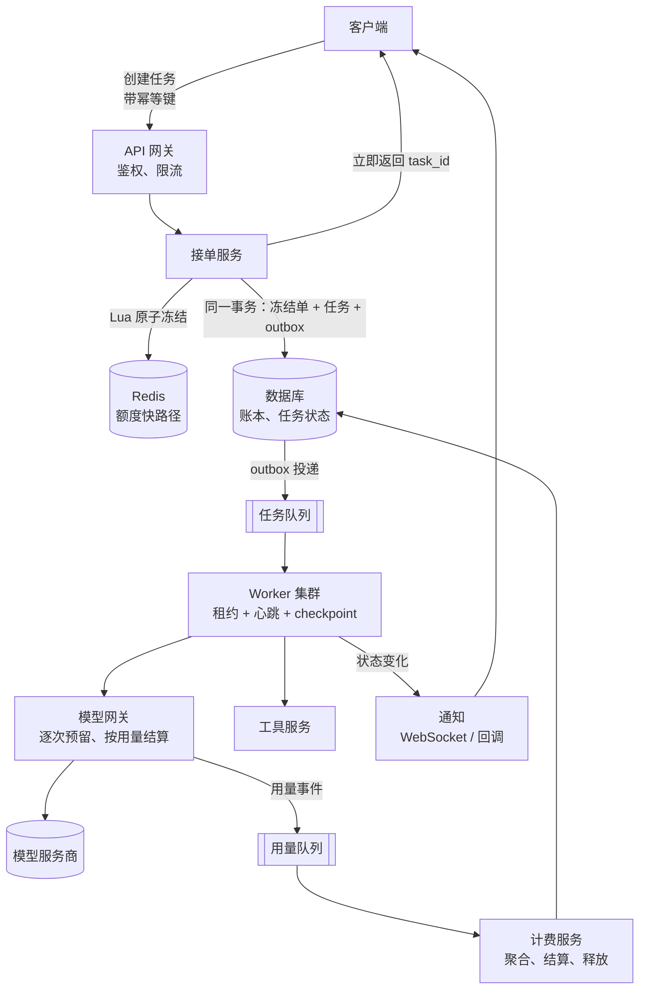

1. **网关**：鉴权、按租户限流（令牌桶）、检查幂等键。
2. **接单服务**：
   - 在 Redis 里用 Lua 脚本原子地“检查可用额度并冻结”；
   - 在数据库的**同一个事务**里写入冻结单、任务记录和 outbox 消息；
   - 然后立刻返回 task_id。
3. **任务队列**：outbox 后台进程把任务投递到 MQ，负责削峰。
4. **Worker**：领取任务时拿到租约，定期心跳，每完成一步写 checkpoint。
5. **模型网关**：所有模型调用都必须经过它，逐次预留、按用量结算、上报用量事件。这是计费准确的关键，后面详细讲。
6. **计费服务**：消费用量事件，按任务聚合，任务结束时做最终结算。
7. **结果获取**：客户端轮询任务状态，或通过 WebSocket / 回调接收推送。

### 12.4 额度：先冻结，再结算

**为什么不能在入口直接扣款**：任务要跑几十分钟，入口根本不知道最终会消耗多少 token、调多少次工具。所以扣款拆成两个阶段：

1. **入口冻结**一个上限额度：按“模型档位 × 预估 token 上限 + 工具调用上限”算，写一条冻结单。冻结是为了**防止超额**。
2. **任务结束时按实际用量结算**：真正扣款，多冻结的部分释放回去；任务失败就按规则释放。结算才是**真扣**。

这和住酒店一模一样：入住时前台先在你的信用卡上**预授权**一笔押金（冻结），退房时按实际消费扣款（结算），剩下的押金解冻。没人会在入住时就猜你会喝几瓶迷你吧的可乐。

这个主线之外，面试官常会追问下面几点。

**① 冻结必须是原子的**。“查余额够不够”和“扣掉冻结额”如果分两步做，并发时两个请求会同时看到余额够、同时冻结，最终超额。

- 用 Redis 的 Lua 脚本一次完成：`可用 = 余额 − 已冻结；够就把已冻结加上本次金额，不够就拒绝`。
- 同时，冻结单以 task_id 为唯一键写进数据库。**数据库是账本的最终来源，Redis 只是快路径**，两者定期对账。Redis 丢了数据，可以从数据库重建。

**② 热点租户**。大企业客户可能一个账户每秒就有上千个请求，全部打在同一个 Redis key 上会成为瓶颈，就像一家公司的所有员工都挤在同一台 ATM 前取钱。常用解法：

- 把额度拆成 N 个**子桶**，请求随机落到其中一个，相当于多开几台 ATM，每台放一部分钱；
- 或者让每台接单服务先从总额度里**批量领一小段额度**，在本地扣，用完再领（类似“号段”思路），相当于先给每个部门发一笔备用金，花完再申请。

代价是额度会被切碎，可能出现“总额够但某个桶不够”，需要桶之间能互相调拨。

**③ 长任务中途超出冻结额怎么办**。冻结的是预估上限，Agent 实际跑起来可能超出。处理思路像加油站预付：先付 200，不够再续；卡里实在没钱了，就先把车停在路边，而不是把车扔了。

- 模型网关每次调用前，都从这个任务的冻结额里预留本次调用的上限；
- 剩余冻结额不足时，尝试从租户余额里**追加冻结**（续冻）；
- 余额也不够时，**暂停任务**：保存 checkpoint，通知用户充值或确认，而不是直接杀掉，否则前面花的钱就白费了。

**④ 用量是多维的，口径要统一**：

- 用量分别埋点：输入 token、输出 token、缓存命中 token、工具调用次数、执行时长、模型档位。
- 冻结和结算用**同一份价格表的同一个版本**：冻结单上记下价格版本号，结算时按它算。否则任务跑到一半调了价，就会出现“冻结按 A 算、结算按 B 算”对不上的问题。

**⑤ 计费准确靠“逐次计量”，不是事后估算**：

- 模型网关每次调用拿到服务商返回的 usage 后，生成一条**带唯一 event_id** 的用量事件，事件幂等入库。
- 最终结算 = 这个任务所有用量事件的汇总，而不是结束时再估一遍。
- **拿不到用量的情况**（流式中途断开、服务商没返回 usage）：不能当作免费。先按本次预留的上限计入“待确认费用”，之后用服务商的账单对账修正。这正是报告里预算网关“保留未知预留”的做法。

**⑥ 全链路幂等**：

| 环节 | 幂等手段 |
| --- | --- |
| 创建任务 | 客户端的幂等键；task_id 唯一约束 |
| 冻结 | 冻结单以 task_id 为唯一键，重复冻结直接返回已有结果 |
| 用量上报 | event_id 唯一，重复事件被丢弃 |
| 结算 | 状态机 `冻结中 → 已结算 / 已释放`，用条件更新（只有当前状态是“冻结中”才能改）保证只结算一次 |
| MQ 重复投递 | 消费者按上述唯一键去重 |

**⑦ 失败分场景处理**：

- 模型调用失败、没有产生用量：全额释放冻结。
- 部分工具调用成功后失败：按已完成部分结算。
- 断流、用量未知：按保守上限暂计，对账后修正。
- 用户主动取消：结算已发生的用量，释放剩余部分。

### 12.5 长任务与高可用：关键在任务状态

高可用的难点不在网关（网关无状态，多开几台就行），而在**几十万个跑了一半的任务**。网关像餐厅门口的迎宾，换一个人照样迎客；真正让人紧张的是后厨几十万口正在炖的锅：厨师突然倒下了，得有人知道每口锅炖到了哪一步，接着炖下去。

- **任务状态持久化**：状态机（排队中 → 运行中 → 暂停 / 成功 / 失败）存在数据库里，每一步的 checkpoint 也存下来。调度器和 worker 都可以是无状态的，重启后从数据库恢复。
- **租约和心跳接管**：
  - worker 定期续租；worker 挂了，租约过期，任务回到可领取状态，由新 worker 从最后一个 checkpoint 继续；
  - 用 fencing token 防止旧 worker“复活”后重复写。
- **工具调用的副作用**：有些工具调用不能重复执行，比如“发一封邮件”“下一个订单”。要么给工具调用也带上幂等键，要么在 checkpoint 里先记录“已执行、结果是什么”，恢复时直接读记录，不重新执行。
- **MQ 削峰和隔离**：
  - 入口突增时先进队列；
  - 多次重试仍失败的任务进死信队列，自动释放冻结额度并通知用户；
  - 队列积压超过阈值时，网关开始限流新任务，这就是背压。
- **依赖故障**：
  - **模型服务商**故障：熔断，切换到备用服务商或备用模型；超时要有上限，重试要有次数上限和退避。
  - **Redis** 故障：计费路径要“失败即拒绝”（fail closed），宁可暂停接新任务，也不能在无法冻结时放行，否则会超额。
  - **数据库**：主从加多可用区部署。
- **对账和兜底**：
  - 定期核对 Redis 与数据库的冻结额，以及内部账本与服务商账单；
  - 超过“最长任务时长 + 缓冲”仍未结算的冻结单要报警，确认后自动释放，防止额度被永久占住。

### 12.6 和报告里预算网关的对应

报告做实验时写的预算网关（`experiments/lib/budget.cjs`、`gateway.cjs`），是这套设计的单机缩小版：

| 平台设计 | 预算网关里的对应 | 规模差异 |
| --- | --- | --- |
| 入口冻结上限 | 每次请求前按“输入字节数 + 最大输出 token”预留，是保守上限 | 平台按任务冻结，网关按单次调用预留 |
| 按实际用量结算 | 拿到服务商返回的 usage 后，把预留改成实际费用 | 相同 |
| 用量未知时不当作免费 | 断流、缺用量、HTTP 失败的请求保留全部预留 | 相同 |
| 原子冻结 | 跨进程的目录锁加“写临时文件再重命名”，保证并发预留不超额 | 平台用 Redis Lua 加数据库事务 |
| 分级额度 | 总上限 ¥20，各阶段各有上限，不能自动借用 | 对应租户、项目、任务多级额度 |
| 额度调整可审计 | 阶段上限调整记录在账本的 `capHistory` 里 | 对应账本流水 |
| 重试单独计费 | 每次重试重新预留；关掉 SDK 自带重试 | 对应幂等和重试策略 |
| 熔断 | 同一进程上游失败满 5 次就停止转发 | 对应服务商熔断 |
| 凭证隔离 | 子进程只拿到临时令牌，真实 Key 只在网关里 | 对应网关统一持有服务商凭证 |
| 所有调用必须经过网关 | 出站连接拦截，SDK 绕不过网关 | 对应模型网关是唯一出口 |

这张表可以直接当面试里的“项目经历”来讲：一个小而完整的实现，说明你亲手处理过“先预留、后结算、未知用量保守计入、并发不超额”这几个核心问题。

### 12.7 面试口头版（3–5 分钟）

**回答顺序**：

1. **澄清需求（30 秒）**：“2 万 QPS 里新建长任务占多少？任务平均跑多久？计费维度有哪些？能接受的超额风险是多少？”并说明 Little 定律估算：全是长任务就是 3600 万并发，不现实，所以假设新建任务约 200 / 秒，约 36 万个同时运行。
2. **总体架构（1 分钟）**：快进快出。网关鉴权限流 → 原子冻结 → 同一事务写冻结单、任务和 outbox → MQ → worker 后台执行 → 立即返回 task_id；结果通过轮询或推送获取。
3. **计费（1–1.5 分钟）**：
   - 先冻结上限、后按实际用量结算；
   - 所有模型调用经过模型网关逐次计量，用量事件带 event_id 幂等入库；
   - 冻结和结算用同一个价格版本；
   - 中途超额就续冻或暂停；
   - 用量未知时保守计入，事后对账；
   - 全链路幂等。
4. **长任务和高可用（1 分钟）**：
   - 任务状态和 checkpoint 持久化；
   - worker 租约加心跳，挂了由别人从断点接管，fencing token 防止重复写；
   - 工具副作用要幂等；
   - 死信队列隔离失败任务并释放额度；
   - 下游熔断，计费依赖故障时失败即拒绝。
5. **权衡和兜底（30 秒）**：Redis 是快路径、数据库是账本；热点租户分桶；定期对账；超时未结算的冻结单报警并释放。
6. **引出项目经历**：“我在个人项目的评测里实现过一个缩小版的预算网关……”（对照 12.6 节）

**常见追问和简答**：

| 追问 | 简答 |
| --- | --- |
| Redis 扣完、数据库没写成功怎么办？ | 以数据库为准。Redis 冻结带过期时间；数据库事务失败时回滚 Redis 冻结，或者由对账任务发现“有冻结、无冻结单”后释放 |
| 为什么不用分布式事务（两阶段提交）？ | 吞吐低、实现复杂。用 outbox 加幂等消费实现最终一致，对计费场景足够，再用对账兜底 |
| 消息重复消费会不会重复扣钱？ | 不会。用量事件的 event_id 和结算状态机都保证幂等 |
| 任务跑到一半余额不足？ | 先尝试续冻；续冻失败就暂停并保存 checkpoint，通知用户，不直接杀掉 |
| 怎么防止少计费？ | 所有模型调用只能经过模型网关，出站流量拦截；用量缺失时按上限计入，事后与账单对账 |
| 预估冻结额太大，把用户额度都占住了？ | 冻结上限按档位设默认值，允许用户指定；长任务改为“初始冻结 + 按需续冻” |
| worker 假死后又恢复，会不会两个 worker 同时跑一个任务？ | 租约过期后才会被接管；写入时带 fencing token，旧 token 的写入被拒绝 |
| 价格中途调整？ | 冻结单记录价格版本，已开始的任务按原版本结算 |
| 2 万 QPS 的状态查询怎么扛？ | 查询走缓存和只读副本；推荐用 WebSocket 或回调推送代替高频轮询 |
| 怎么证明计费是准的？ | 逐次计量加事件汇总；每日与服务商账单对账；差异超过阈值就报警 |

## 附录：术语表

| 术语 | 一句话解释 | 在本报告 / 项目里 |
| --- | --- | --- |
| Token | 模型处理文本的最小单位 | 计费和上下文长度都按它算 |
| Tokenizer | 把文本切成 token 的程序 | 不同模型的分词器不同 |
| 上下文窗口 | 一次请求能容纳的 token 上限 | deepseek-flash 为 1M |
| System prompt | 放在最前面的系统设定 | “只根据资料回答” |
| Few-shot | 在提示词里给几个示例 | 本报告未使用 |
| Temperature | 控制输出随机性的参数 | 实验里多为 0.2 |
| max_tokens | 输出长度上限 | 网关对它强制设上限 |
| Streaming | 边生成边返回 | 所有计时都基于流式 |
| TTFT | 首字延迟 | 报告记的是“首个回答字” |
| TPOT / tokens/s | 每个输出 token 的耗时 / 输出速度 | 报告第 10 节并发实验 |
| 端到端延迟 | 从提问到回答结束 | PageIndex p50 6.35 s |
| 推理模型 | 先输出思考过程再回答的模型 | R1 蒸馏版不适合实时 |
| Thinking mode | 模型的思考开关 | deepseek-flash 默认开，需关闭 |
| RAG | 先检索再生成 | 报告的主题 |
| 整包（whole pack） | 把全部资料放进提示词 | 6 万字以内首选 |
| Chunk / 切段 | 检索的最小文本单位 | 按标题，目标 400 字 |
| Chunk overlap | 相邻段的重叠部分 | 80 字 |
| BM25 | 关键词打分检索 | 快但怕同义词和错字 |
| 分词 | 把中文切成词 | 框架默认不支持中文 |
| jieba | 常用中文分词库 | 实验 02 的“一行修复” |
| Embedding / 向量 | 表示语义的一串数字 | bge 512 维，其余 1024 维 |
| 余弦相似度 | 衡量两个向量方向是否接近 | 向量检索的“距离” |
| 向量数据库 | 存向量、找最近邻 | 项目用本地文件 + 暴力计算 |
| ANN | 近似最近邻搜索 | 大规模向量库才需要 |
| FAISS / Milvus | 常见向量检索库 / 数据库 | 本报告未使用 |
| 混合检索 | 关键词 + 向量结合 | BM25 + bge / DashScope |
| RRF | 按排名倒数融合多路结果 | k = 60，权重 1:1 或 1:2 |
| Rerank | 用更强的模型对候选重新排序 | 本报告未测 |
| Top-k | 取前 k 个结果 | 每题 5 段 |
| Recall / 召回率 | 该找到的找到了多少 | 报告里的“找到正确段落” |
| Precision / 精确率 | 找到的里有多少是对的 | — |
| Hit rate / 证据覆盖率 | 标准片段是否进入证据 | PageIndex 97.9% |
| Lost in the middle | 长上下文中间的内容更容易被忽略 | 报告第 3 节未观察到 |
| Agentic retrieval | 由模型主导、多步的检索 | PageIndex |
| PageIndex | 目录树加模型读页的检索方式 | 报告 4.3 节 |
| Tool / Function calling | 模型输出结构化的工具调用 | PageIndex 工具 |
| JSON Schema | 描述工具参数格式的规范 | 工具说明的一部分 |
| Agent | 在循环中调用工具直到完成的模型程序 | LangGraph 实验 |
| ReAct | “推理 + 行动”交替的 agent 范式 | 8.2 节 |
| Agent loop | agent 的“想—做—看”循环 | 每题最多 6 次 |
| MCP | 工具接入模型应用的开放协议 | PageIndex SDK 提供 MCP 工具 |
| Orchestration / 编排 | 组织多步流程和分支 | LangGraph 的图 |
| LangChain | 标准化零件式的 LLM 应用框架 | 实验 02 |
| LCEL / Runnable | LangChain 串联零件的方式 | 7.1 节 |
| LlamaIndex | 以索引为中心的 RAG 框架 | 实验 02 |
| Query Engine | LlamaIndex 的检索加回答一条龙 | 77%，非流式 |
| LangGraph | 用状态图编排 agent | 实验 08 |
| StateGraph / Node / Edge | LangGraph 的图、节点、边 | 7.3 节 |
| Conditional edge | 根据状态选择分支的边 | `tools_condition` |
| ToolNode | 自动执行工具调用的节点 | 检索工具 |
| Memory | 让 agent 记住历史的机制 | 本报告未涉及 |
| LiteLLM | 统一调用多家模型 API 的 Python 库 | PageIndex SDK 的底层 |
| OpenAI 兼容接口 | 仿照 OpenAI 格式的 HTTP API | DeepSeek、DashScope、llama-server 都支持 |
| 网络分层 | 应用、安全、传输、网络、链路各管一层 | 2.1 节 |
| IP 地址 | 机器在网络上的地址 | — |
| IPv4 / IPv6 | 两代 IP 地址格式 | 项目只用 IPv4 |
| 端口 | 区分同一台机器上的不同服务 | HTTPS 默认 443 |
| localhost / 回环地址 | 127.0.0.1，数据不出本机 | 预算网关、本地识别服务 |
| DNS | 把域名翻译成 IP 地址 | 实测几毫秒 |
| TCP | 可靠、有序、先建连接的传输协议 | HTTP/1.1、HTTP/2 的底层 |
| 三次握手 | TCP 建立连接的过程 | 花 1 个 RTT |
| RTT | 数据往返一次的时间 | — |
| 队头阻塞 | 前一个包没到，后面的都得等 | TCP 的代价 |
| UDP | 不建连接、不重传的传输协议 | DNS、实时音视频、QUIC |
| QUIC / HTTP/3 | 基于 UDP 的新一代传输和 HTTP | — |
| TLS / HTTPS | 加密连接 / 加密的 HTTP | 实测握手约 20–90 ms |
| 证书 | 证明服务器身份的电子文件 | — |
| HTTP 方法 | GET 取数据，POST 提交数据 | 调用模型用 POST |
| 状态码 | 服务器返回的三位数结果 | 200、400、401、402、429、5xx |
| 请求头 / 正文 | 元信息 / 实际数据 | `Authorization`、JSON |
| Keep-alive / 连接复用 | 一个连接连续发多个请求 | 省掉重复握手 |
| HTTP/2 多路复用 | 一个连接同时跑多个请求 | — |
| SSE | 服务器逐段推送文本的流式方式 | 大模型流式输出 |
| WebSocket | 长期双向通道 | 云端实时语音识别 |
| 正向代理 | 替你访问外部服务器 | 本机代理软件 |
| TUN 模式 / fake-IP | 代理接管全部流量，用假 IP 应答 DNS | 实测解析到 198.18.x.x |
| 反向代理 / 网关 | 挡在服务前统一鉴权、计费 | 预算网关 |
| 超时 | 请求的最长等待时间 | 每题 120 秒 |
| 重试 / 指数退避 | 失败后等待更久再试 | 有次数上限 |
| 幂等 | 执行一次和多次结果相同 | 调用大模型不是幂等的 |
| 限流 / 429 | 请求太频繁被拒绝 | 并发实验要留意 |
| REST | 用 URL 表示资源、方法表示动作 | `/chat/completions` |
| API Key / Bearer | 调用凭证 / 放在请求头里的写法 | 加密保存，不打日志 |
| 预热请求 | 提前发一个小请求建立缓存和连接 | `max_tokens=1`，约每 4 分钟续一次 |
| 进程 / 线程 | 独立运行的程序 / 进程内的执行流 | 3.1 节 |
| 主线程 | 负责界面响应的线程，不能阻塞 | — |
| IPC | 进程间通信 | 通道定义在 `shared/protocol.ts` |
| 主进程 / 渲染进程 / preload | Electron 的三种角色 | 3.1 节 |
| utilityProcess | Electron 的独立子进程 | 语音识别、向量模型 |
| Sidecar / 边车进程 | 主程序旁边启动的独立服务 | 本地 FunASR |
| 原子写入 | 先写临时文件再重命名 | 设置文件、预算账本 |
| 文件锁 | 防止多个进程同时修改 | 账本用锁目录 |
| bit / byte | 位 / 字节（8 位） | — |
| Unicode | 给每个字符一个编号 | — |
| UTF-8 | 最常用的字符编码 | 汉字通常 3 字节 |
| GBK | 较老的中文编码 | Windows 乱码之源 |
| CRLF / LF | Windows / Unix 的换行符 | 项目统一用 LF |
| JSON | 纯文本的结构化数据格式 | API 请求和配置 |
| Base64 | 把二进制编码成可打印文本 | 加密后的 Key |
| SHA-256 | 数据指纹，改一个字节就变 | 校验语料和依赖 |
| 采样率 | 每秒采样点数 | 语音 16 kHz，系统声音常为 48 kHz |
| 位深 / PCM | 每个采样点的位数 / 原始音频格式 | 16 位 PCM |
| 声道 | 单声道或立体声 | 识别用单声道 |
| 帧 / RMS | 一小段音频 / 这段的能量 | VAD 靠能量判断 |
| 环回采集 | 录下电脑正在播放的声音 | `loopbackCapture.ts` |
| AudioWorklet | 浏览器里的实时音频处理线程 | 分帧 |
| VAD | 判断有没有人在说话 | 静音 300 ms 断句 |
| 端点检测 | 判断一句话从哪开始、到哪结束 | VAD 的核心任务 |
| 中间结果 / 最终结果 | 会被修正的临时文字 / 确定的一句 | 云端实时识别 |
| 梅尔频谱 | 模拟人耳感知的声音特征图 | Whisper 的输入 |
| Whisper | OpenAI 开源的语音识别模型 | 本地识别，DirectML GPU |
| DirectML | Windows 上通用的 GPU 计算接口 | onnxruntime 用它 |
| FunASR / Paraformer | 阿里开源的中文识别工具包 / 模型 | 本地边车、云端实时识别 |
| QPS | 每秒请求数 | 12 章：入口峰值 2 万 |
| Little 定律 | 并发数 = 到达速率 × 停留时间 | 2 万 × 1800 秒 = 3600 万 |
| 同步 / 异步 | 等结果 / 先拿取件单再取结果 | 长任务必须异步 |
| 消息队列 MQ | 生产者和消费者之间的缓冲 | 削峰、解耦 |
| At-least-once | 消息不丢但可能重复 | 消费者必须幂等 |
| 死信队列 DLQ | 反复失败的消息单独隔离 | 失败任务释放额度 |
| Redis / Lua 脚本 | 内存键值库 / 原子执行的一段脚本 | 原子冻结额度 |
| 数据库事务 | 一组写入要么全成功要么全失败 | 冻结单与 outbox 同事务 |
| 最终一致性 | 跨系统经过一段时间后对上 | 计费链路 |
| Outbox 模式 | 消息和业务数据同事务写入，后台投递 | 防止写了库没发消息 |
| 冻结 / 结算 | 先占住上限额度 / 按实际用量真扣 | 预算网关的预留与结算 |
| 幂等键 | 同一请求只处理一次的唯一 ID | task_id、event_id |
| 状态机 | 限定状态只能按规定路径变化 | 冻结中 → 已结算 / 已释放 |
| 热点账户 / 分桶 | 单个 key 太热 / 拆成多个子额度 | 大客户额度 |
| 租约 / 心跳 | 有期限的任务所有权 / 定期续期 | worker 挂了可被接管 |
| Fencing token | 递增编号，拒绝旧持有者的写入 | 防止假死 worker 重复写 |
| Checkpoint / 事件溯源 | 每步记录，可从断点恢复 | 长任务恢复 |
| 令牌桶 | 按速率发放令牌的限流算法 | 网关限流 |
| 熔断 | 下游持续出错时暂停调用 | 服务商故障切换 |
| 背压 | 下游处理不过来时让上游放慢 | 队列积压时限流 |
| Fail closed | 出故障时默认拒绝 | 计费依赖故障时不放行 |
| 对账 | 两份独立记录互相核对 | 内部账本对服务商账单 |
| CPU | 中央处理器，少量强核心 | i9-13980HX，24 核 32 线程 |
| 核心 / 线程 | CPU 的独立执行单元 / 同时执行的指令流 | — |
| SIMD / AVX | 一条指令同时处理一组数 | CPU 跑小模型靠它 |
| GPU | 大量简单计算单元，擅长并行计算 | RTX 4060 Laptop |
| CUDA | NVIDIA 的 GPU 编程平台 | llama.cpp 用 CUDA 12.4 版本 |
| SM | GPU 的流式多处理器，相当于一个车间 | 这张卡 24 个 |
| CUDA core | 做普通浮点和整数运算的单元 | 这张卡 3072 个 |
| Tensor Core | 专门加速矩阵乘法的单元 | 大模型推理的主力 |
| Thread / Warp / Block | 线程 / 32 个线程为一组 / 线程块 | CUDA 的执行层级 |
| Kernel | 在 GPU 上运行的一个函数 | 推理引擎由大量 kernel 组成 |
| FLOPS | 每秒浮点运算次数，衡量算力 | prefill 看它 |
| 带宽 | 每秒能搬运的数据量 | decode 看它 |
| 寄存器 Register | 每个线程私有、最快的存储 | 每 SM 约 256 KB |
| Register spill | 寄存器不够时溢出到 local memory | 会拖慢 kernel |
| Local memory | 线程私有的溢出区，物理上在显存里 | 名字叫 local，其实不在芯片上 |
| 共享内存 / L1 | SM 内的片上 SRAM | 每 SM 约 128 KB |
| L2 缓存 | 全卡共享的片上缓存 | 约 32 MB |
| 全局内存 | GPU 的主存，即显存 | 权重和 KV cache 放在这里 |
| GDDR6 | 消费级显卡的显存类型 | 8 GB，约 256 GB/s |
| HBM | 堆叠封装的高带宽显存 | 数据中心卡，约 3 TB/s 量级 |
| PCIe | CPU 和显卡之间的总线 | 4.0 ×8，约 16 GB/s |
| 共享 GPU 内存 | 显存不足时借用系统内存 | 很慢，Apertus 疑似受此影响 |
| 统一内存 | CPU 和 GPU 共用一块内存 | 苹果 M 系列 |
| NPU | 笔记本处理器里的 AI 加速单元 | 本报告未使用 |
| 注意力（Q / K / V） | 用查询和键算相似度，再加权汇总值 | KV cache 的来源 |
| GQA | 多个查询头共用一组 K、V | Qwen3-4B：32 个查询头，8 个 KV 头 |
| KV 大小公式 | 2 × 层数 × KV 头数 × 头维度 × 字节数 | 每 token 144 KiB（f16） |
| 算术强度 | 每读一个字节做多少次运算 | 决定瓶颈在算力还是带宽 |
| Compute-bound / Memory-bound | 瓶颈在算力 / 瓶颈在带宽 | prefill / decode |
| Roofline 模型 | 用算力和带宽两条上限分析性能的方法 | 9.5 节 |
| Batching / 批处理 | 多个请求共用一次权重读取 | 4 路并发时总输出 46 → 96 token/s |
| Prefill | 一次性处理输入的阶段 | 决定首字延迟 |
| Decode | 逐 token 生成的阶段 | 决定输出速度 |
| KV cache | 缓存每个 token 的 Key / Value | q8_0 省 46.875% 分配 |
| Prefix caching | 相同开头的请求复用缓存 | 云端输入费用降约 96% |
| Cache hit rate | 命中缓存的输入 token 比例 | 整包 97–98% |
| Quantization / 量化 | 用更少位数存权重或 KV | Q4_K_M、Q8_0 |
| GGUF | llama.cpp 的模型文件格式 | 本地模型和 Qwen3-Embedding |
| ONNX | 通用模型交换格式 | transformers.js 跑 bge |
| f16 / bf16 | 16 位浮点精度 | KV 对照组 |
| llama.cpp / llama-server | 本地推理引擎 / 其 HTTP 服务 | build 11222 |
| GPU offload（-ngl） | 把模型层放到显卡 | `-ngl 99` |
| Flash Attention | 更快、更省显存的注意力计算 | `-fa on` |
| Slot / 并行槽位 | llama-server 同时服务的请求数 | 4 槽约服务 4 路实时请求 |
| vLLM | 服务器端高吞吐推理引擎 | 本报告未测 |
| PagedAttention | 分页管理 KV cache 的技术 | vLLM 的核心 |
| Continuous batching | 请求随到随加入批次 | 提高并发吞吐 |
| Throughput / 吞吐 | 单位时间的总处理量 | 本地 96 token/s（4 路） |
| 冷启动 | 第一次请求的额外耗时 | 本地 1.5–4.4 s |
| VRAM / 显存 | 显卡内存 | 8 GB 是本报告的边界 |
| LLM-as-judge | 用模型给回答打分 | 0 / 1 / 2 分制 |
| Bootstrap | 重抽样估计区间 | 2000 次，种子 7 |
| 置信区间 | 描述估计的不确定性 | 报告的括号里的范围 |
| 配对比较 | 同一批题逐题相减 | PageIndex 与各方法的差值 |
| 评测集 | 问题加标准答案要点 | 48 + 48 + 12 题 |
| 预检（pilot） | 小样本试跑，不计入正式结果 | 每题型 4 题 |
| 预算网关 | 统一预留、结算费用的代理 | `experiments/lib/gateway.cjs` |
| 摊销 | 把一次性成本分到多次使用上 | 建索引费用 ÷ 查询次数 |
| Observability / 可观测性 | 记录调用的用量、延迟、状态 | 截断记录 `finish_reason=length` |
| Egress 拦截 | 禁止程序擅自联网 | 拦下了 LiteLLM 自动下载 tokenizer |

想看这些概念在实测里的表现，回到[报告](REPORT.zh-CN.md)。
