# Don't reach for RAG too early: measured advice on retrieval, models and frameworks for personal knowledge bases

[简体中文](REPORT.zh-CN.md) · [Experiments](../README.md) · [Walkthrough: example questions, real answers, one card per experiment](WALKTHROUGH.en.md) · [Beginner handbook](HANDBOOK.en.md)

> A not-too-serious engineering test report. Every number comes from `experiments/*/results/summary.json` in this repository. The figures are drawn by [`make_figures.py`](make_figures.py), [`continuation_figures.py`](continuation_figures.py) and [`pageindex_figures.py`](pageindex_figures.py), with the plotted data in [`data/`](data/).
>
> The experiments ran in two rounds. **Round 1** answered and judged with deepseek-chat. **Round 2** (PageIndex, KV cache, cloud prefix cache) used deepseek-flash with thinking disabled throughout. deepseek-chat has since been retired, so round-1 conclusions about it describe how it behaved at the time. The two rounds are never pooled. [Current pricing](https://api-docs.deepseek.com/quick_start/pricing).

## Summary: seven unsurprising conclusions that finally have numbers behind them

One of my personal projects does real-time speech transcription. When someone finishes a sentence, it pulls relevant passages from my own notes and asks an LLM for an answer I can say out loud. Latency is everything: if nothing appears two seconds after the question ends, the answer is useless. To cut costs, compare models and find out when RAG is actually needed, I ran 13 experiments on CS-Notes, a public Chinese computer-science note collection. The conclusions:

1. **When there isn't much material, sending it whole is the best "retrieval".** Up to 60k Chinese characters, just send everything. Accuracy doesn't move until 85k characters (75%). The prefix cache hits 97–98% of the time, and each question costs under 0.01 CNY.
2. **When you do retrieve, don't rely on keywords alone.** BM25 gets 46–67% fully correct, dense retrieval 74–96%. Speech-recognition typos and transliterations cost BM25 another ten-plus points; it has no defence against paraphrase.
3. **Local embedding models are good enough.** On a laptop GPU, Qwen3-Embedding-0.6B ties cloud DashScope: 95.8% vs 97.9% of correct passages found, both 91.7% under speech noise. The 24 MB bge-small reaches 83%.
4. **PageIndex is a diligent student who reads the table of contents, and is just as slow.** It beats BM25 by 21–33 points and dense retrieval by 17–20, but its difference from simply sending everything is not significant, and it costs about 5 s more and 6–7× the price per question.
5. **Answer models: for real time, watch the first token; otherwise, watch accuracy.** A local Qwen3-4B is usable on 8 GB of VRAM. Reasoning models think for over a minute first, which is no good for real time.
6. **Frameworks have no magic.** Configured properly, LangChain and LlamaIndex match a few hundred lines of hand-written code. Their Chinese defaults barely work, and they bring 346 MB of dependencies. LangGraph's agent loop brings no significant gain on single-hop questions and costs about 15× as much.
7. **Caching really saves money, not necessarily time.** Locally, q8_0 cut KV-cache startup allocation by 46.875%. In the cloud, a prefix-cache hit cut the whole-pack input cost by about 96%, without consistently faster first tokens.

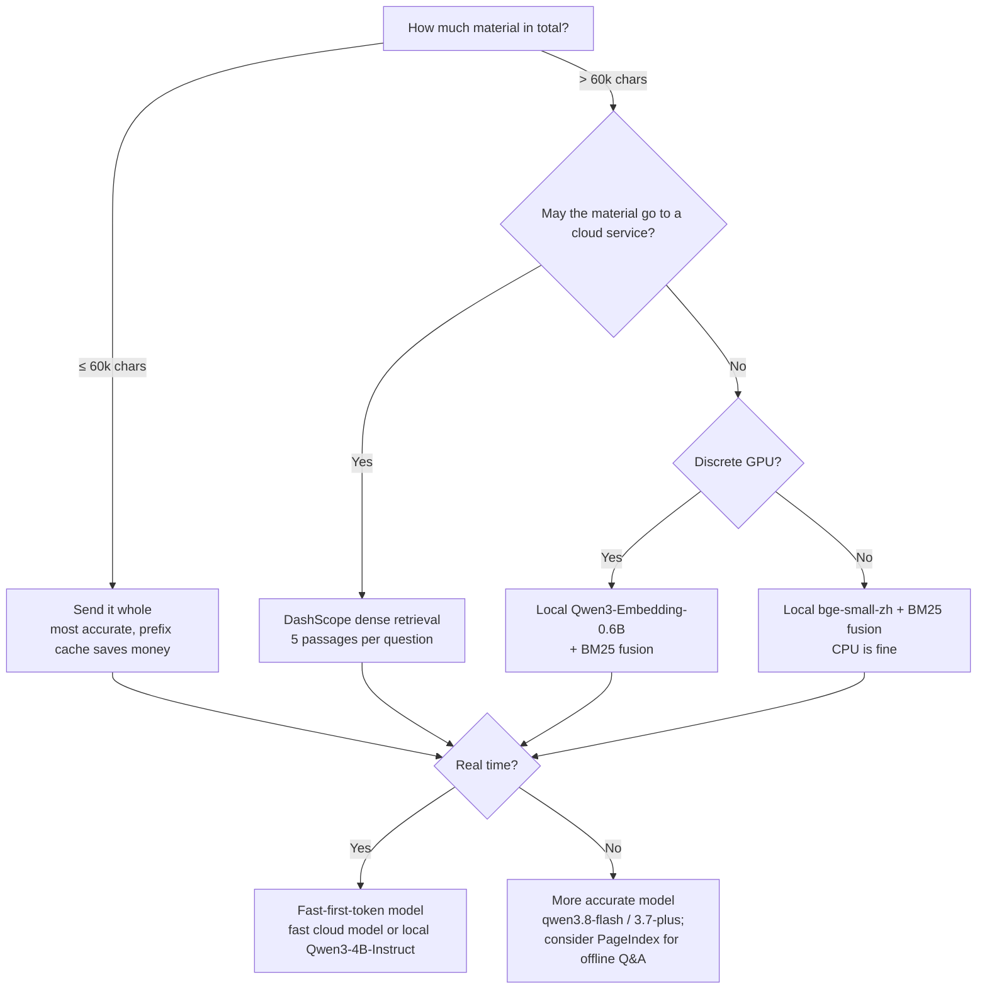

## 1. Why these experiments

The project's constraints make it different from ordinary document Q&A:

- **The first token must be fast**: more than two seconds after the speaker stops is too late.
- **Questions come from speech recognition**: Chinese, spoken, with typos, transliterations and filler words.
- **The material is small but mixed**: a résumé, job descriptions, tens to hundreds of thousands of characters of notes.
- **It is a desktop app**: shipping a Python runtime just for retrieval is unwelcome.
- **Privacy and cost**: the material is personal, and every call costs money.

Many personal and small-team knowledge bases share these constraints, so the conclusions are written as general advice. Out of scope: tables and images, and million-document retrieval services. Multi-hop reasoning got only an exploratory 12-question test in round 2.

## 2. Test bench

| Item | Value |
| --- | --- |
| Hardware | Intel i9-13980HX, 16 GB RAM, NVIDIA RTX 4060 Laptop 8 GB (driver 592.00) |
| OS | Windows 11 Home (Chinese); home broadband through a local proxy, IPv4 only |
| App stack | Node 22.13.1, Electron 41.1.1, transformers.js 3.8.1 |
| Local inference | llama.cpp b11222 (CUDA 12.4), `-ngl 99 -fa on` |
| Python | 3.12; LangChain 1.4.2, LlamaIndex 0.14.25, LangGraph 1.2.12; PageIndex SDK 0.2.10 |
| Cloud answer models | Round 1: deepseek-chat; Alibaba Bailian qwen3.8-flash, qwen3.7-plus, qwen3-8b (thinking off). Round 2: deepseek-flash (DeepSeek-V4.1-Flash, thinking off) |
| Embedding models | bge-small-zh-v1.5 (q8, CPU), Qwen3-Embedding-0.6B (GGUF Q8_0, GPU), DashScope text-embedding-v4 |
| Prices (CNY per million tokens, list price at the time) | Round 1 deepseek-chat: cached input 0.2, input 2, output 3; qwen3.8-flash input 0.8, output 2.7; qwen3.7-plus input 2, output 8; qwen3-8b unpriced, not costed. Round 2 deepseek-flash (peak): cached 0.04, uncached 2, output 8. text-embedding-v4: 0.5 |
| Corpus | Public [CS-Notes](https://github.com/CyC2018/CS-Notes) (CC BY-NC-SA 4.0, pinned commit); text not committed |

**Method**


Real questions and each method's answers are in the [walkthrough](WALKTHROUGH.en.md).

- **Questions**: a model writes questions from passages, half with the original terms and half paraphrased (synonyms, Chinese/English swaps), each with 2–4 answer points. Speech-noise questions are rewritten by a model to look like recognition output. Round 2 adds 12 cross-section composite questions, checked by the assistant against public text; they are not independent human annotation.
- **Strict answer rule**: the prompt simulates "someone just asked me a technical question out loud". The answer must be conversational and use only the given material; if nothing is found, the model must say "not in the material". A retrieval miss therefore becomes a wrong answer instead of being quietly patched by the model's general knowledge.
- **Judging**: 0 / 1 / 2 points against the answer points. We report "fully correct" (2) and "wrong or empty" (0). Intervals are 95% bootstrap over questions. In round 2 the question is the unit: the two answers to a question are averaged first, and methods are compared paired by question.
- **Timing**: streaming APIs; we record the first answer token (reasoning excluded), total time and output speed, plus cold start and VRAM for local models.
- **Cost**: API token usage × list price at the time. In round 2 every paid request went through a budget gateway that reserves an upper bound before sending and settles on reported usage. No figure here is a provider bill.

**Known biases, up front**: questions, answers and judging come from the same vendor's models, which may favour their own phrasing. Groups have only 22–54 questions, so ignore differences of a point or two. Some experiments ran concurrently, which affects latency (noted per section).

## 3. Pack size: how far does sending it whole go?


Experiment 01 (round 1) fixes 44 questions whose answers are all in the first eight documents, then keeps adding documents on other topics, from 22k to 129k characters. Each size is answered twice:

| Pack size | Whole fully correct / wrong | BM25 | Local bge hybrid | DashScope dense | Whole first token (median) | Whole cost per question |
| --- | --- | --- | --- | --- | --- | --- |
| 22k | 75 / 2 | 47 / 36 | 69 / 10 | 76 / 0 | 870 ms | ¥0.0025 |
| 33k | 75 / 5 | 47 / 36 | 70 / 14 | 77 / 0 | 777 ms | ¥0.0036 |
| 50k | 75 / 2 | 47 / 36 | 66 / 14 | 76 / 0 | 895 ms | ¥0.0056 |
| 85k | 75 / 5 | 46 / 36 | 68 / 16 | 77 / 0 | 1041 ms | ¥0.0089 |
| 129k | **69 / 10** | 46 / 36 | 69 / 14 | 77 / 0 | 994 ms | ¥0.0129 |

(Percent; 88 answers per cell; whole-pack 95% interval about ±12 points. Retrieval first token about 560–740 ms, about ¥0.0004–0.0008 per question.)

- Whole-pack accuracy holds rock steady up to 85k characters. At 129k it starts to slip and the wrong-answer rate doubles.
- DashScope dense retrieval scores 76–77% at every size and never answers wrongly. The gap comes from retrieval quality, not from "whole vs retrieval".

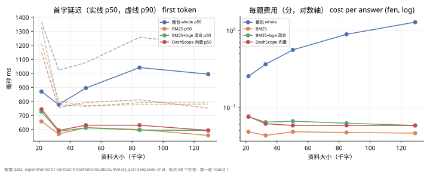

Whole is 0.1–0.45 s slower to the first token and 5–28× more expensive than retrieval, but the absolute numbers stay small: about 1.3 CNY cents per question at 129k characters, with 98% prefix-cache hits. The high p90 at 22k is the experiment's very first batch (cold start), not an effect of size.

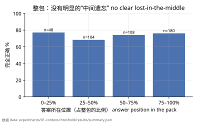

Split by where the answer sits in the pack, accuracy is 68–77%; no obvious "lost in the middle".

**A harder way to grow the pack (experiment 01b)**: experiment 01 grows the pack with unrelated documents, which doesn't make retrieval harder. So we repeated it with same-topic material, where the distractors look like the answers:

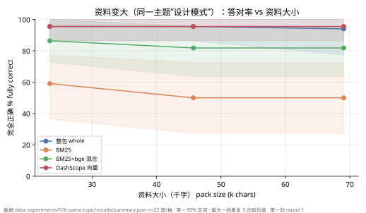

- 26 design-pattern notes with identical structure, the hardest distractors. From 23k to 69k characters, 22 questions:
  - whole and DashScope both hold 95.5% (the 69k size repeated three times: whole 95.5 / 95.5 / 90.9%);
  - BM25 falls from 59% to 50%, bge hybrid from 86% to 82%.

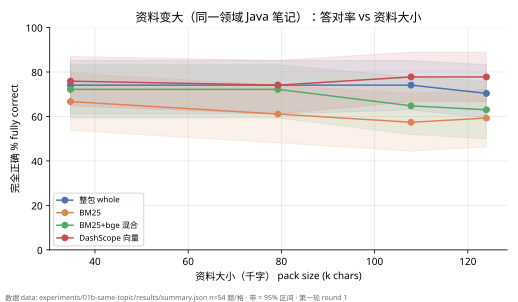

- 5 Java notes, from 35k to 124k characters, 54 questions:
  - whole 74% → 70%; DashScope stays at 76–78%;
  - bge hybrid 72% → 63%; BM25 67% → 59%.
  - The 148k size stopped at the experiment's 3.5 CNY budget cap.

**Conclusion**: a 60k-character limit for sending whole is comfortable. Past 100k characters of same-domain material, whole packs and small local hybrid retrieval both decline; good dense retrieval is essentially unaffected. My project raised its whole-pack limit from 30k to 60k characters accordingly. For 32k-context models, note that 60k Chinese characters is about 30–40k tokens.

## 4. Retrieval: can it find the passage?

### 4.1 Three basic methods

Same 200k-character material, 48 questions (round 1):

| Method | Correct passage found | Fully correct | Query time | Cost |
| --- | --- | --- | --- | --- |
| BM25 (keywords) | 65% | 46% | < 1 ms | none |
| BM25 + local bge-small-zh hybrid | 79% | 60% | about 5 ms | 24 MB model; about 3.5 min to index 2M characters |
| DashScope text-embedding-v4 | 85% | 69% | about 150 ms (network) | material uploaded to Alibaba Cloud; about 0.5 CNY to index 2M characters |

BM25 loses almost all its points on paraphrased questions: with synonyms or Chinese/English swaps, the words simply don't match. An earlier benchmark showed the same ordering on two corpora at three sizes.

### 4.2 How many passages, and how to chunk

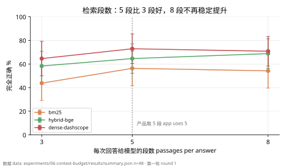

Experiment 06: the same 48 questions with 3 / 5 / 8 passages per answer. Five passages (at most three per document) beat three by 6–12 points fully correct (BM25 44% → 56%, bge hybrid 58% → 65%, DashScope 65% → 73%). Eight brought no consistent gain and about 0.1 s more first-token latency. My project now sends five.

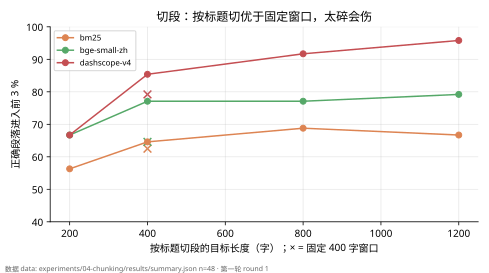

Experiment 04 looks at retrieval only (correct passage in the top 3):

| Chunking | BM25 | Local bge | DashScope |
| --- | --- | --- | --- |
| By heading, target 200 chars | 56% | 67% | 67% |
| By heading, target 400 chars (current) | 65% | 77% | 85% |
| By heading, target 800 chars | 69% | 77% | 92% |
| By heading, target 1200 chars | 67% | 79% | 96% |
| Fixed 400-char window (headings ignored) | 63% | 65% | 79% |

- Chunking by heading clearly helps both embedding models; going down to 200 characters loses context.
- Dense retrieval does better on larger chunks. But CS-Notes sections are short, so the average chunk only grew from 297 to 455 characters and the intervals overlap. The project has not changed yet.

### 4.3 PageIndex: the student who reads the table of contents (round 2)

[PageIndex](https://docs.pageindex.ai/sdk/client) reads like a person does. It first builds a "table of contents" tree for the document. To answer a question, the model reads the outline, picks likely sections, then reads those pages. No embeddings, no chunking.

**How we compared**

- **Corpus**: the M tier, 37 documents, 200347 characters, 637 chunks, rendered as a 136-page PDF. Text extracted from the PDF matches the source exactly (after whitespace normalization).
- **Questions**: 48 clean, 48 paired speech-noise, and 12 exploratory cross-section composites.
- **Controlled group**: whole, BM25, dense and PageIndex share the answer model and prompt.
  - Retrieval methods get at most 5 evidence units, 3 per document and 2000 characters; whole sends all 37 documents.
  - PageIndex uses the official SDK's local tools (`get_document_structure` to read the outline, `get_page_content` to read pages) inside my controlled adapter. The model may only select chunks from pages it **actually read**, with at most 6 model calls and 120 s per question. This is not the official end-to-end default.
  - Scale: 96 questions × 2 per method, 768 answers, plus 96 multi-hop answers.
- **Official native group**: the SDK's own `chat_completions`, 12 multi-hop questions × 2, reported separately.


| Questions | Whole | BM25 | Dense | PageIndex | Native PageIndex |
| --- | --- | --- | --- | --- | --- |
| Clean (48) | 76.0% (64–88) | 58.3% (45–72) | 62.5% (49–75) | **79.2%** (68–90) | — |
| Noisy (48) | 69.8% (57–81) | 44.8% (31–58) | 58.3% (45–72) | **78.1%** (67–89) | — |
| Multi-hop (12, exploratory) | 83.3% (71–96) | 50.0% (25–75) | 83.3% (63–100) | 100% (24/24) | 91.7% (23/24 ok) |

The student does read the book. PageIndex put the gold chunk into its evidence 97.9% (clean) / 96.9% (noisy) of the time while sending only 706–769 characters on average. BM25 managed 70.8% / 54.2%, and dense 81.3% / 75.0%. Of course, a chunk being in the evidence doesn't prove the answer used it.

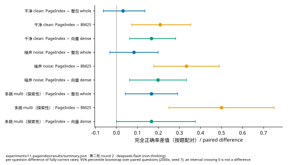

**PageIndex minus each method**, fully-correct rate, paired by question, 95% interval:

| Questions | vs BM25 | vs dense | vs whole |
| --- | --- | --- | --- |
| Clean | +20.8 points (7–35) | +16.7 (6–28) | +3.1 (−6–14), **interval crosses 0** |
| Noisy | +33.3 (18–49) | +19.8 (6–33) | +8.3 (−3–20), **interval crosses 0** |

So "PageIndex is better" holds against BM25 and dense retrieval only. Against whole it merely *looks* a little better; the interval crosses 0 and the data can't tell. On multi-hop, PageIndex got everything right and its interval collapsed to a point. That says 12 questions are too few, not that it can't miss.

Also, dense retrieval scored below its round-1 74–96% (section 7). Answer model, evidence cap and question mix all differ between rounds, so the numbers are not comparable and say nothing about DashScope getting worse.

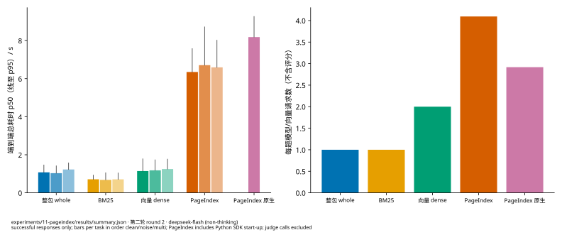

| Method (clean questions) | End-to-end p50 / p95 | First answer token p50 | Requests per question (judge excluded) |
| --- | --- | --- | --- |
| Whole | 1.08 / 1.46 s | 0.79 s | 1 |
| BM25 | 0.71 / 0.93 s | 0.49 s | 1 |
| Dense | 1.14 / 1.79 s | 0.88 s | 2 |
| PageIndex | 6.35 / 7.58 s | 6.09 s | 4.06 (about 3 outline / page reads + 1 answer) |
| Native PageIndex (multi-hop) | 8.18 / 9.27 s | unobservable | 2.92 |

The student's problem is that they read before answering. Almost all of PageIndex's time goes into serial retrieval steps, including one Python SDK start-up per question, which was not separated out. Meanwhile the whole pack sends 88k input tokens, 88192 of them from the prefix cache, and still shows its first token in about 0.8 s. For "must start talking within two seconds", the controlled PageIndex flow doesn't fit.

The native group read 5208 characters of page text on average against about 900 for the controlled group, so the two aren't directly comparable. Native streaming mixes "let me look that up" narration with the final answer, so its first answer token is unobservable.

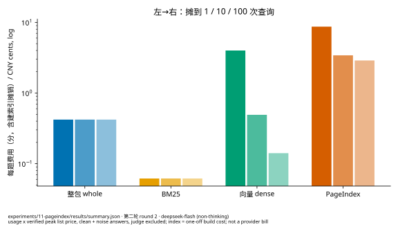

- **Index build**:
  - PageIndex flash mode: 18.3 s, 27 model calls, 0.059 CNY. Building the tree uses no model; the model writes node summaries and optimizes the tree.
  - Vector index: 23.5 s, 64 requests, 0.039 CNY.
  - BM25 and whole need no index.
- **Per question** (clean + noisy, judge excluded): whole 0.0042 CNY (relies on the prefix cache; about 0.16 on a miss), BM25 0.0006, dense 0.0010, PageIndex 0.0283.
- **Index cost spread over 1 / 10 / 100 queries**: PageIndex 0.087 / 0.034 / 0.029; dense 0.040 / 0.005 / 0.0014.

## 5. Spoken input: when someone says "tee-see-pee"

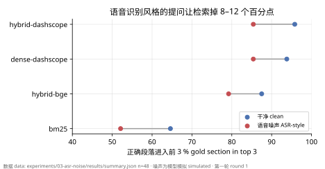

Experiment 03 rewrites 48 questions to look like speech recognition output: homophone typos, transliterated English terms, filler words, no punctuation. For example, "How does the TCP/IP architecture differ from OSI layering" becomes something like "um that tee-see-pee ip architecture versus oh-ess-eye layering what's different".

| Method | Clean question (passage found) | Spoken-style question (passage found) |
| --- | --- | --- |
| BM25 | 65% | 52% |
| Local bge hybrid | 88% | 79% |
| DashScope dense | 94% | 85% |

End to end on spoken-style questions: BM25 is 38% fully correct and 46% wrong; DashScope is 60% fully correct and 15% wrong. **Dense retrieval is far more forgiving of typos and transliteration**, the second reason real-time speech needs it. Round-2 PageIndex barely lost anything on noisy questions (79.2% clean, 78.1% noisy), perhaps because the model reads the outline to understand the question instead of matching words.

Limitation: the noise is model-simulated, not real recognition output, and the model sometimes added content to questions.

## 6. Answer models: fast and accurate rarely come together

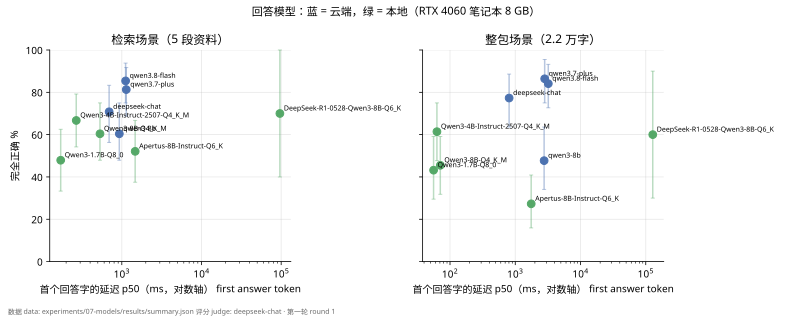

Experiment 07 (round 1): same questions and judge; only the answer model changes. Retrieval uses the fixed DashScope top 5 passages; whole uses a 22k-character pack.

| Model | Retrieval: fully correct | Whole: fully correct | First answer token p50 (retrieval / whole) | Whole cold start | Cost per question (whole) | VRAM |
| --- | --- | --- | --- | --- | --- | --- |
| deepseek-chat (retired) | 70.8% | 77.3% | 693 / 805 ms | 1.1 s | ¥0.0028 | — |
| qwen3.8-flash | 85.4% | 84.1% | 1116 / 3207 ms | 4.1 s | ¥0.0071 | — |
| qwen3.7-plus | 81.3% | 86.4% | 1137 / 2824 ms | 3.7 s | ¥0.0179 | — |
| qwen3-8b (cloud) | 60.4% | 47.7% | 930 / 2769 ms | 5.0 s | not costed | — |
| Local Qwen3-1.7B Q8_0 | 47.9% | 43.2% | 171 / 56 ms | 1.5 s | 0 | 4.1 GB |
| Local Qwen3-4B-Instruct-2507 Q4_K_M | 66.7% | 61.4% | 268 / 63 ms | 2.8 s | 0 | 5.0 GB |
| Local Qwen3-8B Q4_K_M | 60.4% | 45.5% | 532 / 71 ms | 4.4 s | 0 | 7.0 GB |
| Local Apertus-8B-Instruct Q6_K | 52.1% | 27.3% | 1471 / 1754 ms | 82 s | 0 | 7.7 GB |
| Local DeepSeek-R1-0528-Qwen3-8B Q6_K (reasoning, 10 questions per setting) | 70% (2 timeouts) | 60% | 96 / 128 **s** | 229 s | 0 | 7.8 GB |

(48 retrieval and 44 whole questions per cell, 10 for R1; VRAM is total after loading, including about 0.6–1.2 GB of system use.)

- **Reasoning models overthink**: the R1 distill "thinks" for about 600–850 characters per question. Its median first answer token arrives after 96–128 **seconds**, and 2 of 10 questions exceeded 300 s. Accuracy isn't bad (60–70%, tiny sample), so it suits offline note preparation, not real-time answers.
- **56–71 ms whole-pack first tokens locally are not a typo**: llama-server caches the shared prefix. The first request pays a 1.5–4.4 s cold start; after that only the new question is processed. It's the same idea as the cloud prefix cache (section 9).
- **"More accurate" has a price**: qwen3.8-flash and 3.7-plus are more accurate in both settings, but their whole-pack first token is close to 3 s. That is slow for real time and better suited to unhurried work like post-meeting review or writing notes.
- **Same model, local and cloud agree**: Qwen3-8B scores 60.4% / 45.5% locally and 60.4% / 47.7% in the cloud, so Q4_K_M quantization costs almost no quality.
- **The 8 GB boundary**: an 8B Q6_K model takes 7.7 GB after loading. Apertus had an 82 s cold start and stayed slow, probably spilling into shared memory. On this card, use Q4 for 8B models.
- **Local models lose more on long material**: from retrieval to whole, 8B drops 15 points and 1.7B / 4B about 5. Cloud models are similar in both settings.

Round-2 deepseek-flash reached its first answer token at p50 0.79 s on the 200k-character whole pack, but questions, material and judging differ between rounds, so it doesn't belong in the table above.

## 7. Embedding models: small ones hold their own


Experiment 07b (round 1, retrieval only, 5 passages with at most 3 per document):

| Method | Clean questions | Speech noise | Query time |
| --- | --- | --- | --- |
| BM25 | 81.3% | 75.0% | 0.1 ms |
| bge-small-zh (CPU) | 83.3% | 77.1% | 1–4 ms |
| Qwen3-Embedding-0.6B (GPU) | 95.8% | 91.7% | about 20 ms |
| DashScope v4 | 97.9% | 91.7% | about 150 ms (network; cache hits not counted) |
| BM25 + bge fusion | 91.7% | 79.2% | |
| BM25 + Qwen3-Embedding fusion | 95.8% | 89.6% | |
| BM25 + DashScope fusion | 95.8% | 89.6% | |

- Qwen3-Embedding-0.6B on the laptop GPU essentially ties DashScope, free and offline. The price is a 639 MB model and a GPU; indexing 637 chunks takes about 25 s.
- bge-small fused with BM25 improves clearly (91.7%), but only reaches 79% under speech noise.
- My project ships bge-small (24 MB, CPU). A Qwen3-Embedding option for users with a discrete GPU is a worthwhile follow-up.

## 8. Frameworks: no magic, just dependencies


Experiment 02 (round 1): the same 200k-character corpus, 48 questions and answer/judge model, with the retrieval pipeline rebuilt in LangChain 1.4 and LlamaIndex 0.14.

| Configuration | Correct passage found | Fully correct |
| --- | --- | --- |
| LangChain / LlamaIndex BM25, defaults | 27% | 19% |
| LangChain BM25 + jieba tokenization (one-line change) | 81% | 60% |
| LangChain dense, defaults against DashScope | errors out | — |
| LangChain dense, fixed | 92% | 67% |
| LlamaIndex dense, default / tuned | 90% / 96% | 71% / 77% |
| LlamaIndex query engine (as shipped) | — | 77% (non-streaming, median 2.1 s end to end) |
| Hand-written: BM25 / bge hybrid / DashScope | 65% / 79% / 85% | 46% / 60% / 69% |

- **Chinese defaults barely work**: both frameworks' BM25 tokenizes on spaces or English rules, which fails on Chinese. With one line of jieba, LangChain actually overtakes the hand-written BM25, mainly because it sends about 2900 characters per answer versus 640.
- **Three traps with non-OpenAI services**:
  1. LangChain's `OpenAIEmbeddings` sends token ids instead of text by default, which DashScope rejects;
  2. after turning that off, batches must be capped at 10;
  3. DashScope sometimes signals a busy backend with HTTP 400, which the OpenAI client does not retry, so you add your own retry.

  All three took reading source code to find.
- **Configured properly, everyone lands in the same range**: the frameworks' lead comes mostly from sending the model more text, not from being smarter.
- **Weight**: the two frameworks plus dependencies are 103 Python packages, 346 MB, with 1.0–5.1 s imports and 88–158 s to build a vector index over 200k characters. The hand-written chunking + BM25 is 405 lines of TypeScript with no dependencies.

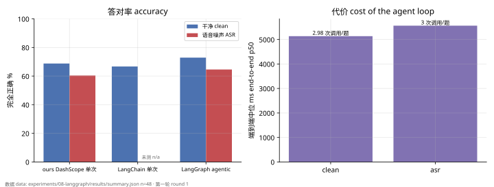

Experiment 08 builds an agent following the structure of LangGraph's official agentic RAG tutorial: decide whether to retrieve → judge relevance → if irrelevant, rewrite the question and retrieve again → answer. That is three model calls per question.

- 72.9% (clean) / 64.6% (speech noise) fully correct, about 4 points above single retrieval, within the interval.
- Rewriting triggered on only 2–4% of questions (it almost always judged the material relevant) and didn't visibly help noisy questions.
- Median 5.1–5.6 s end to end, about 0.012 CNY per question, roughly 15× single retrieval.
- LangGraph installs with LangChain 1.x; no extra dependencies.

**Advice**: for prototypes inside a Python service, LlamaIndex's dense defaults are already decent. For latency-sensitive, streaming products packaged as desktop apps, a few hundred hand-written lines fit better. Single-hop Q&A doesn't need an agent loop, which will think three times over and hand you much the same answer.

## 9. Caching: local KV and cloud prefix

When an LLM processes input, it computes intermediate results (Keys and Values) for every token and keeps them in memory: the KV cache. If the next request starts identically, that part can be reused instead of recomputed. Both local and cloud models do this, but it is measured in completely different ways.

### 9.1 Local: q8_0 nearly halves the KV allocation (round 2)

With Qwen3-4B-Instruct-2507 Q4_K_M on llama.cpp build 11222, we tested 8 configurations: KV precision f16 / q8_0 × total context 8192 / 16384 × 1 / 2 slots. Each configuration was started independently 5 times, with GPU offload 99, Flash Attention on and a 64-token output cap. All requests went serially to slot 0, so this is not a concurrency benchmark, and answer quality was not assessed.

The formal run had 150 successful requests, 30 capacity skips and 0 failures. The whole pack measured 8635 input tokens and, with output headroom, fit only the 16384-token single-slot configurations; the others were skipped as-is rather than trimming the material.


Runtime logs report 1152 MiB (f16) vs 612 MiB (q8_0) at 8192 tokens, and 2304 vs 1224 MiB at 16384 tokens: 46.875% less with q8_0. This is **startup allocation**. Occupied KV bytes at runtime have no observable field and remain null; neither GPU totals nor theoretical formulas stand in for them. [CSV](data/12-kv-allocation.csv).

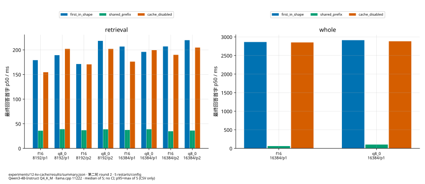

After each independent start we measured three kinds of request: the first one, a follow-up with a shared prefix, and one with reuse disabled. Across eight short-retrieval configurations, median first answer tokens were 171.3–219.7 ms, 34.8–39.0 ms and 154.6–204.7 ms respectively. State order wasn't randomized and question endings differed slightly, so this describes these conditions, not a general speedup. Each median uses five independent starts; the CSV's p95 is simply the maximum of five, which is weak tail evidence. [CSV](data/12-prefix-latency.csv).

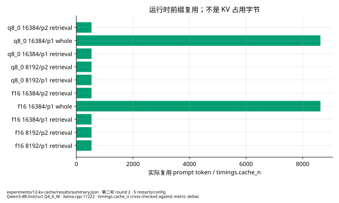

Every request's `timings.cache_n` matched the delta of the server's cache counter. With a shared prefix, short retrieval reused 535 tokens and the whole pack 8630; with reuse disabled, 0. These are reused tokens, not occupied bytes. [CSV](data/12-prefix-tokens.csv).

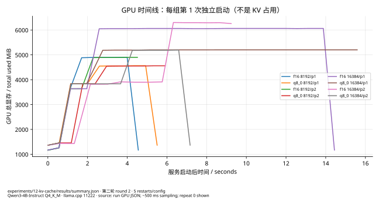

The timeline shows total GPU memory for each configuration's first independent start, sampled about every 500 ms; the sampling command itself stretches the interval. Other processes affect the total too, so the curves can't be attributed to KV alone. [CSV](data/12-gpu-timeline.csv).

### 9.2 Cloud: caching saves money, not much time (round 2)

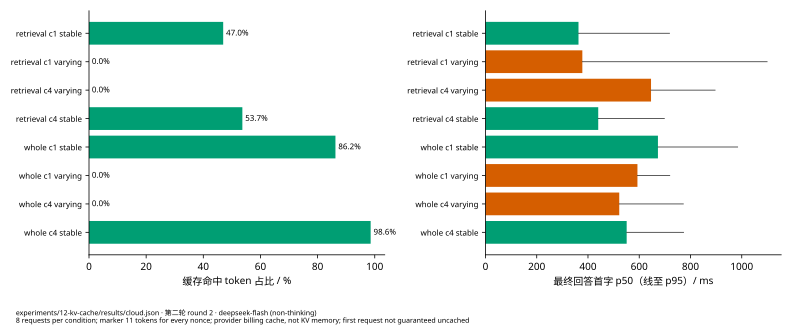

- **Setup**:
  - deepseek-flash with two input shapes: retrieval (about 477 tokens) and whole (about 9350 tokens).
  - Each shape compares a stable prefix with a token-equal varying one, at concurrency 1 and 4, 8 requests per condition: 64 requests, all successful.
  - The varying prefix differs by a leading "marker". All 33 markers were measured before the run at 11 tokens each, so they really were equal. Equal characters don't mean equal tokens; measure first.
- **Cache hits**:
  - Stable prefixes started hitting after the first request, always in multiples of 256 tokens (256 / 9216); varying prefixes never hit.
  - The first concurrency-1 request missed. The concurrency-4 stable group hit throughout, presumably because that prefix had already been requested in an earlier condition. Lesson: a first request is not guaranteed to miss.
- **Latency**: at these sizes, hits gave no consistent first-token gain. For example, whole at concurrency 1 was 673 ms stable vs 593 ms varying (p50, 8 requests each).
- **Cost**: a hit cuts whole-shape input cost by about 96% (9216 tokens at the cached price, the rest at the uncached price).

This is the provider's **billing cache**, not server KV memory, and it can't substitute for the local allocation in 9.1. [CSV](data/12-cloud-cache.csv).

## 10. Concurrency: what if many people ask at once?

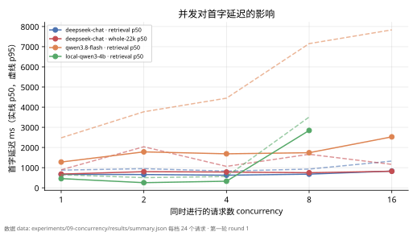

Experiment 09 (round 1, 24 requests per level):

- **deepseek-chat didn't care about concurrency**: retrieval-shaped requests and 22k-character whole packs held first-token p50 at 0.6–0.8 s and p95 at or below 2.1 s from 1 to 16 concurrent requests, with no errors.
- **qwen3.8-flash slowed with concurrency**: first-token p50 rose from 1.3 to 2.5 s and p95 from 2.5 to 7.8 s, with no errors.
- **Local inference (Qwen3-4B-Instruct, 4 parallel slots)**:
  - 1–4 concurrent requests: first-token p50 0.26–0.46 s; total output rose from 46 to 96 tokens/s (about 24 per stream).
  - 8 concurrent requests exceed the slot count and queue, pushing first-token p50 to 2.8 s.
  - An 8 GB laptop GPU can serve about four real-time requests at once.
- **Cache effects**: the same requests were resent at every level, so from the second level on the prefix-cache hit rate is stable (deepseek-chat retrieval 74%, whole 98%, local 96%). Levels are comparable with each other, but first tokens are lower than for fully cold requests.
- **Retrieval components**:
  - BM25 queries take 0.05–0.1 ms (200k to 930k characters) and indexing 33–94 ms.
  - bge-small on CPU processes 31–41 chunks per second regardless of batch size (transformers.js gains nothing from batching here).
  - DashScope embeds 9–15 chunks per second, with no gain beyond 4 concurrent requests.
  - At that rate, a local bge index over 2M characters (about 5800 chunks) takes about 2.5–3 minutes. This part ran alongside local inference, so the CPU numbers may be slightly low.

## 11. Letting an AI write your material

I wrote a material-writing prompt for external AI assistants and tested it for three rounds on two real job descriptions (the prompt and test record live in the original project and are not included here):

- Format and honesty rules held up well: none of the six packs invented first-person experience, and platform noise was cleaned out.
- Coverage improved with each rule revision: whole-pack fully correct went from 20% to 37% and from 43% to 60%.
- **"Add a keyword line at the end of each section" didn't help**: in all six comparisons retrieval did slightly better without it, so the rule was dropped.

## 12. Recommendations

| Your situation | Material ≤ 60k chars | Larger material | Answer model |
| --- | --- | --- | --- |
| Fully offline, privacy first, 8 GB GPU | Whole | Qwen3-Embedding-0.6B + BM25 | Local Qwen3-4B-Instruct-2507 Q4_K_M |
| Fully offline, no GPU | Whole | bge-small-zh + BM25 (CPU) | Small local models are limited; use at least a cloud answer model |
| Cloud OK, speed first (real time) | Whole | DashScope dense, 5 passages | A fast-first-token cloud model (round-1 deepseek-chat is retired; round-2 deepseek-flash reached its first token in about 0.8 s on the whole pack) |
| Cloud OK, accuracy first (not real time) | Whole | DashScope dense; consider PageIndex for offline Q&A | qwen3.8-flash / qwen3.7-plus |
| Small team sharing one service | Whole | DashScope or local Qwen3-Embedding | A concurrency-insensitive cloud model (round-1 deepseek-chat didn't slow at 16 streams) |

**General rules for writing material**:

- Organize by heading, with sections of 200–500 characters that stand on their own.
- Put both Chinese and English spellings of terms in headings.
- Start with a core pack under 25k characters.
- Use frameworks for prototypes; in the product, check first whether hand-written code is enough.

## 13. Pitfalls we hit

- **Frameworks**:
  - Chinese BM25 tokenization fails by default.
  - `OpenAIEmbeddings` sends token ids by default.
  - DashScope takes at most 10 items per batch and returns 400 when busy, which isn't retried.
  - In LangGraph the model often issues several retrievals in one step; counting rounds by tool messages skips the relevance check, so count retrieval steps.
  - Callbacks don't attach to model calls inside conditional edges; count usage at the call site.
- **PageIndex SDK**:
  - Constructor arguments change between versions (0.2.10 uses `index_backend` / `chat_backend`), which mocked tests don't catch.
  - Indexing requests carry no `max_tokens`; if a gateway defaults to 512, summaries are silently truncated.
  - The SDK retries 10 times on its own, multiplying budget use on failures.
  - LiteLLM tries to download a tokenizer at import.
  - Page reads don't go through the client's `get_page_content`, so observe them at the official tool table.
- **Model API**: deepseek-flash has thinking on by default, so it must be disabled explicitly. A budget gateway should strip caller-supplied `reasoning_effort`, or thinking may quietly come back on.
- **Measurement**:
  - Embedding caches distort throughput tests (identical text isn't recomputed).
  - Local prefix caching makes first-token p50 very low, so report cold start separately.
  - With reasoning models, distinguish "first token" from "first answer token".
  - Concurrently running experiments affect each other's latency.
  - Equal characters don't mean equal tokens.
- **Windows**:
  - pip reads requirements.txt as GBK, so keep it ASCII.
  - Python prints GBK by default; set `PYTHONIOENCODING=utf-8`.
  - CRLF in generated files leaves `\r` at the end of URLs.
  - `sha256sum` prefixes output with `\` for paths containing backslashes.
  - Use IPv4 only: `curl -4`, `--dns-result-order=ipv4first`.
- **Electron**: a lone command-line argument shaped like `local:xxx` makes Electron exit with code 127 and no output; add a comma or any other character.
- **VRAM**: an 8B Q6_K model almost fills an 8 GB card with an 82 s cold start; use Q4_K_M.

## 14. Limitations, cost and reproduction

**Limitations**

- Small groups (22–54 questions); questions, answers and judging from the same vendor's models, with no human review of judging.
- Speech noise is simulated; only Chinese technical notes were tested.
- Round 2's 12 multi-hop questions are exploratory and assistant-checked.
- Cloud latency comes from a single network, and some experiments ran concurrently.
- Local models were tested on a single 8 GB laptop GPU.
- Not observable: native PageIndex's first answer token, occupied KV bytes at runtime, and the SDK start-up share of PageIndex time.

**Cost** (API usage × list price at the time; not provider bills)

- **Round 1**: about 9 CNY for the new experiments (about 1 of it estimated for framework-internal calls), plus about 7.3 CNY for an earlier retrieval benchmark.
- **Round 2**: 3043 requests, 9.39 CNY, with no unsettled reservations.
  - By stage: preflight 0.72, indexing 0.10, main comparison 6.86, multi-hop and native 1.34, cloud cache 0.38; judge calls, about 0.36, are included in the stages.
  - The controlled group's 864 answers had no failures. One of 24 native answers failed: the budget gateway's request validation rejected a second tool turn before forwarding, with no charge. That failure stays in the denominator and was not rerun.

**Reproduction**: see the [experiments directory](../README.md). Each experiment has its own folder with scripts, questions and `results/summary.json`. Raw answers quote the corpus and stay on the local machine. To redraw the figures:

```
"%LOCALAPPDATA%/llm-bench/experiments/venv/Scripts/python.exe" experiments/report/make_figures.py
"%LOCALAPPDATA%/llm-bench/experiments/venv/Scripts/python.exe" experiments/report/pageindex_figures.py
```

New to the concepts? The [beginner handbook](HANDBOOK.en.md) covers them.
