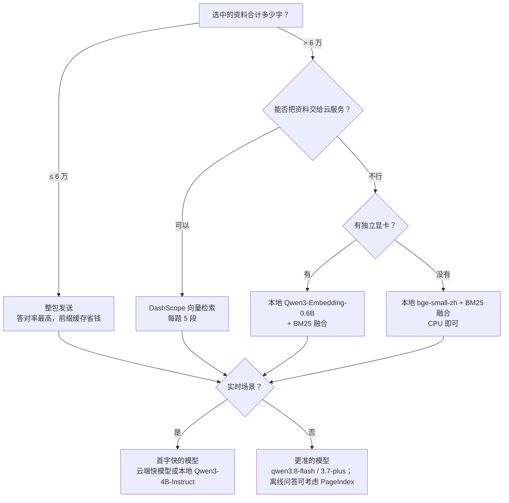

# 小资料先别急着上 RAG：个人知识库的检索、模型与框架实测与建议

[English](REPORT.en.md) · [实验目录](../README.zh-CN.md) · [小白手册：读懂这份报告需要的概念](HANDBOOK.zh-CN.md)

> 一份不太严肃的工程测试报告。所有数字都来自本仓库 `experiments/*/results/summary.json`，图表由 [`make_figures.py`](make_figures.py)、[`continuation_figures.py`](continuation_figures.py) 和 [`pageindex_figures.py`](pageindex_figures.py) 生成，绘图数据在 [`data/`](data/)。
>
> 实验分两轮做。**第一轮**的回答和评分模型是 deepseek-chat，**第二轮**（PageIndex、KV cache、云端前缀缓存）统一换成 deepseek-flash（关闭思考）。deepseek-chat 后来已经下线，所以第一轮里跟它有关的结论只代表它当时的表现。两轮的数字各算各的，不放在一起比。[现行价格](https://api-docs.deepseek.com/zh-cn/quick_start/pricing/)。

## 摘要：七个不太意外、但终于有数字撑腰的结论

我的一个个人项目要做实时语音转录：对方说完一句话，程序从我自己的资料里找出相关内容，让大模型生成一段能直接说出口的回答。这类场景对延迟非常敏感，说完两秒还没出字，这个回答就没用了。为了压成本、比较模型，也想搞清楚“到底什么时候才需要 RAG”，我用公开的中文技术笔记 CS-Notes 做了 13 组实验。结论是：

1. **资料不多的时候，整包发给模型就是最好的“检索”。** 6 万字以内放心整包，8.5 万字以内答对率纹丝不动（75%）。前缀缓存命中 97–98%，每题不到一分钱。
2. **需要检索时，别只靠关键词。** BM25 完全正确 46–67%，向量检索 74–96%。语音识别的错字和音译还会让 BM25 再掉十几个点，它对“换个说法问”几乎没有抵抗力。
3. **本地向量模型已经够用。** Qwen3-Embedding-0.6B 在自家显卡上和云端的 DashScope 打成平手（找对段落 95.8% vs 97.9%，语音噪声下都是 91.7%），把 24 MB 的 bge-small（83%）甩在后面。
4. **PageIndex 像一个认真翻目录的好学生，也像好学生一样慢。** 它比 BM25 高 21–33 个百分点、比向量高 17–20 个百分点，但和“直接整包”比差异不显著，每题还要多花约 5 秒、贵 6–7 倍。
5. **回答模型：实时场景看首字，非实时场景看准确。** 本地 Qwen3-4B 在 8 GB 显存上能用；推理模型会先“想”一分多钟，不适合实时。
6. **框架没有魔法。** LangChain、LlamaIndex 配好之后和几百行手写代码是同一水平，但中文默认配置基本不可用，还要背上 346 MB 的依赖。LangGraph 的 agent 循环在单跳问答上没有显著提升，却要多花约 15 倍的钱。
7. **缓存是真省钱，但不一定省时间。** 本地 q8_0 让 KV cache 的启动分配量少了 46.875%。云端前缀缓存命中后，整包的输入费用降约 96%，首字延迟却没有稳定变快。



## 1. 为什么要做这些实验

项目的约束决定了它和常见的“文档问答”不太一样：

- **首字要快**：对方说完到出第一个字，超过两秒就没用了。
- **问题来自语音识别**：中文、口语，带错字、音译和口头语。
- **资料不大但杂**：个人简历、岗位描述、几万到几十万字的笔记。
- **桌面应用**：不想为了检索额外打包一个 Python 运行时。
- **隐私和费用**：资料是个人的，每次调用都要花钱。

很多“个人 / 小团队知识库”都有同样的约束，所以结论尽量写成通用建议。不在本报告范围内的：表格和图片资料、百万级文档的检索服务。多跳推理只在第二轮用 12 道题做了探索性测试。

## 2. 实验台

| 项 | 值 |
| --- | --- |
| 硬件 | Intel i9-13980HX，16 GB 内存，NVIDIA RTX 4060 Laptop 8 GB（驱动 592.00） |
| 系统 | Windows 11 家庭中文版；家庭宽带，经本机代理，只用 IPv4 |
| 应用栈 | Node 22.13.1、Electron 41.1.1、transformers.js 3.8.1 |
| 本地推理 | llama.cpp b11222（CUDA 12.4），`-ngl 99 -fa on` |
| Python | 3.12；LangChain 1.4.2、LlamaIndex 0.14.25、LangGraph 1.2.12；PageIndex SDK 0.2.10 |
| 云端回答模型 | 第一轮：deepseek-chat，阿里云百炼 qwen3.8-flash、qwen3.7-plus、qwen3-8b（均关闭思考）；第二轮：deepseek-flash（DeepSeek-V4.1-Flash，关闭思考） |
| 向量模型 | bge-small-zh-v1.5（q8，CPU）、Qwen3-Embedding-0.6B（GGUF Q8_0，GPU）、DashScope text-embedding-v4 |
| 价格（元 / 百万 token，实验时的标价） | 第一轮 deepseek-chat：缓存命中输入 0.2、输入 2、输出 3；qwen3.8-flash 输入 0.8、输出 2.7；qwen3.7-plus 输入 2、输出 8；qwen3-8b 未查到价格，不计费用。第二轮 deepseek-flash（高峰价）：命中 0.04、未命中 2、输出 8。text-embedding-v4：0.5 |
| 语料 | 公开的 [CS-Notes](https://github.com/CyC2018/CS-Notes)（CC BY-NC-SA 4.0，固定提交），正文不入库 |

**方法**

- **出题**：模型从资料段落出题，一半直接用术语，一半换个说法（同义词、中英互换），每题带 2–4 个答案要点。语音噪声题由模型把题目改写成“识别结果”的样子。第二轮另有 12 道跨章节组合题，由助手对照公开原文核对，不是独立人工标注。
- **严格回答规则**：提示词模拟“有人刚口头问了一个技术问题”，要求口语化、只依据给出的资料回答，找不到就说“资料中没有相关内容”。这样检索漏了什么会直接变成答错，不会被模型的常识悄悄补上。
- **评分**：按要点打 0 / 1 / 2 分，报告“完全正确”（2 分）和“答错或说没有”（0 分）的比例。区间是按题目 bootstrap 得到的 95% 区间。第二轮以题为单位，同一题的两次回答先取平均，方法之间按题配对比较。
- **计时**：流式接口，记录首个回答字（推理模型的思考不算）、总时间和输出速度；本地模型另记冷启动和显存。
- **费用**：接口返回的 token 用量 × 当时的标价。第二轮所有付费请求都经过一个预算网关：发请求前按上限预留，拿到用量后结算。报告中的费用都不是服务商账单。

**已知偏差（先把丑话说在前面）**：出题、回答和评分用的是同一家的模型，可能偏向它自己的表述；每组只有 22–54 题，一两个百分点的差异不要当真；部分实验同时运行，延迟会互相影响（各节会注明）。

## 3. 资料规模：整包到底能撑多大？


实验 01（第一轮）固定 44 道题，答案都在最前面的 8 篇文档里。然后不停往资料里塞别的主题的文档，从 2.2 万字加到 12.9 万字，每种大小回答两遍：

| 资料大小 | 整包 完全正确 / 答错 | BM25 | 本地 bge 混合 | DashScope 向量 | 整包首字（中位） | 整包每题费用 |
| --- | --- | --- | --- | --- | --- | --- |
| 2.2 万 | 75 / 2 | 47 / 36 | 69 / 10 | 76 / 0 | 870 ms | ¥0.0025 |
| 3.3 万 | 75 / 5 | 47 / 36 | 70 / 14 | 77 / 0 | 777 ms | ¥0.0036 |
| 5.0 万 | 75 / 2 | 47 / 36 | 66 / 14 | 76 / 0 | 895 ms | ¥0.0056 |
| 8.5 万 | 75 / 5 | 46 / 36 | 68 / 16 | 77 / 0 | 1041 ms | ¥0.0089 |
| 12.9 万 | **69 / 10** | 46 / 36 | 69 / 14 | 77 / 0 | 994 ms | ¥0.0129 |

（单位 %；每格 88 个回答；整包的 95% 区间约 ±12 个百分点。检索方式首字约 560–740 ms，每题约 ¥0.0004–0.0008。）

- 整包在 8.5 万字以内稳如老狗，到 12.9 万字才开始下滑，答错率翻倍。
- DashScope 向量检索在每个大小都是 76–77%，一次都没答错。差距主要来自检索方法的好坏，而不是“整包还是检索”。


整包比检索的首字慢 0.1–0.45 秒，每题贵 5–28 倍，但绝对值依然很小：12.9 万字时每题约 1.3 分钱，前缀缓存命中 98%。2.2 万字那一档的 p90 偏高，是因为它是整个实验的第一组请求（冷启动），不是资料大小造成的。


按答案在整包里的位置分四段，答对率 68–77%，没有看到明显的“中间遗忘”（lost in the middle）。

**换个更难的扩容方式（实验 01b）**：实验 01 靠塞无关文档扩容，检索不会因此变难。于是又用同主题资料重做了两组，这次干扰项和正确答案长得很像：


- 26 篇“设计模式”笔记，结构完全相同，是最难区分的干扰项。从 2.3 万字加到 6.9 万字，22 题：
  - 整包和 DashScope 都保持 95.5%（6.9 万字一档重复 3 次，整包分别为 95.5 / 95.5 / 90.9%）；
  - BM25 从 59% 降到 50%，bge 混合从 86% 降到 82%。


- 5 篇 Java 笔记，从 3.5 万字加到 12.4 万字，54 题：
  - 整包 74% → 70%，DashScope 76–78% 基本不动；
  - bge 混合 72% → 63%，BM25 67% → 59%。
  - 14.8 万字一档因为触到该实验 ¥3.5 的预算上限而中止。

**结论**：整包上限定在 6 万字比较稳妥。同领域资料超过 10 万字后，整包和本地小模型混合检索都会下降，好的向量检索基本不受影响。我的项目据此把整包上限从 3 万字调到了 6 万字。上下文只有 32k 的模型要留意：6 万中文字约 3–4 万 token。

## 4. 检索：能不能找到那一段

### 4.1 三种基本方法

同样 20 万字资料、48 道题（第一轮）：

| 方法 | 找到正确段落 | 完全正确 | 查询耗时 | 代价 |
| --- | --- | --- | --- | --- |
| BM25（关键词） | 65% | 46% | < 1 ms | 无 |
| BM25 + 本地 bge-small-zh 混合 | 79% | 60% | 约 5 ms | 24 MB 模型；200 万字建索引约 3.5 分钟 |
| DashScope text-embedding-v4 | 85% | 69% | 约 150 ms（网络） | 资料要上传阿里云；200 万字建索引约 ¥0.5 |

BM25 丢分几乎都丢在“换了说法”的题上：同义词、中英互换时，字面就对不上了。更早的基准在两套语料、三种规模上也是同样的排序。

### 4.2 每次给几段、怎么切


实验 06：同样 48 题，每次给模型 3 / 5 / 8 段。5 段（每篇最多 3 段）比 3 段的完全正确率高 6–12 个百分点（BM25 44% → 56%，bge 混合 58% → 65%，DashScope 65% → 73%）。8 段没有稳定收益，首字还要多等约 0.1 秒。我的项目因此改成每次 5 段。


实验 04 只看检索，比较不同的切段方式（正确段落进入前 3 的比例）：

| 切段 | BM25 | 本地 bge | DashScope |
| --- | --- | --- | --- |
| 按标题，目标 200 字 | 56% | 67% | 67% |
| 按标题，目标 400 字（项目当前） | 65% | 77% | 85% |
| 按标题，目标 800 字 | 69% | 77% | 92% |
| 按标题，目标 1200 字 | 67% | 79% | 96% |
| 固定 400 字窗口（忽略标题） | 63% | 65% | 79% |

- 按标题切段对两种向量模型都明显有帮助；切到 200 字会丢上下文。
- 向量检索在更大的段上表现更好。但 CS-Notes 的小节本来就短，平均段长只从 297 字涨到 455 字，区间也有重叠，所以项目暂时没有改。

### 4.3 PageIndex：会翻目录的好学生（第二轮）

[PageIndex](https://docs.pageindex.ai/sdk/client) 的思路很像人读书：先把文档建成一棵“目录树”，回答问题时让模型先看目录、挑出可能的章节，再去读对应的页。不用向量，也不用切段。

**怎么比的**

- **语料**：M 档 37 篇、200347 字、637 段，转成 136 页 PDF。PDF 提取出的文字和原文逐字一致（空白归一化后）。
- **题目**：48 道干净题、48 道对应的语音噪声题，另有 12 道跨章节组合题（探索性）。
- **受控组**：整包、BM25、向量、PageIndex 四种方法用同一个回答模型、同一段提示词。
  - 检索类方法最多给 5 个证据单元，每篇最多 3 个，正文不超过 2000 字；整包则发送全部 37 篇。
  - PageIndex 用官方 SDK 的本地工具（看目录的 `get_document_structure`、读页的 `get_page_content`），但我套了一个受控适配器：模型只能选**实际读过的页**里的片段，每题最多 6 次模型调用、120 秒。这不是官方的端到端默认流程。
  - 规模：每种方法 96 题 × 2 次，共 768 次回答；多跳题另有 96 次。
- **官方原生组**：直接调用官方的 `chat_completions`，12 道多跳题各答 2 次，和受控组分开看。


| 题型 | 整包 | BM25 | 向量 | PageIndex | 原生 PageIndex |
| --- | --- | --- | --- | --- | --- |
| 干净（48 题） | 76.0%（64–88） | 58.3%（45–72） | 62.5%（49–75） | **79.2%**（68–90） | — |
| 噪声（48 题） | 69.8%（57–81） | 44.8%（31–58） | 58.3%（45–72） | **78.1%**（67–89） | — |
| 多跳（12 题，探索性） | 83.3%（71–96） | 50.0%（25–75） | 83.3%（63–100） | 100%（24/24 次） | 91.7%（23/24 成功） |

好学生确实会翻书：PageIndex 把标准答案所在的片段放进证据的比例是 97.9%（干净）/ 96.9%（噪声），而且平均只送了 706–769 字。BM25 只有 70.8% / 54.2%，向量 81.3% / 75.0%。当然，片段在证据里不等于回答真的用上了它。


PageIndex 减去各方法的完全正确率（按题配对，95% 区间）：

| 题型 | 对 BM25 | 对向量 | 对整包 |
| --- | --- | --- | --- |
| 干净 | +20.8 个百分点（7–35） | +16.7（6–28） | +3.1（−6–14），**区间跨 0** |
| 噪声 | +33.3（18–49） | +19.8（6–33） | +8.3（−3–20），**区间跨 0** |

所以说“PageIndex 更好”，只在和 BM25、向量比的时候成立。对上整包，它只是**看起来**略好，区间跨 0，统计上说不清。多跳题 PageIndex 全对，区间退化成一个点，这只说明 12 道题太少，不代表它必然全对。

另外，这一轮向量检索的成绩低于第 7 节第一轮的 74–96%。两轮的回答模型、证据字数上限和题目组合都不同，不能拿来直接比，也不能据此说 DashScope 变差了。


| 方法（干净题） | 端到端 p50 / p95 | 首个回答字 p50 | 每题请求数（不含评分） |
| --- | --- | --- | --- |
| 整包 | 1.08 / 1.46 s | 0.79 s | 1 |
| BM25 | 0.71 / 0.93 s | 0.49 s | 1 |
| 向量 | 1.14 / 1.79 s | 0.88 s | 2 |
| PageIndex | 6.35 / 7.58 s | 6.09 s | 4.06（约 3 次翻目录 / 读页 + 1 次回答） |
| 原生 PageIndex（多跳） | 8.18 / 9.27 s | 不可观测 | 2.92 |

好学生的问题在于要先翻书。PageIndex 的时间几乎都花在串行的检索步骤上，其中还包括每题一次 Python SDK 启动（本轮没有把启动时间单独拆出来）。相比之下，整包输入 8.8 万 token，其中 88192 个命中前缀缓存，首字仍然只要约 0.8 秒。对“两秒内必须出字”的实时场景，受控 PageIndex 流程不适用。

原生组平均读了 5208 字页面正文，受控组约 900 字，两组的证据量不同，不适合直接比较。原生组的流式输出会把“我先去查一下”之类的叙述和最终回答混在一起，所以它的首个回答字记为不可观测。


- **建索引**：
  - PageIndex flash 模式 18.3 秒、27 次模型调用、¥0.059。建树本身不调用模型，模型用于写节点摘要和优化树。
  - 向量索引 23.5 秒、64 次请求、¥0.039。
  - BM25 和整包不用建索引。
- **每题费用**（干净加噪声，不含评分）：整包 ¥0.0042（依赖前缀缓存，没命中时约 ¥0.16），BM25 ¥0.0006，向量 ¥0.0010，PageIndex ¥0.0283。
- **把建索引费用摊到 1 / 10 / 100 次查询**：PageIndex ¥0.087 / ¥0.034 / ¥0.029；向量 ¥0.040 / ¥0.005 / ¥0.0014。

## 5. 语音输入：对方说“踢西批”的时候


实验 03 把 48 道题改写成语音识别的样子：同音错字、英文术语被音译、口头语、没有标点。例如“TCP/IP 体系结构跟 OSI 分层有什么不一样”变成了“嗯 那个踢西批 ip 体系结构跟 哦艾斯艾 分层有什么不一样”。

| 方法 | 干净问题（找对段落） | 语音风格问题（找对段落） |
| --- | --- | --- |
| BM25 | 65% | 52% |
| 本地 bge 混合 | 88% | 79% |
| DashScope 向量 | 94% | 85% |

端到端（语音风格问题）：BM25 完全正确 38%、答错 46%；DashScope 完全正确 60%、答错 15%。**向量检索对错字和音译宽容得多**，这是实时语音场景要用向量检索的第二个理由。第二轮的 PageIndex 在噪声题上几乎不掉分（干净 79.2%，噪声 78.1%），可能是因为它靠模型读目录理解问题，而不是字面匹配。

局限：这里的噪声是模型模拟的，不是真实的识别结果；模型偶尔还会给问题添内容。

## 6. 回答模型：快和准很难兼得


实验 07（第一轮）：同一套题、同一个评分模型，只换回答模型。检索场景用固定的 DashScope 前 5 段，整包场景用 2.2 万字资料。

| 模型 | 检索：完全正确 | 整包：完全正确 | 首个回答字 p50（检索 / 整包） | 整包冷启动 | 每题费用（整包） | 显存 |
| --- | --- | --- | --- | --- | --- | --- |
| deepseek-chat（已下线） | 70.8% | 77.3% | 693 / 805 ms | 1.1 s | ¥0.0028 | — |
| qwen3.8-flash | 85.4% | 84.1% | 1116 / 3207 ms | 4.1 s | ¥0.0071 | — |
| qwen3.7-plus | 81.3% | 86.4% | 1137 / 2824 ms | 3.7 s | ¥0.0179 | — |
| qwen3-8b（云端） | 60.4% | 47.7% | 930 / 2769 ms | 5.0 s | 未计 | — |
| 本地 Qwen3-1.7B Q8_0 | 47.9% | 43.2% | 171 / 56 ms | 1.5 s | 0 | 4.1 GB |
| 本地 Qwen3-4B-Instruct-2507 Q4_K_M | 66.7% | 61.4% | 268 / 63 ms | 2.8 s | 0 | 5.0 GB |
| 本地 Qwen3-8B Q4_K_M | 60.4% | 45.5% | 532 / 71 ms | 4.4 s | 0 | 7.0 GB |
| 本地 Apertus-8B-Instruct Q6_K | 52.1% | 27.3% | 1471 / 1754 ms | 82 s | 0 | 7.7 GB |
| 本地 DeepSeek-R1-0528-Qwen3-8B Q6_K（推理模型，每场景 10 题） | 70%（2 题超时） | 60% | 96 / 128 **秒** | 229 s | 0 | 7.8 GB |

（检索每格 48 题、整包每格 44 题，R1 每格 10 题；显存是加载后的总占用，含系统约 0.6–1.2 GB。）

- **推理模型想得太多**：R1 蒸馏版每题先“思考”约 600–850 字，首个回答字中位要 96–128 **秒**，10 题里有 2 题超过 300 秒。答对率不低（60–70%，样本很小），适合离线整理资料，不适合实时回答。
- **本地整包首字 56–71 ms 不是笔误**：llama-server 会缓存同一段前缀，第一次请求付出 1.5–4.4 秒的冷启动，之后只需处理新问题。这和云端的前缀缓存是同一件事（第 9 节）。
- **“更准”是有代价的**：qwen3.8-flash 和 3.7-plus 在两个场景都更准，但整包时首字接近 3 秒，对实时场景偏慢，更适合会后复盘、写资料这类不赶时间的任务。
- **同一个模型，本地和云端表现一致**：Qwen3-8B 本地 60.4% / 45.5%，云端 60.4% / 47.7%，说明 Q4_K_M 量化几乎没有损失质量。
- **8 GB 显存的边界**：8B Q6_K 模型加载后占 7.7 GB。Apertus 冷启动 82 秒，之后依然慢，可能溢出到了共享内存。在这块卡上，8B 模型建议用 Q4。
- **本地模型在长资料上掉得更多**：整包场景比检索场景，8B 低 15 个点，1.7B 和 4B 低约 5 个点；云端模型两种场景相近。

第二轮的 deepseek-flash 在 20 万字整包上首个回答字 p50 为 0.79 秒，但两轮的题目、资料和评分都不同，不和上表放在一起比较。

## 7. 向量模型：小模型也能打


实验 07b（第一轮，只看检索，每次 5 段、每篇最多 3 段）：

| 方法 | 干净问题 | 语音噪声 | 查询耗时 |
| --- | --- | --- | --- |
| BM25 | 81.3% | 75.0% | 0.1 ms |
| bge-small-zh（CPU） | 83.3% | 77.1% | 1–4 ms |
| Qwen3-Embedding-0.6B（GPU） | 95.8% | 91.7% | 约 20 ms |
| DashScope v4 | 97.9% | 91.7% | 约 150 ms（网络；命中缓存的未计） |
| BM25 + bge 融合 | 91.7% | 79.2% | |
| BM25 + Qwen3-Embedding 融合 | 95.8% | 89.6% | |
| BM25 + DashScope 融合 | 95.8% | 89.6% | |

- Qwen3-Embedding-0.6B 在本机 GPU 上和 DashScope 基本持平，免费、离线。代价是 639 MB 的模型和一块显卡；637 段建索引约 25 秒。
- bge-small 和 BM25 融合后提升明显（91.7%），但在语音噪声下只有 79%。
- 我的项目目前内置 bge-small（24 MB，CPU）。给有独立显卡的用户加一个 Qwen3-Embedding 选项，是值得做的后续任务。

## 8. 框架：没有魔法，只有依赖


实验 02（第一轮）：同一份 20 万字语料、同样 48 题、同一个回答和评分模型，分别用 LangChain 1.4 和 LlamaIndex 0.14 重建检索流程。

| 配置 | 找到正确段落 | 完全正确 |
| --- | --- | --- |
| LangChain / LlamaIndex 的 BM25，默认配置 | 27% | 19% |
| LangChain BM25 + jieba 分词（改一行） | 81% | 60% |
| LangChain 向量，默认配置接 DashScope | 直接报错 | — |
| LangChain 向量，修好后 | 92% | 67% |
| LlamaIndex 向量，默认 / 调整后 | 90% / 96% | 71% / 77% |
| LlamaIndex 查询引擎（原样） | — | 77%（非流式，端到端中位 2.1 秒） |
| 手写实现：BM25 / bge 混合 / DashScope | 65% / 79% / 85% | 46% / 60% / 69% |

- **中文默认配置基本不可用**：两个框架的 BM25 默认按空格或英文规则分词，中文几乎全军覆没。加一行 jieba 分词后，LangChain 反而超过了手写 BM25，主要原因是它每次给模型约 2900 字（手写实现是 640 字）。
- **接非 OpenAI 服务要踩三个坑**：
  1. LangChain 的 `OpenAIEmbeddings` 默认发送 token id 而不是文本，DashScope 直接拒绝；
  2. 关掉之后还要限制每批 10 条；
  3. DashScope 偶尔用 HTTP 400 表示后端繁忙，而 OpenAI 客户端不会重试 400，需要自己包一层重试。

  三处都要读源码才能定位。
- **配好之后，大家都在同一水平**：框架领先的部分主要来自每次塞给模型更多文字，不是框架本身更聪明。
- **重量**：两个框架加依赖共 103 个 Python 包、346 MB，导入要 1.0–5.1 秒，20 万字建向量索引 88–158 秒。手写的切段 + BM25 是 405 行 TypeScript，零依赖。


实验 08 按 LangGraph 官方 agentic RAG 教程的结构搭了一个 agent：决定是否检索 → 判断资料是否相关 → 不相关就改写问题再检索 → 回答。每题 3 次模型调用。

- 完全正确 72.9%（干净）/ 64.6%（语音噪声），比单次检索高约 4 个点，但在置信区间内。
- 改写问题只在 2–4% 的题上触发（它几乎总觉得资料“相关”），对语音噪声题没有明显帮助。
- 端到端中位 5.1–5.6 秒，每题约 ¥0.012，约为单次检索的 15 倍。
- LangGraph 随 LangChain 1.x 一起安装，没有额外依赖。

**建议**：在 Python 服务里做原型时，LlamaIndex 的向量默认值已经不错。对延迟敏感、要流式输出、要打包成桌面应用的产品，手写几百行更合适。单跳问答不需要 agent 循环，它会认真地多想三遍，然后给出差不多的答案。

## 9. 缓存：本地 KV 与云端前缀

大模型处理一段输入时，会为每个 token 算出一组中间结果（Key / Value），存在显存里，这就是 KV cache。下一次请求如果开头一模一样，这部分就可以直接复用，不用重算。本地和云端都有这件事，但测量方式完全不同。

### 9.1 本地：q8_0 让 KV 少占将近一半（第二轮）

用 Qwen3-4B-Instruct-2507 Q4_K_M 和 llama.cpp build 11222，测了 8 种配置：KV 精度 f16 / q8_0 × 总上下文 8192 / 16384 × 槽位 1 / 2。每种配置独立启动 5 次，GPU offload 99，Flash Attention 打开，输出上限 64 token。所有请求都串行发到 slot 0，所以这不是并发吞吐测试，也没有评估回答质量。

正式运行共 150 次有效请求、30 次容量跳过、0 次失败。整包输入实测 8635 token，加上输出余量，只有 16384、单槽的配置装得下；其他配置如实跳过，没有自动删减资料。


运行日志显示：8192 token 下 f16 分配 1152 MiB、q8_0 分配 612 MiB；16384 token 下分别为 2304 和 1224 MiB，q8_0 少了 46.875%。注意这是 KV 的**启动分配量**。运行中 KV 实际占用多少字节，没有对应的观测字段，记为空；也没有拿 GPU 总显存或理论公式来冒充。[CSV](data/12-kv-allocation.csv)。


每次独立启动后分别测三种请求：第一次请求、共享前缀的后续问题、关闭复用的请求。8 种短检索配置下，首个回答字的中位数分别为 171.3–219.7 ms、34.8–39.0 ms、154.6–204.7 ms。状态顺序没有随机化，前后问题的结尾也略有不同，所以这只描述这次的测试条件，不能推广成通用的加速比。每个中位数来自 5 次独立启动；CSV 里的 p95 其实就是 5 个样本的最大值，尾延迟的证据很弱。[CSV](data/12-prefix-latency.csv)。


每次请求的 `timings.cache_n` 都和服务指标里缓存计数的增量一致。共享前缀时，短检索复用 535 token，整包复用 8630 token；关闭复用时为 0。这是复用的 token 数，不是占用的字节数。[CSV](data/12-prefix-tokens.csv)。


时间线展示每种配置第 1 次独立启动时的 GPU 总显存，约每 500 ms 采样一次，采样命令本身也会拖慢间隔。设备上的其他进程同样会影响总量，所以曲线不能全算在 KV 头上。[CSV](data/12-gpu-timeline.csv)。

### 9.2 云端：缓存很省钱，但不怎么省时间（第二轮）


- **设置**：
  - 模型 deepseek-flash，两种输入形状：检索（约 477 token）和整包（约 9350 token）。
  - 每种形状对比稳定前缀和等长的变化前缀，并发 1 和 4，每个条件 8 次，共 64 次，全部成功。
  - 变化前缀靠开头的一个“标记”来区分。运行前实测了全部 33 个标记，都是 11 token，所以确实等长：字数相同不等于 token 数相同，这个坑必须先量。
- **缓存命中**：
  - 稳定前缀在第一次之后开始命中，而且命中量总是 256 token 的整数倍（256 / 9216）；变化前缀一次都没命中。
  - 并发 1 的第一次请求没命中；并发 4 的稳定组从头到尾都命中，推测是因为同一前缀在之前的条件里已经请求过。结论：第一次请求不保证没命中。
- **延迟**：在这两个输入规模下，命中缓存没有带来稳定的首字改善。例如整包并发 1，稳定前缀 673 ms，变化前缀 593 ms（p50，每组 8 次）。
- **费用**：命中后，整包形状的输入费用下降约 96%（9216 token 按命中价，其余按未命中价）。

这是服务商的**计费缓存**，不是服务端的 KV 显存；它和 9.1 节的本地 KV 分配量是两回事，不能互相替代。[CSV](data/12-cloud-cache.csv)。

## 10. 并发：多人同时问会怎样


实验 09（第一轮，每档 24 个请求）：

- **deepseek-chat 对并发不敏感**：检索形请求和 2.2 万字整包请求，在 1–16 路并发下首字 p50 都在 0.6–0.8 秒，p95 不超过 2.1 秒，没有错误。
- **qwen3.8-flash 随并发变慢**：首字 p50 从 1.3 秒升到 2.5 秒，p95 从 2.5 秒升到 7.8 秒，没有错误。
- **本地推理（Qwen3-4B-Instruct，4 个并行槽位）**：
  - 并发 1–4 路时首字 p50 0.26–0.46 秒，总输出从 46 升到 96 token/s（每路约 24 token/s）；
  - 并发 8 路超过槽位数，开始排队，首字 p50 升到 2.8 秒。
  - 一台 8 GB 显卡的笔记本大约能同时服务 4 个实时请求。
- **缓存对这组数字的影响**：同一组请求在各并发档重复发送，从第 2 档起前缀缓存命中率稳定（deepseek-chat 检索 74%、整包 98%，本地 96%）。各档之间可比，但首字比完全冷启动的请求偏低。
- **检索组件**：
  - BM25 查询 0.05–0.1 ms（20 万到 93 万字），建索引 33–94 ms。
  - bge-small 在 CPU 上每秒处理 31–41 段，批大小不影响速度（transformers.js 在这里吃不到批处理的好处）。
  - DashScope 向量化每秒 9–15 段，并发超过 4 没有提升。
  - 按这个速度，200 万字（约 5800 段）在本地建 bge 索引约 2.5–3 分钟。这部分和本地推理实验同时运行，CPU 数字可能略偏低。

## 11. 让 AI 帮你写资料

我写了一份给外部 AI 用的资料编写提示词，拿两份真实的岗位描述当素材测了三轮（提示词与测试记录在原项目中，未包含在本仓库）：

- 格式和真实性规则执行得很好：6 个资料包都没有编造第一人称经历，原文里的平台噪声也全部清理掉了。
- 覆盖面随规则迭代提升，整包下完全正确率从 20% 升到 37%、从 43% 升到 60%。
- **“每节末尾加一行关键词”没有帮助**：6 组对比里，去掉关键词行的检索结果都略好，于是这条规则被删了。

## 12. 推荐清单

| 你的情况 | 资料 ≤ 6 万字 | 资料更大 | 回答模型 |
| --- | --- | --- | --- |
| 纯离线、隐私优先，有 8 GB 独显 | 整包 | Qwen3-Embedding-0.6B + BM25 | 本地 Qwen3-4B-Instruct-2507 Q4_K_M |
| 纯离线，没有独显 | 整包 | bge-small-zh + BM25（CPU） | 本地小模型效果有限，建议至少用云端回答 |
| 愿意用云，重视速度（实时） | 整包 | DashScope 向量，每题 5 段 | 首字快的云端模型（第一轮 deepseek-chat 已下线；第二轮 deepseek-flash 整包首字约 0.8 秒） |
| 愿意用云，重视准确（非实时） | 整包 | DashScope 向量；离线问答可以考虑 PageIndex | qwen3.8-flash / qwen3.7-plus |
| 小团队共用一个服务 | 整包 | DashScope 或本地 Qwen3-Embedding | 对并发不敏感的云端模型（第一轮 deepseek-chat 16 路并发不变慢） |

**写资料的通用规矩**：

- 按标题组织，每节 200–500 字，能单独看懂；
- 术语的中英文写法都放进标题；
- 先做一份 2.5 万字以内的核心资料包；
- 框架用于原型，产品里先看手写能不能满足。

## 13. 踩坑记录

- **框架**：
  - 中文 BM25 默认分词失效。
  - `OpenAIEmbeddings` 默认发 token id。
  - DashScope 每批 ≤ 10 条，繁忙时返回 400，而且不会被自动重试。
  - LangGraph 里模型常在一步中并行发出多个检索，按“工具消息数”计轮次会跳过相关性判断，应该按检索步数计。
  - 回调挂不到条件边里的模型调用，用量要在调用处自己统计。
- **PageIndex SDK**：
  - 构造参数随版本变化（0.2.10 用 `index_backend` / `chat_backend`），只跑模拟测试发现不了。
  - 建索引时发出的请求不带 `max_tokens`，如果网关默认只给 512，摘要会被悄悄截断。
  - SDK 自带 10 次重试，失败会成倍消耗预算。
  - LiteLLM 导入时会自动联网下载 tokenizer。
  - 读页不走客户端的 `get_page_content`，要在官方工具表上观测。
- **模型接口**：deepseek-flash 默认打开思考模式，必须显式关闭；预算网关要删掉调用方传入的 `reasoning_effort`，否则思考可能被悄悄打开。
- **测量**：
  - 向量缓存会让吞吐测试失真（相同文本不会重新计算）。
  - 本地推理的前缀缓存让首字 p50 很低，冷启动要单独报。
  - 推理模型要区分“首个 token”和“首个回答字”。
  - 并行运行的实验会互相影响延迟。
  - 字数相同不等于 token 数相同。
- **Windows**：
  - pip 按 GBK 读 requirements.txt，里面不要写非 ASCII 字符。
  - Python 输出默认 GBK，设 `PYTHONIOENCODING=utf-8`。
  - 脚本生成的文件带 CRLF，会让 URL 末尾多出 `\r`。
  - `sha256sum` 对含反斜杠的路径会在输出前加 `\`。
  - 只用 IPv4：`curl -4`、`--dns-result-order=ipv4first`。
- **Electron**：命令行里单独一个形如 `local:xxx` 的参数会让 Electron 启动失败（退出码 127，无任何输出），加个逗号或别的字符就好。
- **显存**：8 GB 显卡上 8B Q6_K 模型几乎占满，冷启动 82 秒；改用 Q4_K_M。

## 14. 局限、费用与复现

**局限**

- 每组题量不大（22–54 题），出题、回答和评分用同一家的模型，没有人工复核评分。
- 语音噪声是模拟的；只测了中文技术笔记。
- 第二轮的多跳题只有 12 道，而且是助手核对的探索性题目。
- 云端延迟只在一个网络环境下测过，部分实验同时运行。
- 本地模型只测了一块 8 GB 的笔记本显卡。
- 测不到的指标：原生 PageIndex 的首个回答字；运行中 KV 占用的字节数；PageIndex 耗时里 SDK 启动占多少。

**费用**（接口用量 × 当时标价，不是服务商账单）

- **第一轮**：新增实验约 ¥9（其中框架内部调用约 ¥1 为估算），更早的检索基准约 ¥7.3。
- **第二轮**：3043 次请求，¥9.39，没有无法结算的未知预留。
  - 分阶段：预检 ¥0.72、建索引 ¥0.10、主对照 ¥6.86、多跳和原生组 ¥1.34、云端缓存 ¥0.38；评分调用约 ¥0.36，已包含在各阶段里。
  - 受控组 864 次回答没有失败。原生组 24 次中失败 1 次：第二轮工具调用被预算网关的请求校验拦下，没有转发也没有计费。这次失败计入分母，没有补跑。

**复现**：见[实验目录](../README.zh-CN.md)。每个实验一个目录，里面有脚本、题目和 `results/summary.json`。原始回答会引用语料原文，只保存在本机。重画图表：

```
"%LOCALAPPDATA%/llm-bench/experiments/venv/Scripts/python.exe" experiments/report/make_figures.py
"%LOCALAPPDATA%/llm-bench/experiments/venv/Scripts/python.exe" experiments/report/pageindex_figures.py
```

想先补概念？看[小白手册](HANDBOOK.zh-CN.md)。
